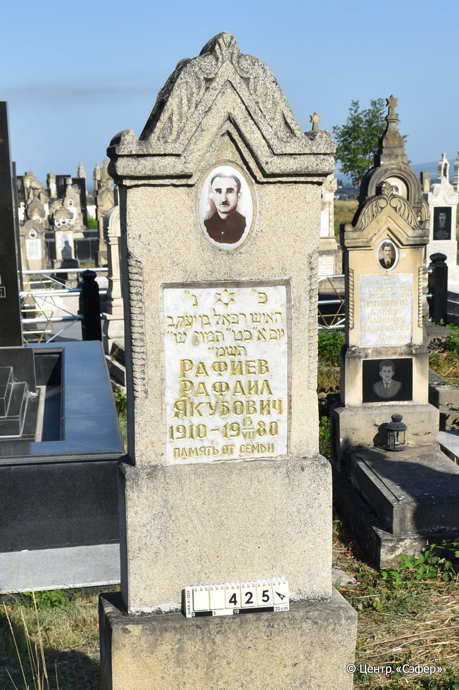
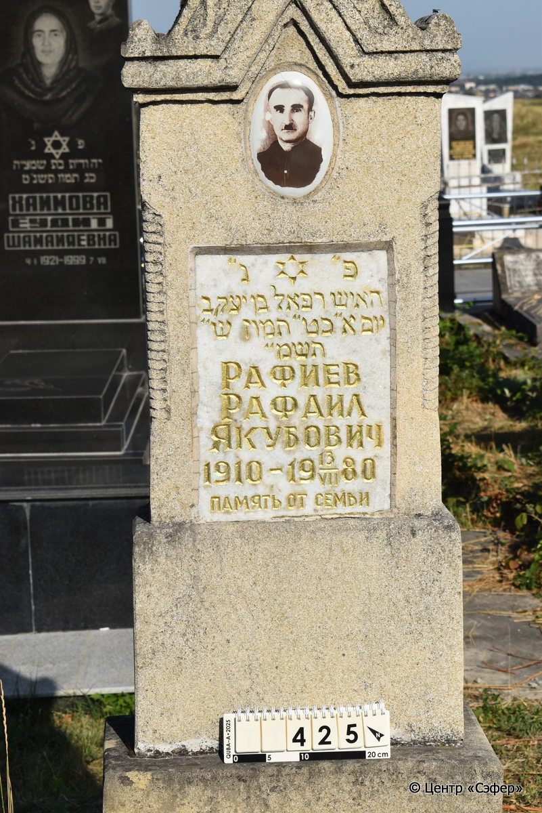
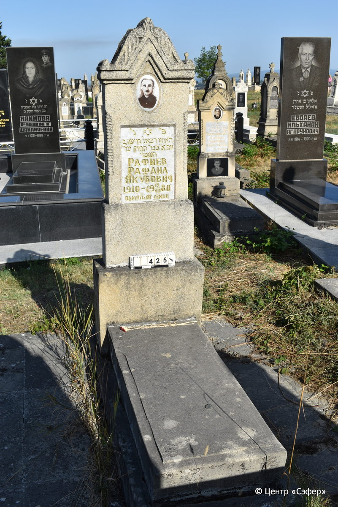

::: {style="font-size: 1em; margin-bottom: 1.2em"}
[Куба (центральное)](../cemeteries/QBA.html) > QBA0425
:::

```{r}
suppressPackageStartupMessages(library(tidyverse))
```


:::: {.columns}

::: {.column width="20%"}

```{r}
#| lightbox:
#|   group: photos





```
:::

::: {.column width="5%"}
:::

::: {.column width="74%"}

::: {.name-style}
РАФИЕВ Рафаэль [Рафаил], сын Яакова (Якубович)
:::

::: {style="font-size: 1.2em;"}
רפאל בן יעקב
:::

:::: {.columns}
::: {.column width="5%"}
{width=1.3em}
:::

::: {.column style="width: 40%; padding-left: 0.2em;"}
19.10.1980 /  
:::

::: {.column width="5%"}
{width=1.3em}
:::

::: {.column style="width: 50%; padding-left: 0.2em;"}
13.07.1980 / 29.Ta.5740
:::

::::


::: {.panel-tabset}

#### Эпитафия

```{r}
tibble(`Оригинал` = "פ״ נ״
האיש רפאל בן יעקב
יום א״ כט״ תמוז ש״
תשמ״
Рафиев
Рафаил
Якубович
1910 - 1980 13/VII
Память от семьи",
       `Перевод` = "Здесь покоится
мужчина, Рафаэль, сын Яакова,
<Скончался> в воскресенье, 29 таммуза, год
5740.
Рафиев
Рафаил
Якубович
1910 - 13.07.1980 
Память от семьи") |>
  mutate(`Оригинал` = str_split(`Оригинал`, "
"),
         `Перевод` = str_split(`Перевод`, "
")) |>
  unnest_longer(c(`Оригинал`, `Перевод`)) |> 
  mutate(id = 1:n()) |> 
  relocate(id, .before = Перевод) |> 
  rename(` ` = id) |> 
  knitr::kable(align = c("r", "c", "l"))
```

|||
|-|---|
|**Примечания**| |
|**Язык**      |иврит, русский    |
|**Метки**     |     |
: {tbl-colwidths="[25,75]"}

#### Памятник

|||
|-|---|
|**Тип памятника**   |L-образный                                                                         |
|**Материал**        |известняк, мрамор (мраморная вставка для текста, керамический медальон с портретом, цементный раствор, следы эрозии, сколы)                                                     |
|**Размеры**         |180×59×29  --- стела; 18×51×117  --- плита; 16×64×135  --- основание                                                                        |
|**Тип декора**      |архитектурно-орнаментальный, растительный, традиционная символика                                                                        |
|**Элементы декора** |треугольное завершение с волютами и растительными элементами, вставка с текстом и звездой Давида, медальон с фотопортретом, витые шнуры по лицевые граням                                                                          |
|**Координаты**      |[41.3710786, 48.50757647](https://www.google.com/maps/place/41.3710786, 48.50757647)                    |
: {tbl-colwidths="[25,75]"}

#### Источник

|||
|-|---|
|**Место хранения**        |Архив полевых исследований Центра «Сэфер»     |
|**Контакты**              |students@sefer.ru    |
|**Ссылка**                |https://sfira.org        |
|**Исходный ID**           |  |
|**Условия использования** |[CC BY-NC 4.0](https://creativecommons.org/licenses/by-nc/4.0/deed.ru)     |
: {tbl-colwidths="[25,75]"}

:::

:::

::::

