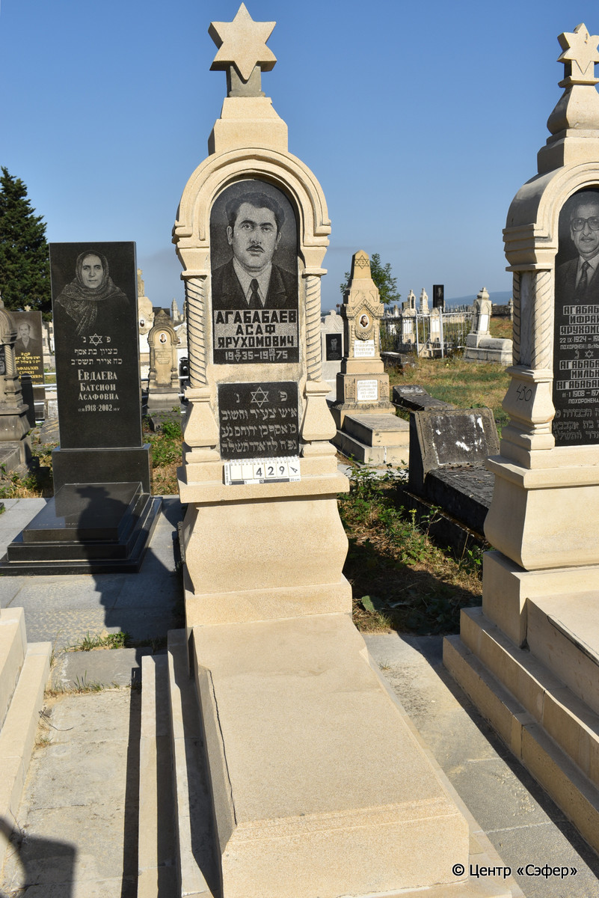
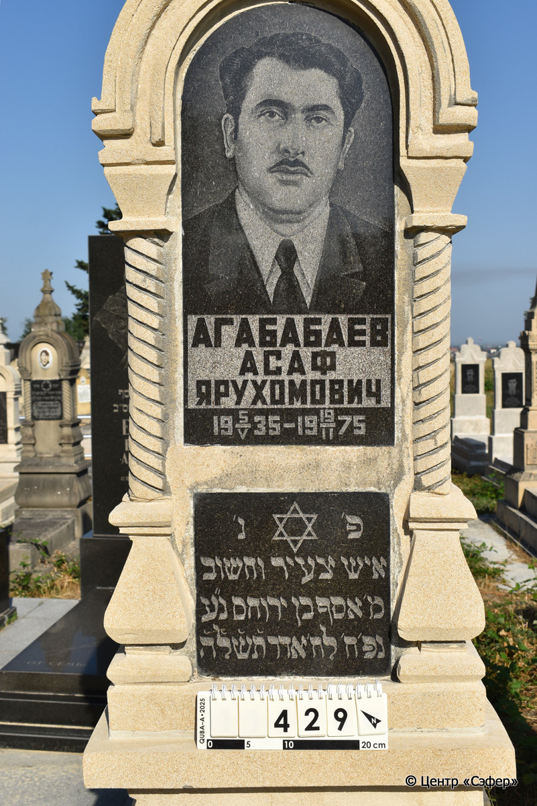

::: {style="font-size: 1em; margin-bottom: 1.2em"}
[Куба (центральное)](../cemeteries/QBA.html) > QBA0429
:::

```{r}
suppressPackageStartupMessages(library(tidyverse))
```


:::: {.columns}

::: {.column width="20%"}

```{r}
#| lightbox:
#|   group: photos




```
:::

::: {.column width="5%"}
:::

::: {.column width="74%"}

::: {.name-style}
АГАБАБАЕВ Асаф, сын Ярухама (Ярухомович)
:::

::: {style="font-size: 1.2em;"}
אסף בן ירוחם
:::

:::: {.columns}
::: {.column width="5%"}
{width=1.3em}
:::

::: {.column style="width: 40%; padding-left: 0.2em;"}
05.05.1935 /  
:::

::: {.column width="5%"}
{width=1.3em}
:::

::: {.column style="width: 50%; padding-left: 0.2em;"}
19.02.1975 / 8.Ad.5735
:::

::::


::: {.panel-tabset}

#### Эпитафия

```{r}
tibble(`Оригинал` = "Агабабаев
Асаф
Ярухомович
1935 5/V - 1975 19/II

פ׳ נ׳
איש צעיר וחשוב
מ׳ אסף בן ירוחם נ״ע
נפ׳ ח׳ לח׳ אדר ת׳ש׳ל׳ה׳",
       `Перевод` = "Агабабаев
Асаф
Ярухомович
05.05.1935 - 19.02.1975

Здесь покоится
человек молодой и важный,
господин Асаф, сын Ярухама, покоится в раю,
скончался 8 адара 5735 <года>.") |>
  mutate(`Оригинал` = str_split(`Оригинал`, "
"),
         `Перевод` = str_split(`Перевод`, "
")) |>
  unnest_longer(c(`Оригинал`, `Перевод`)) |> 
  mutate(id = 1:n()) |> 
  relocate(id, .before = Перевод) |> 
  rename(` ` = id) |> 
  knitr::kable(align = c("r", "c", "l"))
```

|||
|-|---|
|**Примечания**| |
|**Язык**      |иврит, русский    |
|**Метки**     |     |
: {tbl-colwidths="[25,75]"}

#### Памятник

|||
|-|---|
|**Тип памятника**   |L-образный                                                                         |
|**Материал**        |известняк, гранит, мрамор (две гранитные вставки для текста и портрета, цементный раствор, две мраморные вставки по бокам)                                                     |
|**Размеры**         |224×56×40  --- стела; 19×53×115  --- плита; 30×91×194  --- основание                                                                        |
|**Тип декора**      |архитектурно-орнаментальный, традиционная символика                                                                        |
|**Элементы декора** |архитектурное навершие со звездой Давида, полукруглые арки с лицевой и обратной стороны на витых полуколоннах, боковые стороны со светлыми мраморными вставками, на темных вставках лицевой стороны - портрет и звезда Давида                                                                          |
|**Координаты**      |[41.37103262, 48.50757422](https://www.google.com/maps/place/41.37103262, 48.50757422)                    |
: {tbl-colwidths="[25,75]"}

#### Источник

|||
|-|---|
|**Место хранения**        |Архив полевых исследований Центра «Сэфер»     |
|**Контакты**              |students@sefer.ru    |
|**Ссылка**                |https://sfira.org        |
|**Исходный ID**           |  |
|**Условия использования** |[CC BY-NC 4.0](https://creativecommons.org/licenses/by-nc/4.0/deed.ru)     |
: {tbl-colwidths="[25,75]"}

:::

:::

::::

