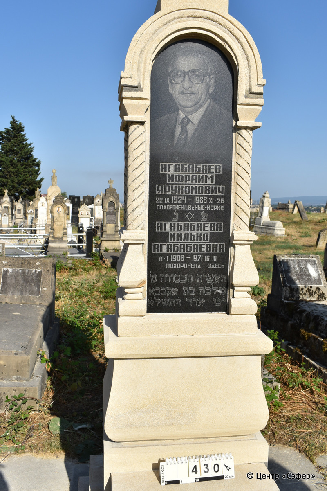
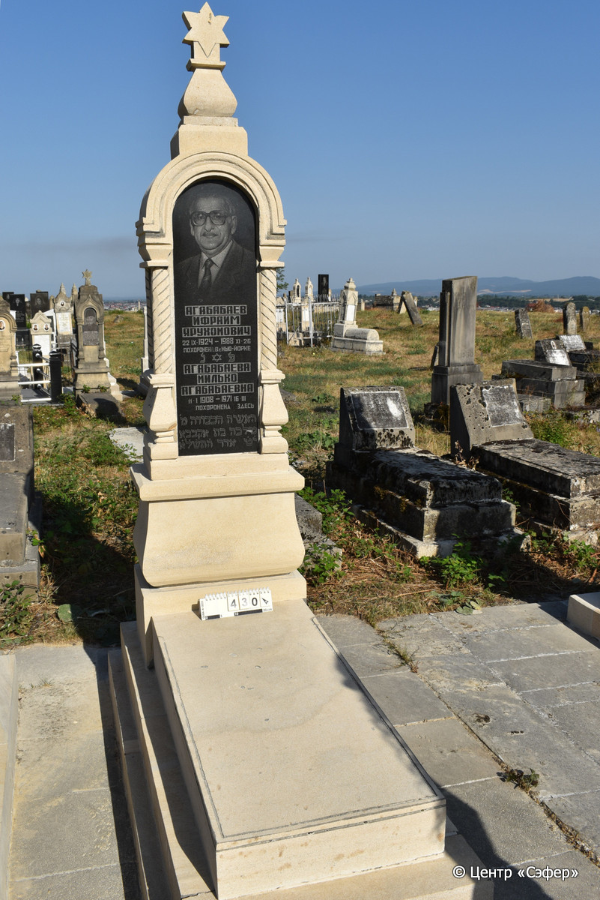

::: {style="font-size: 1em; margin-bottom: 1.2em"}
[Куба (центральное)](../cemeteries/QBA.html) > QBA0430
:::

```{r}
suppressPackageStartupMessages(library(tidyverse))
```


:::: {.columns}

::: {.column width="20%"}

```{r}
#| lightbox:
#|   group: photos




```
:::

::: {.column width="5%"}
:::

::: {.column width="74%"}

::: {.name-style}
АГАБАБАЕВ Ифраим Ярухомович
:::

::: {style="font-size: 1.2em;"}

:::

:::: {.columns}
::: {.column width="5%"}
{width=1.3em}
:::

::: {.column style="width: 40%; padding-left: 0.2em;"}
22.09.1924 /  
:::

::: {.column width="5%"}
{width=1.3em}
:::

::: {.column style="width: 50%; padding-left: 0.2em;"}
26.12.1988 /  
:::

::::

---

::: {.name-style}
АГАБАБАЕВА Малка, дочь Агабабая (Милько Агабабаевна)
:::

::: {style="font-size: 1.2em;"}
מלכה בת אקבבא
:::

:::: {.columns}
::: {.column width="5%"}
{width=1.3em}
:::

::: {.column style="width: 40%; padding-left: 0.2em;"}
11.01.1908 /  
:::

::: {.column width="5%"}
{width=1.3em}
:::

::: {.column style="width: 50%; padding-left: 0.2em;"}
16.03.1971 / 19.Ad.5731
:::

::::


::: {.panel-tabset}

#### Эпитафия

```{r}
tibble(`Оригинал` = "Агабабаев
Ифраим
Ярухомович
22 IX 1924 - 1988 XI 26
Похоронен в г. Нью-Йорке
פ׳ נ׳
Агабабаева
Милько
Агабабаевна
11 I 1908 - 1971 16 III
Похоронена здесь
האשה הכבודה מ׳
מלכה בת אקבבא
י֗ט֗ אדר ה׳ת׳ש׳ל׳א׳",
       `Перевод` = "Агабабаев
Ифраим
Ярухомович
22.09.1924 - 26.11.1988
Похоронен в г. Нью-Йорке
Здесь похоронена
Агабабаева
Милько
Агабабаевна
11.01.1908 - 16.03.1971
Похоронена здесь
Женщина уважаемая
госпожа Малка, дочь Агабабая
19-го адара, 5731 год") |>
  mutate(`Оригинал` = str_split(`Оригинал`, "
"),
         `Перевод` = str_split(`Перевод`, "
")) |>
  unnest_longer(c(`Оригинал`, `Перевод`)) |> 
  mutate(id = 1:n()) |> 
  relocate(id, .before = Перевод) |> 
  rename(` ` = id) |> 
  knitr::kable(align = c("r", "c", "l"))
```

|||
|-|---|
|**Примечания**| |
|**Язык**      |иврит, русский    |
|**Метки**     |%география%    |
: {tbl-colwidths="[25,75]"}

#### Памятник

|||
|-|---|
|**Тип памятника**   |L-образный                                                                         |
|**Материал**        |известняк, гранит, мрамор (одна гранитная вставка для текста и портрета, две мраморные вставки по бокам, цементный раствор, сколы, следы эрозии)                                                     |
|**Размеры**         |226×58×37  --- стела; 20×54×120  --- плита; 27×81×191  --- основание                                                                        |
|**Тип декора**      |архитектурно-орнаментальный, традиционная символика                                                                        |
|**Элементы декора** |архитектурное навершие со звездой Давида, полукруглые арки с лицевой и обратной стороны на витых полуколоннах, боковые стороны со светлыми мраморными вставками, на темной вставке лицевой стороны - портрет и звезда Давида.                                                                          |
|**Координаты**      |[41.37102285, 48.50757415](https://www.google.com/maps/place/41.37102285, 48.50757415)                    |
: {tbl-colwidths="[25,75]"}

#### Источник

|||
|-|---|
|**Место хранения**        |Архив полевых исследований Центра «Сэфер»     |
|**Контакты**              |students@sefer.ru    |
|**Ссылка**                |https://sfira.org        |
|**Исходный ID**           |  |
|**Условия использования** |[CC BY-NC 4.0](https://creativecommons.org/licenses/by-nc/4.0/deed.ru)     |
: {tbl-colwidths="[25,75]"}

:::

:::

::::

