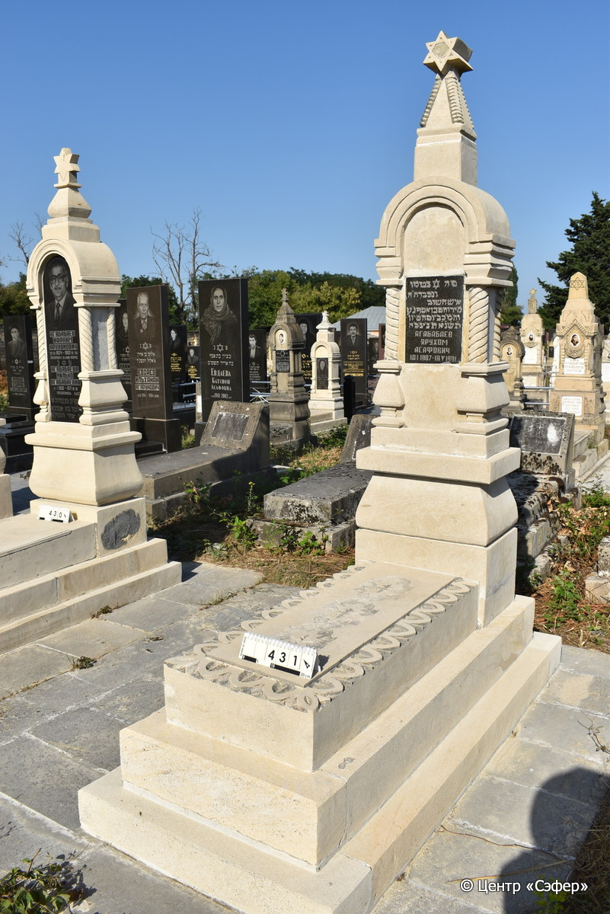
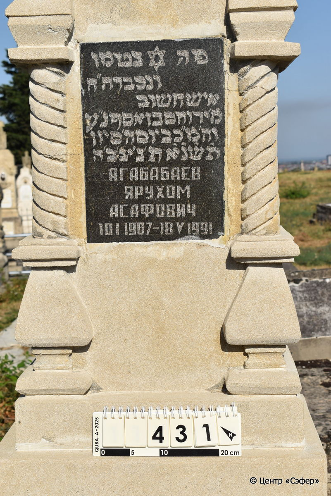

::: {style="font-size: 1em; margin-bottom: 1.2em"}
[Куба (центральное)](../cemeteries/QBA.html) > QBA0431
:::

```{r}
suppressPackageStartupMessages(library(tidyverse))
```


:::: {.columns}

::: {.column width="20%"}

```{r}
#| lightbox:
#|   group: photos




```
:::

::: {.column width="5%"}
:::

::: {.column width="74%"}

::: {.name-style}
АГАБАБАЕВ Йерухам, сын Асафа (Ярухом Асафович)
:::

::: {style="font-size: 1.2em;"}
ירוחם בן אסף
:::

:::: {.columns}
::: {.column width="5%"}
{width=1.3em}
:::

::: {.column style="width: 40%; padding-left: 0.2em;"}
10.01.1907 /  
:::

::: {.column width="5%"}
{width=1.3em}
:::

::: {.column style="width: 50%; padding-left: 0.2em;"}
10.05.1991 / 5.Si.5751
:::

::::


::: {.panel-tabset}

#### Эпитафия

```{r}
tibble(`Оригинал` = "פה נטמן
ונכבר ה״ה
איש חשוב
מ׳ ירוחם בן אסף נ״ע
וה,מ״כ ביום ה׳ סיון
ת׳ש׳נ׳א׳ ת׳נ׳צ׳ב׳ה׳
Агабабаев
Ярухом
Асафович
10 I 1907 - 18 V 1991",
       `Перевод` = "Здесь покоится
уважаемый*,
почтенный мужчина,
г-н Йерухам, сын Асафа. Да упокоится в раю.
И да упокоится во славе, в четверг, 5-го сивана
5751 года. Да будет душа его завязана в узле жизни.
Агабабаев
Ярухом
Асафович
10.01.1907 - 18.05.1991") |>
  mutate(`Оригинал` = str_split(`Оригинал`, "
"),
         `Перевод` = str_split(`Перевод`, "
")) |>
  unnest_longer(c(`Оригинал`, `Перевод`)) |> 
  mutate(id = 1:n()) |> 
  relocate(id, .before = Перевод) |> 
  rename(` ` = id) |> 
  knitr::kable(align = c("r", "c", "l"))
```

|||
|-|---|
|**Примечания**|*Возможно, искаженное написание ונקבר - 'и погребён'.|
|**Язык**      |иврит, русский    |
|**Метки**     |     |
: {tbl-colwidths="[25,75]"}

#### Памятник

|||
|-|---|
|**Тип памятника**   |L-образный                                                                         |
|**Материал**        |известняк, гранит, мрамор (гранитная вставка для текста, цементный раствор, две мраморные вставки по бокам, следы ремонта, трещины)                                                     |
|**Размеры**         |228×58×38  --- стела; 20×52×121  --- плита; 34×90×199  --- основание                                                                        |
|**Тип декора**      |архитектурно-орнаментальный, растительный                                                                        |
|**Элементы декора** |архитектурное навершие со звездой Давида и витыми гранями, полукруглые арки с лицевой и обратной стороны на витых полуколоннах, боковые стороны со светлыми мраморными вставками, на темной вставке лицевой стороны - звезда Давида. Плита обрамлена растительным орнамент. В центре повторена три раза растительная  композиция.                                                                          |
|**Координаты**      |[41.37100297, 48.50757323](https://www.google.com/maps/place/41.37100297, 48.50757323)                    |
: {tbl-colwidths="[25,75]"}

#### Источник

|||
|-|---|
|**Место хранения**        |Архив полевых исследований Центра «Сэфер»     |
|**Контакты**              |students@sefer.ru    |
|**Ссылка**                |https://sfira.org        |
|**Исходный ID**           |  |
|**Условия использования** |[CC BY-NC 4.0](https://creativecommons.org/licenses/by-nc/4.0/deed.ru)     |
: {tbl-colwidths="[25,75]"}

:::

:::

::::

