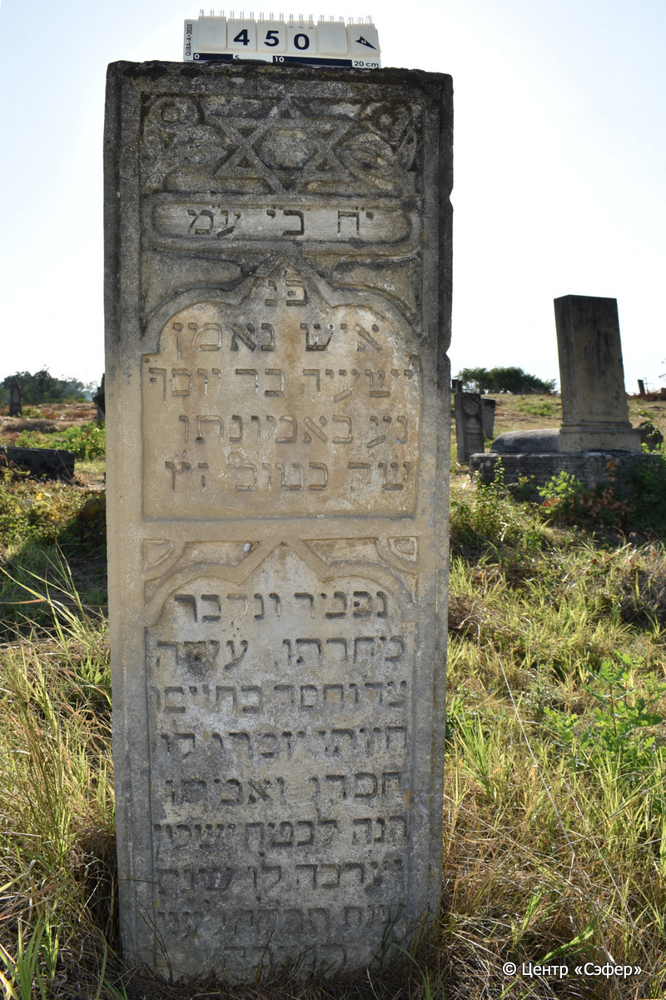

::: {style="font-size: 1em; margin-bottom: 1.2em"}
[Куба (центральное)](../cemeteries/QBA.html) > QBA0450
:::

```{r}
suppressPackageStartupMessages(library(tidyverse))
```


:::: {.columns}

::: {.column width="20%"}

```{r}
#| lightbox:
#|   group: photos



```
:::

::: {.column width="5%"}
:::

::: {.column width="74%"}

::: {.name-style}
Йешая, сын Йосефа
:::

::: {style="font-size: 1.2em;"}
ישעיה בן יוסף
:::

:::: {.columns}
::: {.column width="5%"}
{width=1.3em}
:::

::: {.column style="width: 40%; padding-left: 0.2em;"}
  /  
:::

::: {.column width="5%"}
{width=1.3em}
:::

::: {.column style="width: 50%; padding-left: 0.2em;"}
-.-.1915/1914 / -.-.5675
:::

::::


::: {.panel-tabset}

#### Эпитафия

```{r}
tibble(`Оригинал` = "י״ח ב״י ע״מ
פ״נ
איש נאמן
ישעיה בר יוסף
נ׳ע באמונתו
ש׳ק בטו״ב זי״ו
נפטר ונקבר
מחרתו. עשה
צד׳ וחסד בחיים
חיותו. יזכרו לו
חסדו ואמתו
הנה לבטח ישכון
וערכה לו שנת
שנת תפלה לע֗ני֗
תנצבה",
       `Перевод` = "Пусть торжествуют праведники во славе и радуются на ложах своих*.
Здесь покоится
человек преданный,
Йешайя, сын р. Йосефа,
да упокоится в раю в вере своей.
В святую субботу, ...
скончался и похоронен.
на следующий день. Творил
благодеяние и милость всю
свою жизнь. Будут вспоминать
его милость и праведность.
Здесь пребудет в покое**,
назначен ему год,
год молитва страждущего** {5675}.
Да будет его душа завязана в узле жизни.") |>
  mutate(`Оригинал` = str_split(`Оригинал`, "
"),
         `Перевод` = str_split(`Перевод`, "
")) |>
  unnest_longer(c(`Оригинал`, `Перевод`)) |> 
  mutate(id = 1:n()) |> 
  relocate(id, .before = Перевод) |> 
  rename(` ` = id) |> 
  knitr::kable(align = c("r", "c", "l"))
```

|||
|-|---|
|**Примечания**|*Пс 149:2
**Цит. Втор 33:12
***Год смерти записан с помощью хронограммы в виде цитаты из Пс 102:1, в которой числовое значение отмеченных букв соответствует 675.|
|**Язык**      |иврит    |
|**Метки**     |     |
: {tbl-colwidths="[25,75]"}

#### Памятник

|||
|-|---|
|**Тип памятника**   |стела                                                                         |
|**Материал**        |песчаник (следы эрозии)                                                     |
|**Размеры**         |134×44×17                                                                        |
|**Тип декора**      |архитектурно-орнаментальный, растительный, традиционная символика                                                                        |
|**Элементы декора** |звезда Давида в окружении растительного орнамента, три фигурные ниши для текста                                                                          |
|**Координаты**      |[41.37085436, 48.50767869](https://www.google.com/maps/place/41.37085436, 48.50767869)                    |
: {tbl-colwidths="[25,75]"}

#### Источник

|||
|-|---|
|**Место хранения**        |Архив полевых исследований Центра «Сэфер»     |
|**Контакты**              |students@sefer.ru    |
|**Ссылка**                |https://sfira.org        |
|**Исходный ID**           |  |
|**Условия использования** |[CC BY-NC 4.0](https://creativecommons.org/licenses/by-nc/4.0/deed.ru)     |
: {tbl-colwidths="[25,75]"}

:::

:::

::::

