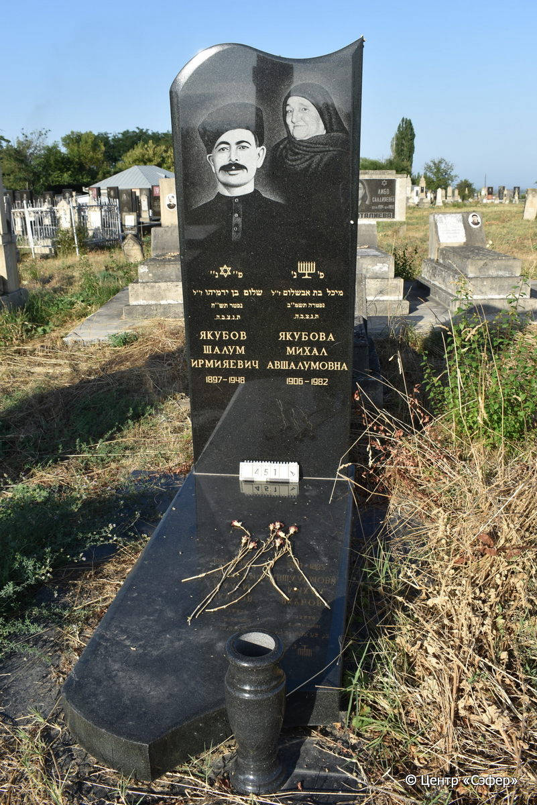
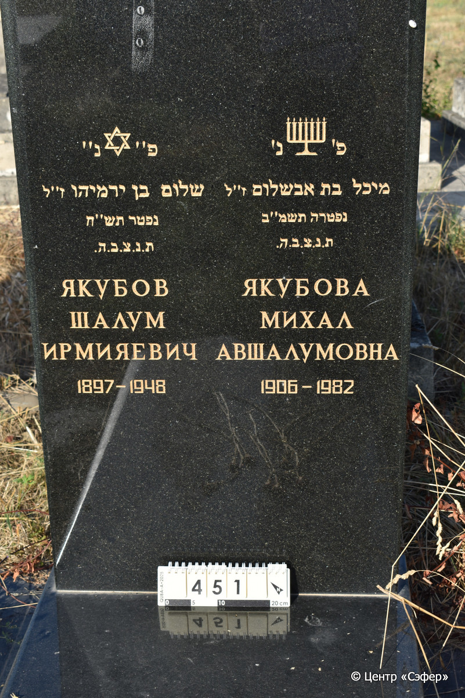

::: {style="font-size: 1em; margin-bottom: 1.2em"}
[Куба (центральное)](../cemeteries/QBA.html) > QBA0451
:::

```{r}
suppressPackageStartupMessages(library(tidyverse))
```


:::: {.columns}

::: {.column width="20%"}

```{r}
#| lightbox:
#|   group: photos




```
:::

::: {.column width="5%"}
:::

::: {.column width="74%"}

::: {.name-style}
ЯКУБОВ Шалом, сын Йеремии (Шалум Ирмияевич)
:::

::: {style="font-size: 1.2em;"}
שלום בן ירמיהו
:::

:::: {.columns}
::: {.column width="5%"}
{width=1.3em}
:::

::: {.column style="width: 40%; padding-left: 0.2em;"}
-.-.1897 /  
:::

::: {.column width="5%"}
{width=1.3em}
:::

::: {.column style="width: 50%; padding-left: 0.2em;"}
-.-.1948 / -.-.5708
:::

::::

---

::: {.name-style}
ЯКУБОВА Михал, дочь Авшалома (Авшалумовна)
:::

::: {style="font-size: 1.2em;"}
מיכל בת אבשלום
:::

:::: {.columns}
::: {.column width="5%"}
{width=1.3em}
:::

::: {.column style="width: 40%; padding-left: 0.2em;"}
-.-.1906 /  
:::

::: {.column width="5%"}
{width=1.3em}
:::

::: {.column style="width: 50%; padding-left: 0.2em;"}
-.-.1982 / -.-.5742
:::

::::


::: {.panel-tabset}

#### Эпитафия

```{r}
tibble(`Оригинал` = "слева
פ״ נ״
שלום בן ירמיהו זייל
נפטר תש״ח
ת.נ.צ.ב.ה.
ЯКУБОВ
ШАЛУМ
ИРМИЯЕВИЧ
1897-1948

справа
פ׳ נ׳
מיכל בת אבשלום ז״ל
נפטרה תשמ״ב
ת.נ.צ.ב.ה.
ЯКУБОВА
МИХАЛ
АВШАЛУМОВНА
1906-1982",
       `Перевод` = "
Здесь покоится
Шалум, сын Йеремии, да будет благословенна его память
Скончался в {5}708 году
Да будет душа его завязана в узле жизни
Якубов 
Шалум
Ирмияевич
1897-1948

 
Здесь покоится 
Михал, дочь Авшалома, да будет благословенна ее память
Скончалась в {5}742 году
Да будет душа ее завязана в узле жизни
Якубова
Михал
Авшалумовна
1906-1982") |>
  mutate(`Оригинал` = str_split(`Оригинал`, "
"),
         `Перевод` = str_split(`Перевод`, "
")) |>
  unnest_longer(c(`Оригинал`, `Перевод`)) |> 
  mutate(id = 1:n()) |> 
  relocate(id, .before = Перевод) |> 
  rename(` ` = id) |> 
  knitr::kable(align = c("r", "c", "l"))
```

|||
|-|---|
|**Примечания**| |
|**Язык**      |иврит, русский    |
|**Метки**     |муж, жена    |
: {tbl-colwidths="[25,75]"}

#### Памятник

|||
|-|---|
|**Тип памятника**   |L-образный                                                                         |
|**Материал**        |гранит (стоит на гранитных плитах)                                                     |
|**Размеры**         |171×70×12  --- стела; 16×72×170  --- плита                                                                        |
|**Тип декора**      |архитектурно-орнаментальный, традиционная символика                                                                        |
|**Элементы декора** |звезда Давида и менора, два фотопортрета, волнистое звершение, ваза для цветов                                                                          |
|**Координаты**      |[41.370805, 48.50771099](https://www.google.com/maps/place/41.370805, 48.50771099)                    |
: {tbl-colwidths="[25,75]"}

#### Источник

|||
|-|---|
|**Место хранения**        |Архив полевых исследований Центра «Сэфер»     |
|**Контакты**              |students@sefer.ru    |
|**Ссылка**                |https://sfira.org        |
|**Исходный ID**           |  |
|**Условия использования** |[CC BY-NC 4.0](https://creativecommons.org/licenses/by-nc/4.0/deed.ru)     |
: {tbl-colwidths="[25,75]"}

:::

:::

::::

