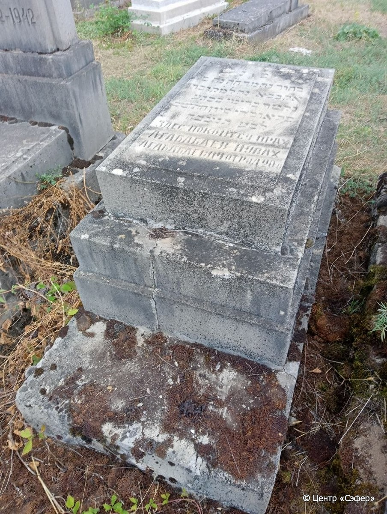
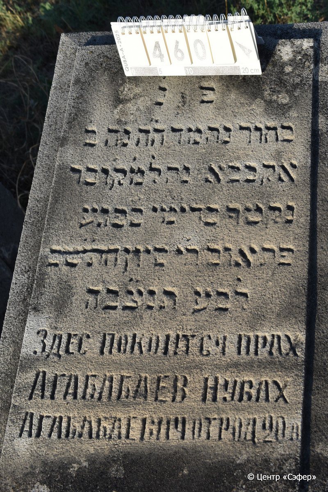
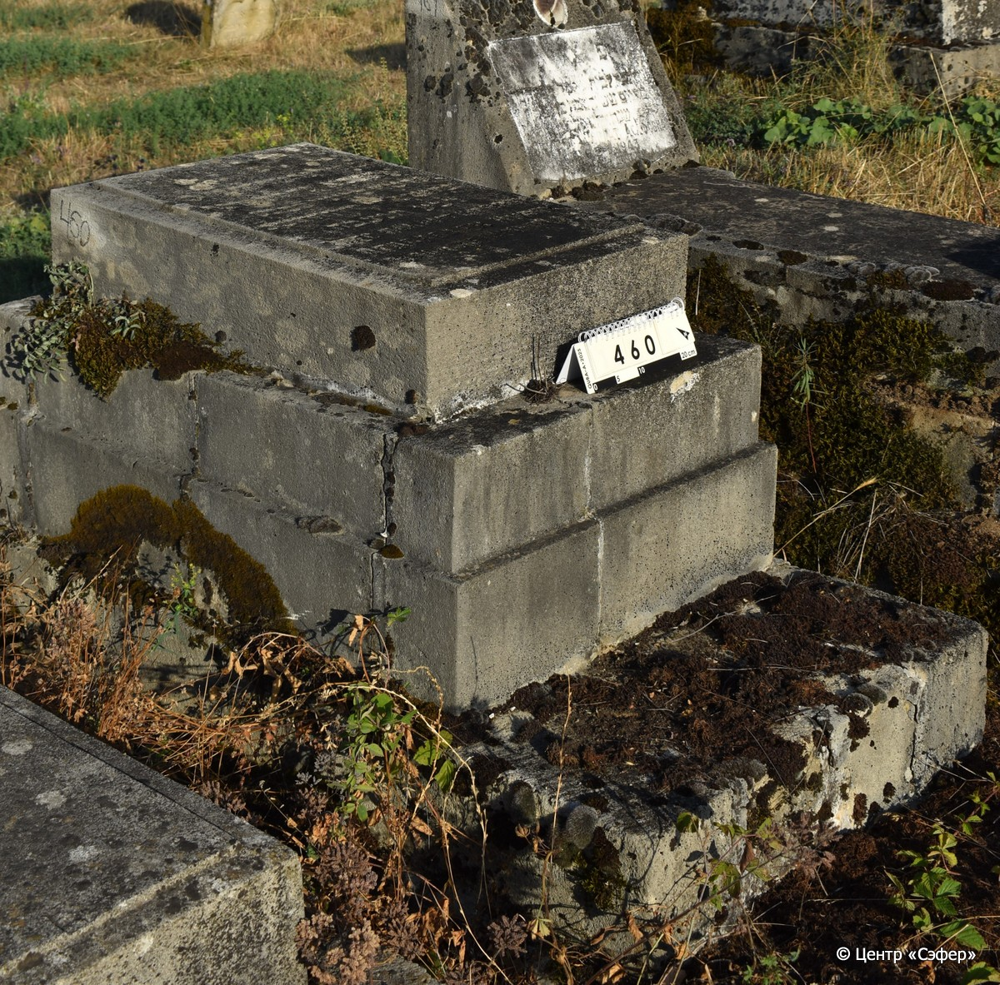

::: {style="font-size: 1em; margin-bottom: 1.2em"}
[Куба (центральное)](../cemeteries/QBA.html) > QBA0460
:::

```{r}
suppressPackageStartupMessages(library(tidyverse))
```


:::: {.columns}

::: {.column width="20%"}

```{r}
#| lightbox:
#|   group: photos





```
:::

::: {.column width="5%"}
:::

::: {.column width="74%"}

::: {.name-style}
АГАБАБАЕВ Ноах, сын Агабабы (Нувах Агабабаевич)
:::

::: {style="font-size: 1.2em;"}
נח בן אקבבא
:::

:::: {.columns}
::: {.column width="5%"}
{width=1.3em}
:::

::: {.column style="width: 40%; padding-left: 0.2em;"}
  /  
:::

::: {.column width="5%"}
{width=1.3em}
:::

::: {.column style="width: 50%; padding-left: 0.2em;"}
03.06.1942* / 18.Si.5702
:::

::::


::: {.panel-tabset}

#### Эпитафия

```{r}
tibble(`Оригинал` = "פ֗ נ֗
בחור נחמד ה״ ה נח ב׳
אקבבא נה ל֗מ֗ק֗ובר
נקטף בדימי בפגע
פתאום ח֗י֗ סיון הת״שב
לב״ ע תנצ״ בה
Здес покоится прах
Агабабаев Нувах
Агабабаевич от род 20 л.",
       `Перевод` = "Здесь покоится
приятный собой юноша, уважаемый господин, Ноах, сын
Агабабы, похоронен,
сорван во цвете лет 
внезапной бедой восемнадцатого сивана {5}702 года
от сотворения мира, да будет душа его завязана в узле жизни
Здесь покоится прах
Агабабаева Нуваха
Агабабаевича, 20 лет от роду") |>
  mutate(`Оригинал` = str_split(`Оригинал`, "
"),
         `Перевод` = str_split(`Перевод`, "
")) |>
  unnest_longer(c(`Оригинал`, `Перевод`)) |> 
  mutate(id = 1:n()) |> 
  relocate(id, .before = Перевод) |> 
  rename(` ` = id) |> 
  knitr::kable(align = c("r", "c", "l"))
```

|||
|-|---|
|**Примечания**| |
|**Язык**      |иврит, русский    |
|**Метки**     |юноша, несчастный случай, преждевременная смерть    |
: {tbl-colwidths="[25,75]"}

#### Памятник

|||
|-|---|
|**Тип памятника**   |индивидуальный                                                                         |
|**Материал**        |известняк (следы эрозии, трещины, цементный раствор)                                                     |
|**Размеры**         |21×54×88  --- плита; 54×79×165  --- основание                                                                        |
|**Тип декора**      |-                                                                        |
|**Элементы декора** |                                                                           |
|**Координаты**      |[41.37097022, 48.50766429](https://www.google.com/maps/place/41.37097022, 48.50766429)                    |
: {tbl-colwidths="[25,75]"}

#### Источник

|||
|-|---|
|**Место хранения**        |Архив полевых исследований Центра «Сэфер»     |
|**Контакты**              |students@sefer.ru    |
|**Ссылка**                |https://sfira.org        |
|**Исходный ID**           |  |
|**Условия использования** |[CC BY-NC 4.0](https://creativecommons.org/licenses/by-nc/4.0/deed.ru)     |
: {tbl-colwidths="[25,75]"}

:::

:::

::::

