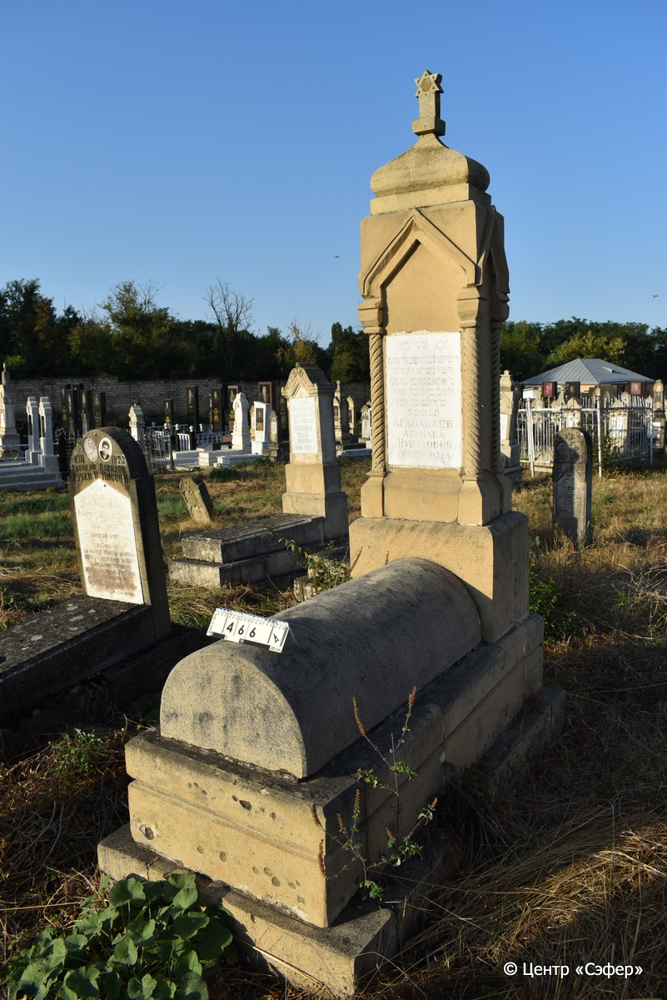
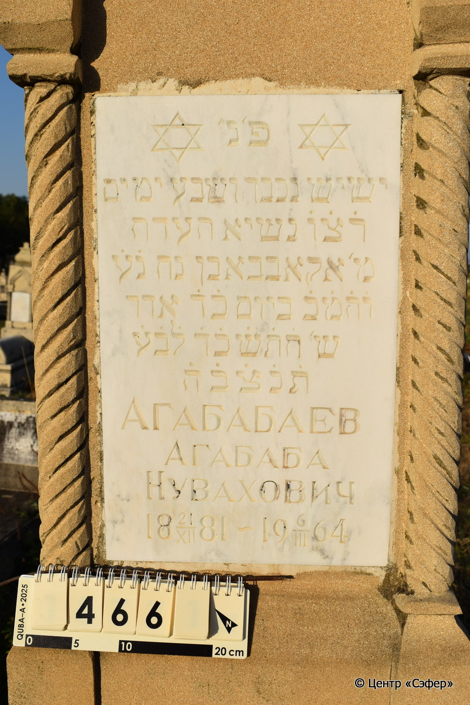

::: {style="font-size: 1em; margin-bottom: 1.2em"}
[Куба (центр.) Азербайджан](../cemeteries/QBA.html) > QBA0466
:::

```{r}
suppressPackageStartupMessages(library(tidyverse))
```


:::: {.columns}

::: {.column width="20%"}

```{r}
#| lightbox:
#|   group: photos




```
:::

::: {.column width="5%"}
:::

::: {.column width="74%"}

::: {.name-style}
АГАБАБАЕВ Агабаба, сын Ноаха (Нувахович)
:::

::: {style="font-size: 1.2em;"}
אקאבבא בן נח
:::

:::: {.columns}
::: {.column width="5%"}
{width=1.3em}
:::

::: {.column style="width: 40%; padding-left: 0.2em;"}
21.12.1881 /  
:::

::: {.column width="5%"}
{width=1.3em}
:::

::: {.column style="width: 50%; padding-left: 0.2em;"}
06.03.1964 / 24.Ad.5724
:::

::::


::: {.panel-tabset}

#### Эпитафия

```{r}
tibble(`Оригинал` = "פ׳ נ׳
ישיש נכבד ושבע ימים
ר֗צ֗ו֗ נשיא העדה
מ׳ אקאבבא בן נח נ֗ע֗
ו֗ה֗מ֗כ֗ ביום כ֗ד֗ אדר
ש׳ ה֗ת֗ש֗כ֗ד֗ ל֗ב֗ע֗
ת֗נ֗צ֗ב֗ה֗
АГАБАБАЕВ
АГАБАБА
НУВАХОВИЧ
18 21/XII 81 - 19 6/III 64",
       `Перевод` = "Здесь покоится
пожилой и уважаемый, [ушедший] в преклонном возрасте,
правдолюбивый и милостивый, глава общины,
господин Агабаба, сын Нуваха, да упокоится он в раю, 
во славе, [скончавшийся] двадцать четвертого адара
5724 года от сотворения мира,
да будет душа его завязана в узле жизни
Агабабаев
Агабаба
Нувахович
21.12.1881 - 06.03.1964") |>
  mutate(`Оригинал` = str_split(`Оригинал`, "
"),
         `Перевод` = str_split(`Перевод`, "
")) |>
  unnest_longer(c(`Оригинал`, `Перевод`)) |> 
  mutate(id = 1:n()) |> 
  relocate(id, .before = Перевод) |> 
  rename(` ` = id) |> 
  knitr::kable(align = c("r", "c", "l"))
```

|||
|-|---|
|**Примечания**| |
|**Язык**      |иврит, русский    |
|**Метки**     |     |
: {tbl-colwidths="[25,75]"}

#### Памятник

|||
|-|---|
|**Тип памятника**   |L-образный                                                                         |
|**Материал**        |известняк, мрамор (мраморная вставка для текста на стеле, следы эрозии, цементный раствор, блоки основания смещены)                                                     |
|**Размеры**         |220×62×40  --- стела; 31×50×115  --- Саркофаг; 55×90×175  --- основание                                                                        |
|**Тип декора**      |архитектурно-орнаментальный, традиционная символика                                                                        |
|**Элементы декора** |архитектурное навершие со звездой Давида. Стрельчатые арки на витых полуколоннах. Две звезды Давида на мраморной вставке с текстом.                                                                          |
|**Координаты**      |[41.37086654, 48.50773285](https://www.google.com/maps/place/41.37086654, 48.50773285)                    |
: {tbl-colwidths="[25,75]"}

#### Источник

|||
|-|---|
|**Место хранения**        |Архив полевых исследований Центра «Сэфер»     |
|**Контакты**              |students@sefer.ru    |
|**Ссылка**                |https://sfira.org        |
|**Исходный ID**           |  |
|**Условия использования** |[CC BY-NC 4.0](https://creativecommons.org/licenses/by-nc/4.0/deed.ru)     |
: {tbl-colwidths="[25,75]"}

:::

:::

::::

