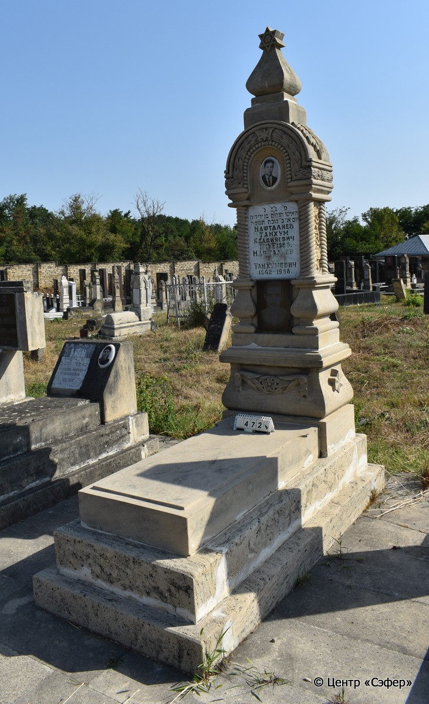
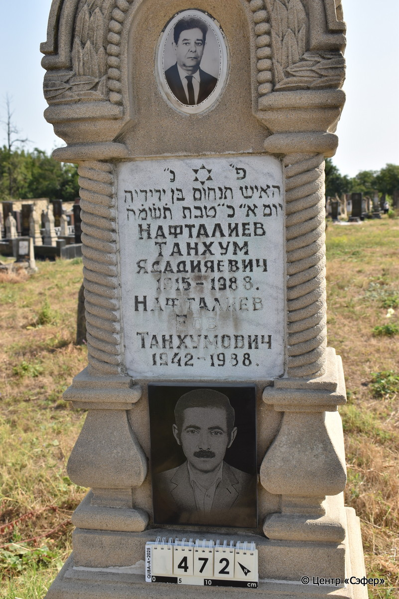

::: {style="font-size: 1em; margin-bottom: 1.2em"}
[Куба (центральное)](../cemeteries/QBA.html) > QBA0472
:::

```{r}
suppressPackageStartupMessages(library(tidyverse))
```


:::: {.columns}

::: {.column width="20%"}

```{r}
#| lightbox:
#|   group: photos




```
:::

::: {.column width="5%"}
:::

::: {.column width="74%"}

::: {.name-style}
НАФТАЛИЕВ Танхум, сын Ядидьи (Ядадияевич)
:::

::: {style="font-size: 1.2em;"}
תנחום בן ידידיא
:::

:::: {.columns}
::: {.column width="5%"}
{width=1.3em}
:::

::: {.column style="width: 40%; padding-left: 0.2em;"}
-.-.1915 /  
:::

::: {.column width="5%"}
{width=1.3em}
:::

::: {.column style="width: 50%; padding-left: 0.2em;"}
-.-.1988 / 20.Te.5748
:::

::::

---

::: {.name-style}
НАФТАЛИЕВ Иов, сын Танхума (Еов Танхумович)
:::

::: {style="font-size: 1.2em;"}
איוב בן תנחום
:::

:::: {.columns}
::: {.column width="5%"}
{width=1.3em}
:::

::: {.column style="width: 40%; padding-left: 0.2em;"}
-.-.1942 /  
:::

::: {.column width="5%"}
{width=1.3em}
:::

::: {.column style="width: 50%; padding-left: 0.2em;"}
-.-.1988 /  
:::

::::


::: {.panel-tabset}

#### Эпитафия

```{r}
tibble(`Оригинал` = "פ״נ״
האיש תנחום בּן ידידיה
יום א״ כ׳ טבת ת֗ש֗מ֗ח֗
Нафталиев
Танхум
Ядадияевич
1915 - 1988
Нафталиев
Еов
Танхумович
1942 - 1988",
       `Перевод` = "Здесь покоится
мужчина Танхум, сын Ядидьи,
<скончавшийся> в воскресенье, двадцатого тевета {5}748 года
Нафталиев
Танхум
Ядадияевич
1915-1988
Нафталиев
Еов
Танхумович
1942-1988") |>
  mutate(`Оригинал` = str_split(`Оригинал`, "
"),
         `Перевод` = str_split(`Перевод`, "
")) |>
  unnest_longer(c(`Оригинал`, `Перевод`)) |> 
  mutate(id = 1:n()) |> 
  relocate(id, .before = Перевод) |> 
  rename(` ` = id) |> 
  knitr::kable(align = c("r", "c", "l"))
```

|||
|-|---|
|**Примечания**| |
|**Язык**      |иврит, русский    |
|**Метки**     |     |
: {tbl-colwidths="[25,75]"}

#### Памятник

|||
|-|---|
|**Тип памятника**   |L-образный                                                                         |
|**Материал**        |известняк, габбро-диорит, мрамор (мраморная вставка для текста, керамический медальон с фото-портретом, панель из чёрного камня с портретом, сколы, цементный раствор, трещины)                                                     |
|**Размеры**         |231×62×45  --- стела; 16×53×120  --- плита; 31×86×192  --- основание                                                                        |
|**Тип декора**      |архитектурно-орнаментальный, растительный, традиционная символика                                                                        |
|**Элементы декора** |архитектурное навершие со звездой Давида, полукруглые арки на витых полуколоннах, свод арки украшен орнаментальными поясами из листьев, бусин, увенчанных шестиконечной звездой. На скатах стелы крупные  листья, в нишах по бокам цветочные композиции, на лицевой стороне медальон с портретом, портрет на темной панели. Звезда Давида на текстовой вставке. Гирлянда из лент, листьев и цветка у плиты на лицевой стороне. По бокам у основания две шестиконечные звезды.                                                                          |
|**Координаты**      |[41.37080361, 48.50778719](https://www.google.com/maps/place/41.37080361, 48.50778719)                    |
: {tbl-colwidths="[25,75]"}

#### Источник

|||
|-|---|
|**Место хранения**        |Архив полевых исследований Центра «Сэфер»     |
|**Контакты**              |students@sefer.ru    |
|**Ссылка**                |https://sfira.org        |
|**Исходный ID**           |  |
|**Условия использования** |[CC BY-NC 4.0](https://creativecommons.org/licenses/by-nc/4.0/deed.ru)     |
: {tbl-colwidths="[25,75]"}

:::

:::

::::

