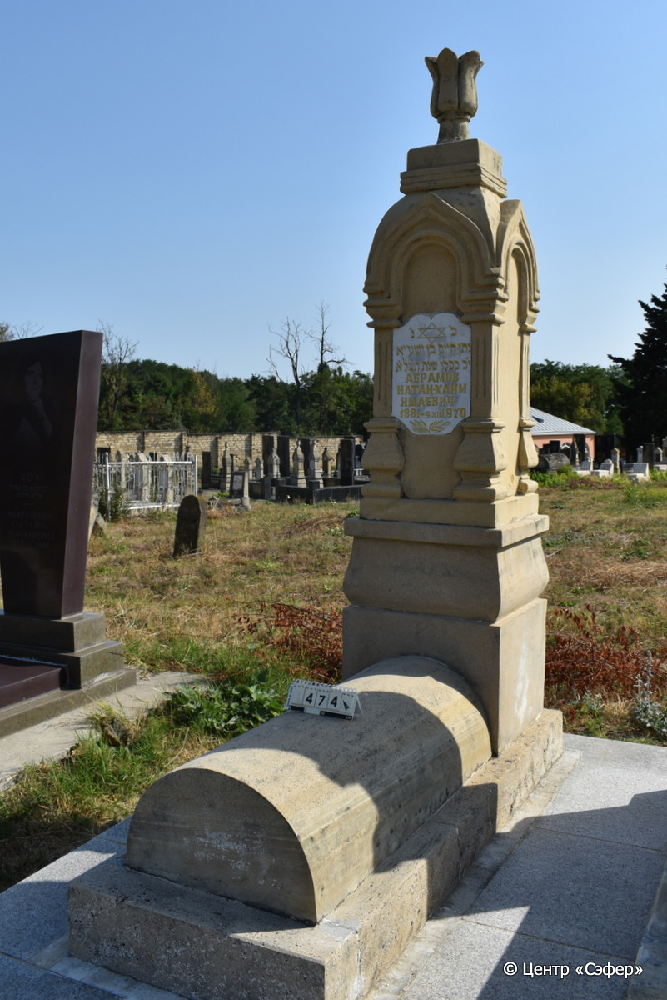
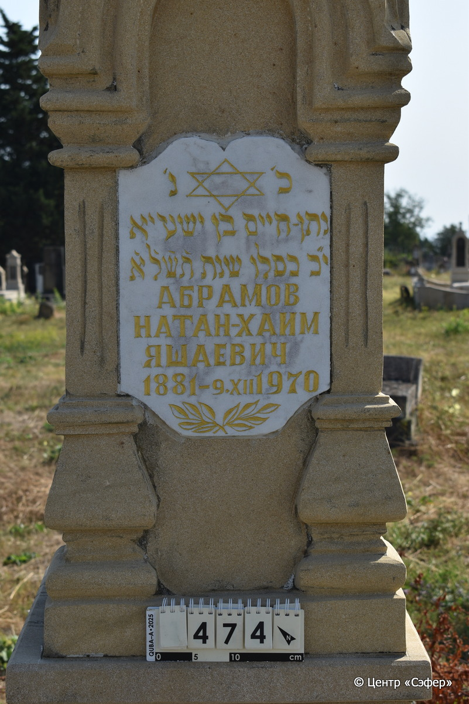

::: {style="font-size: 1em; margin-bottom: 1.2em"}
[Куба (центральное)](../cemeteries/QBA.html) > QBA0474
:::

```{r}
suppressPackageStartupMessages(library(tidyverse))
```


:::: {.columns}

::: {.column width="20%"}

```{r}
#| lightbox:
#|   group: photos




```
:::

::: {.column width="5%"}
:::

::: {.column width="74%"}

::: {.name-style}
АБРАМОВ Натан-Хаим, сын Йешайи (Яшаевич)
:::

::: {style="font-size: 1.2em;"}
נתן-חיים בן ישעיא
:::

:::: {.columns}
::: {.column width="5%"}
{width=1.3em}
:::

::: {.column style="width: 40%; padding-left: 0.2em;"}
12.09.1881 /  
:::

::: {.column width="5%"}
{width=1.3em}
:::

::: {.column style="width: 50%; padding-left: 0.2em;"}
09.12.1970 / 12.Ki.5731
:::

::::


::: {.panel-tabset}

#### Эпитафия

```{r}
tibble(`Оригинал` = "כ׳נ׳
נתן-חיים בן ישעיא
י״ב כסלו שנת ת֗ש֗ל֗א֗
АБРАМОВ
НАТАН-ХАИМ
ЯШАЕВИЧ
1881 - 9.XII 1970",
       `Перевод` = "Здесь покоится
Натан-Хаим, сын Йешайи,
скончавшийся двенадцатого кислева {5}731 года 
Абрамов
Натан-Хаим
Яшаевич
1881-09.12.1970") |>
  mutate(`Оригинал` = str_split(`Оригинал`, "
"),
         `Перевод` = str_split(`Перевод`, "
")) |>
  unnest_longer(c(`Оригинал`, `Перевод`)) |> 
  mutate(id = 1:n()) |> 
  relocate(id, .before = Перевод) |> 
  rename(` ` = id) |> 
  knitr::kable(align = c("r", "c", "l"))
```

|||
|-|---|
|**Примечания**| |
|**Язык**      |иврит, русский    |
|**Метки**     |     |
: {tbl-colwidths="[25,75]"}

#### Памятник

|||
|-|---|
|**Тип памятника**   |L-образный                                                                         |
|**Материал**        |известняк, мрамор (мраморная вставка для текста, буквы выкрашены в золотой цвет, цементный раствор, сколы)                                                     |
|**Размеры**         |238×58×52  --- стела; 30×54×116  --- Саркофаг; 17×70×186  --- основание                                                                        |
|**Тип декора**      |архитектурно-орнаментальный, растительный, традиционная символика                                                                        |
|**Элементы декора** |архитектурное навершие со скульптурным бутоном, стрельчатые арки на каннелированных полуколонах со всех сторон, фигурная мраморная вставка с текстом, на которой изображена звезда Давида и скрещенные ветви с листьями.                                                                          |
|**Координаты**      |[41.37077319, 48.50780988](https://www.google.com/maps/place/41.37077319, 48.50780988)                    |
: {tbl-colwidths="[25,75]"}

#### Источник

|||
|-|---|
|**Место хранения**        |Архив полевых исследований Центра «Сэфер»     |
|**Контакты**              |students@sefer.ru    |
|**Ссылка**                |https://sfira.org        |
|**Исходный ID**           |  |
|**Условия использования** |[CC BY-NC 4.0](https://creativecommons.org/licenses/by-nc/4.0/deed.ru)     |
: {tbl-colwidths="[25,75]"}

:::

:::

::::

