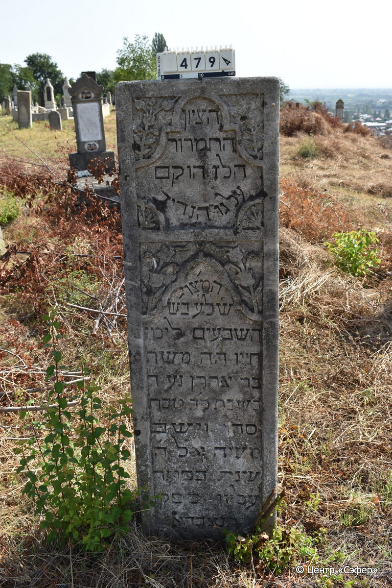

::: {style="font-size: 1em; margin-bottom: 1.2em"}
[Куба (центральное)](../cemeteries/QBA.html) > QBA0479
:::

```{r}
suppressPackageStartupMessages(library(tidyverse))
```


:::: {.columns}

::: {.column width="20%"}

```{r}
#| lightbox:
#|   group: photos



```
:::

::: {.column width="5%"}
:::

::: {.column width="74%"}

::: {.name-style}
Моше, сын Аарона
:::

::: {style="font-size: 1.2em;"}
משה בן אהרן
:::

:::: {.columns}
::: {.column width="5%"}
{width=1.3em}
:::

::: {.column style="width: 40%; padding-left: 0.2em;"}
  /  
:::

::: {.column width="5%"}
{width=1.3em}
:::

::: {.column style="width: 50%; padding-left: 0.2em;"}
01.01.1902* / 22.Te.5662
:::

::::


::: {.panel-tabset}

#### Эпитафия

```{r}
tibble(`Оригинал` = "הציון
התמרור
הלז הוקם
על גו הנדיב
המצוי׳
ש׳ל׳ע׳ בש׳
השבעים לימי
חייו ה׳ה משה
בר אהרן נ׳ע ד׳
בשבת כ׳ב טבת
סדר וישב
משה אל ה׳*
שנת בס״תר
עליון** לפק
תנצ״בהא",
       `Перевод` = "Знак
скорби
этот установлен
в память о щедром человеке, 
и замечательном 
навеки ушедшем в 
возрасте семидесяти лет 
от роду, уважаемом господине Моше,
сыне Аарона, да упокоится он в раю, <скончавшемся> в среду,
22 тевета,
и обратился
Моше ко Всевышнему
в тайне
великой (662) по малому летоисчислению,
да будет его душа завязана в узле жизни") |>
  mutate(`Оригинал` = str_split(`Оригинал`, "
"),
         `Перевод` = str_split(`Перевод`, "
")) |>
  unnest_longer(c(`Оригинал`, `Перевод`)) |> 
  mutate(id = 1:n()) |> 
  relocate(id, .before = Перевод) |> 
  rename(` ` = id) |> 
  knitr::kable(align = c("r", "c", "l"))
```

|||
|-|---|
|**Примечания**|*Исх 5:22
** Теилим 91:1|
|**Язык**      |иврит    |
|**Метки**     |     |
: {tbl-colwidths="[25,75]"}

#### Памятник

|||
|-|---|
|**Тип памятника**   |стела                                                                         |
|**Материал**        |известняк (следы эрозии)                                                     |
|**Размеры**         |149×44×19                                                                        |
|**Тип декора**      |архитектурно-орнаментальный, растительный                                                                        |
|**Элементы декора** |две фигурные ниши для текста в обрамлении цветочных композиций, у основания изображения подсвечников                                                                          |
|**Координаты**      |[41.3706781, 48.50788154](https://www.google.com/maps/place/41.3706781, 48.50788154)                    |
: {tbl-colwidths="[25,75]"}

#### Источник

|||
|-|---|
|**Место хранения**        |Архив полевых исследований Центра «Сэфер»     |
|**Контакты**              |students@sefer.ru    |
|**Ссылка**                |https://sfira.org        |
|**Исходный ID**           |  |
|**Условия использования** |[CC BY-NC 4.0](https://creativecommons.org/licenses/by-nc/4.0/deed.ru)     |
: {tbl-colwidths="[25,75]"}

:::

:::

::::

