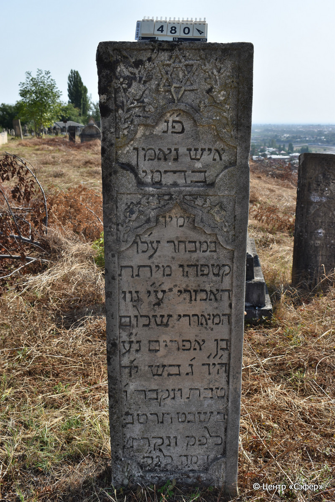

::: {style="font-size: 1em; margin-bottom: 1.2em"}
[Куба (центральное)](../cemeteries/QBA.html) > QBA0480
:::

```{r}
suppressPackageStartupMessages(library(tidyverse))
```


:::: {.columns}

::: {.column width="20%"}

```{r}
#| lightbox:
#|   group: photos



```
:::

::: {.column width="5%"}
:::

::: {.column width="74%"}

::: {.name-style}
Шалом, сын Эфраима
:::

::: {style="font-size: 1.2em;"}
שלום בן אפרים
:::

:::: {.columns}
::: {.column width="5%"}
{width=1.3em}
:::

::: {.column style="width: 40%; padding-left: 0.2em;"}
  /  
:::

::: {.column width="5%"}
{width=1.3em}
:::

::: {.column style="width: 50%; padding-left: 0.2em;"}
24.12.1901* / 14.Te.5662
:::

::::


::: {.panel-tabset}

#### Эпитафия

```{r}
tibble(`Оригинал` = "פ״נ״
איש נאמן
בדמי
ימיו
במבחר ע׳לו
קטפהו מיתת
האכזרי ע״י גוו
המאררי שלום
בן אפרים נ׳ע׳
ה׳י׳ד׳ ג׳ בש י׳ד
טבת ונקבר ו׳
בשבט תרס׳ב
לפק ונקתי
דמה לנ״ק",
       `Перевод` = "Здесь покоится
верный человек
на рассвете 
юности,
во цвете лет
сорванный жестокой
смертью от рук жестоких
неевреев Шалом,
сын Эфраима, да упокоится душа его в раю,
да отомстит Господь за его кровь, [скончавшийся] во вторник 14 
тевета и погребенный 6 
швата {5}662 года
по малому летоисчислению, и отомщу за
их кровь неотомщенную.") |>
  mutate(`Оригинал` = str_split(`Оригинал`, "
"),
         `Перевод` = str_split(`Перевод`, "
")) |>
  unnest_longer(c(`Оригинал`, `Перевод`)) |> 
  mutate(id = 1:n()) |> 
  relocate(id, .before = Перевод) |> 
  rename(` ` = id) |> 
  knitr::kable(align = c("r", "c", "l"))
```

|||
|-|---|
|**Примечания**| |
|**Язык**      |иврит    |
|**Метки**     |     |
: {tbl-colwidths="[25,75]"}

#### Памятник

|||
|-|---|
|**Тип памятника**   |стела                                                                         |
|**Материал**        |известняк (следы эрозии, следы краски)                                                     |
|**Размеры**         |160×46×18                                                                        |
|**Тип декора**      |архитектурно-орнаментальный, растительный, традиционная символика                                                                        |
|**Элементы декора** |две фигурные ниши для текста, наверху звезда Давида в обрамлении цветочных композиций, два цветочных композиций между нишами. У основания изображения подсвечников.                                                                          |
|**Координаты**      |[41.37066206, 48.50788423](https://www.google.com/maps/place/41.37066206, 48.50788423)                    |
: {tbl-colwidths="[25,75]"}

#### Источник

|||
|-|---|
|**Место хранения**        |Архив полевых исследований Центра «Сэфер»     |
|**Контакты**              |students@sefer.ru    |
|**Ссылка**                |https://sfira.org        |
|**Исходный ID**           |  |
|**Условия использования** |[CC BY-NC 4.0](https://creativecommons.org/licenses/by-nc/4.0/deed.ru)     |
: {tbl-colwidths="[25,75]"}

:::

:::

::::

