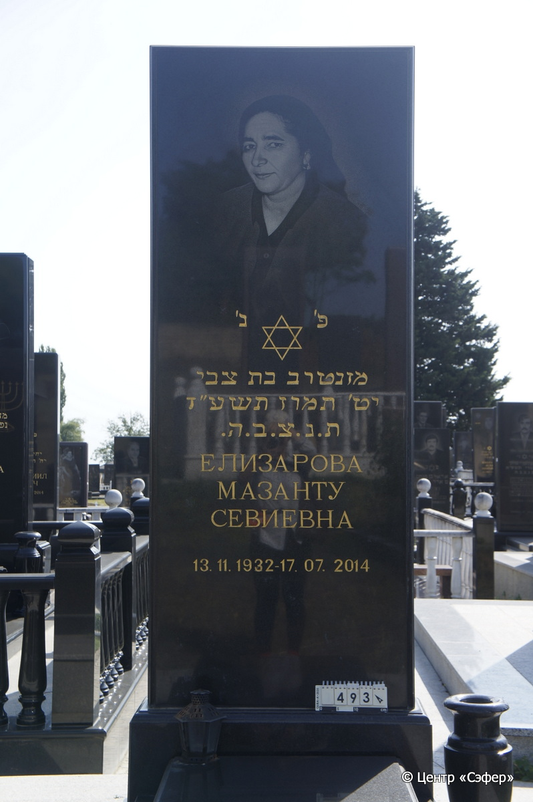
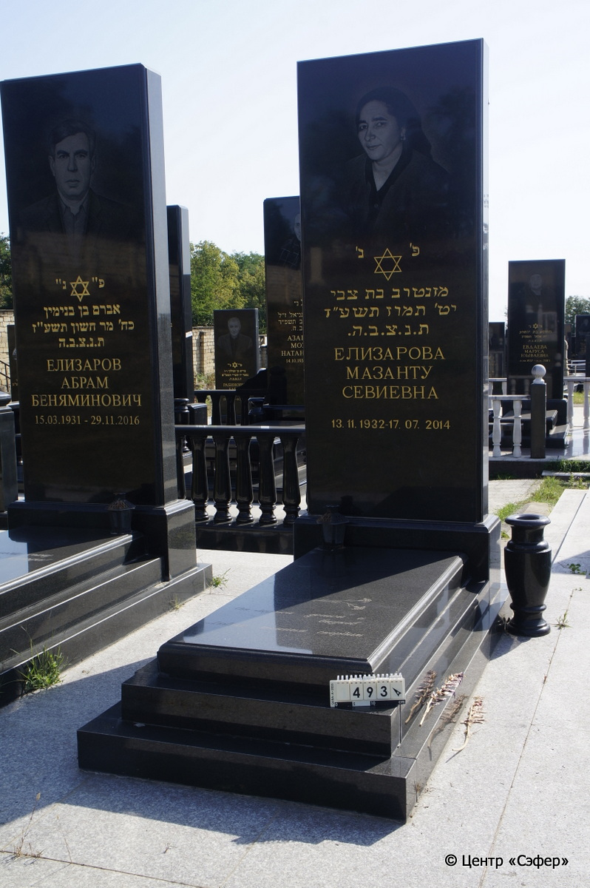

::: {style="font-size: 1em; margin-bottom: 1.2em"}
[Куба (центральное)](../cemeteries/QBA.html) > QBA0493
:::

```{r}
suppressPackageStartupMessages(library(tidyverse))
```


:::: {.columns}

::: {.column width="20%"}

```{r}
#| lightbox:
#|   group: photos




```
:::

::: {.column width="5%"}
:::

::: {.column width="74%"}

::: {.name-style}
ЕЛИЗАРОВА Мазанту, дочь Цви (Севиевна)
:::

::: {style="font-size: 1.2em;"}
מזנטוב בת צבי
:::

:::: {.columns}
::: {.column width="5%"}
{width=1.3em}
:::

::: {.column style="width: 40%; padding-left: 0.2em;"}
13.11.1932 /  
:::

::: {.column width="5%"}
{width=1.3em}
:::

::: {.column style="width: 50%; padding-left: 0.2em;"}
17.07.2014 / 19.Ta.5777
:::

::::


::: {.panel-tabset}

#### Эпитафия

```{r}
tibble(`Оригинал` = "פ׳נ׳
מזנטוב בת צבי
יט׳ תמוז תשע״ז
ת.נ.צ.ב.ה.
ЕЛИЗАРОВА
МАЗАНТУ
СЕВИЕВНА
13.11.1932 - 17.07.2014

снизу
От мужа детей и
внуков
Любим, помним, скорбим",
       `Перевод` = "Здесь покоится
Мазанту, дочь Цви,
[скончавшаяся] девятнадцатого таммуза {5}777 года,
да будет душа ее завязана в узле жизни
Елизарова
Мазанту
Севиевна
13.11.1932 - 17.07.2014

 
От мужа, детей и 
внуков
Любим, помним, скорбим") |>
  mutate(`Оригинал` = str_split(`Оригинал`, "
"),
         `Перевод` = str_split(`Перевод`, "
")) |>
  unnest_longer(c(`Оригинал`, `Перевод`)) |> 
  mutate(id = 1:n()) |> 
  relocate(id, .before = Перевод) |> 
  rename(` ` = id) |> 
  knitr::kable(align = c("r", "c", "l"))
```

|||
|-|---|
|**Примечания**| |
|**Язык**      |иврит, русский    |
|**Метки**     |     |
: {tbl-colwidths="[25,75]"}

#### Памятник

|||
|-|---|
|**Тип памятника**   |L-образный                                                                         |
|**Материал**        |гранит ( )                                                     |
|**Размеры**         |234×81×20  --- стела; 13×68×150  --- плита; 25×110×208  --- основание                                                                        |
|**Тип декора**      |растительный, традиционная символика                                                                        |
|**Элементы декора** |портрет женщины; золотая гравировка эпитафии; две скрещенных гвоздики на плите; звезда Давида на лицевой стороне стелы; на оборотной стороне золотая менора с огнями; металлический светильник (не прикрепленный) на плите слева; гранитная ваза справа от плиты                                                                          |
|**Координаты**      |[41.37114921, 48.5077486](https://www.google.com/maps/place/41.37114921, 48.5077486)                    |
: {tbl-colwidths="[25,75]"}

#### Источник

|||
|-|---|
|**Место хранения**        |Архив полевых исследований Центра «Сэфер»     |
|**Контакты**              |students@sefer.ru    |
|**Ссылка**                |https://sfira.org        |
|**Исходный ID**           |  |
|**Условия использования** |[CC BY-NC 4.0](https://creativecommons.org/licenses/by-nc/4.0/deed.ru)     |
: {tbl-colwidths="[25,75]"}

:::

:::

::::

