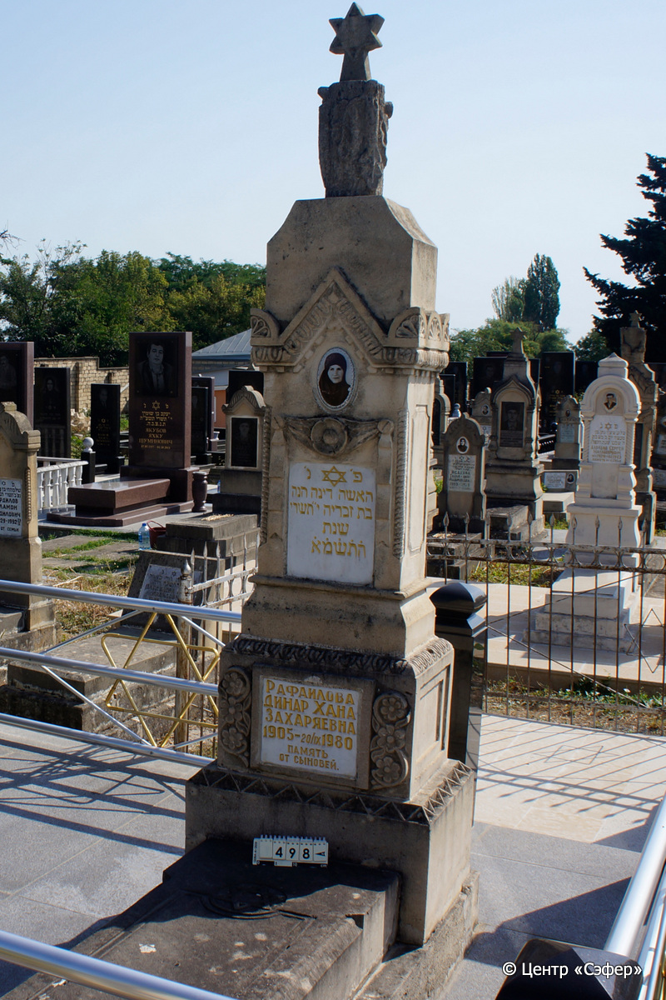
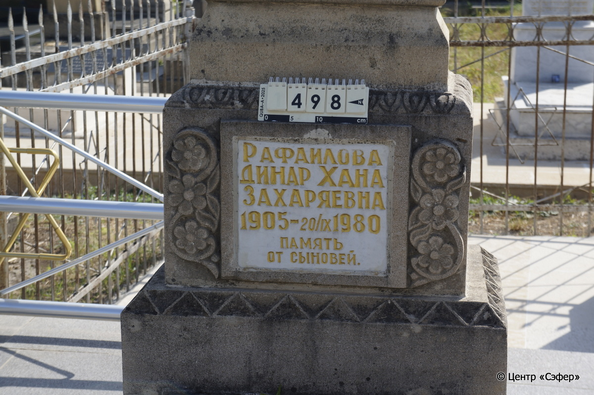

::: {style="font-size: 1em; margin-bottom: 1.2em"}
[Куба (центральное)](../cemeteries/QBA.html) > QBA0498
:::

```{r}
suppressPackageStartupMessages(library(tidyverse))
```


:::: {.columns}

::: {.column width="20%"}

```{r}
#| lightbox:
#|   group: photos




```
:::

::: {.column width="5%"}
:::

::: {.column width="74%"}

::: {.name-style}
РАФАИЛОВА Дина Хана, дочь Захарии (Динар Захаряевна)
:::

::: {style="font-size: 1.2em;"}
דינה חנה בת זכריה
:::

:::: {.columns}
::: {.column width="5%"}
{width=1.3em}
:::

::: {.column style="width: 40%; padding-left: 0.2em;"}
-.-.1905 /  
:::

::: {.column width="5%"}
{width=1.3em}
:::

::: {.column style="width: 50%; padding-left: 0.2em;"}
20.09.1980 / 10.Ti.5741
:::

::::


::: {.panel-tabset}

#### Эпитафия

```{r}
tibble(`Оригинал` = "פ׳נ׳
האשה דינה חנה
בת זכריה י״ תשרי
שנת
ה֗ת֗ש֗מ֗א֗
Рафаилова
Динар Хана
Захаряевна
1905 -20/IX 1980
память
от сыновей",
       `Перевод` = "Здесь покоится
женщина Дина Хана,
дочь Захарии, [скончавшаяся] десятого тишрея
5741
года
Рафаилова
Динар Хана
Захаряевна
1905 - 20.09.1980
память
от сыновей") |>
  mutate(`Оригинал` = str_split(`Оригинал`, "
"),
         `Перевод` = str_split(`Перевод`, "
")) |>
  unnest_longer(c(`Оригинал`, `Перевод`)) |> 
  mutate(id = 1:n()) |> 
  relocate(id, .before = Перевод) |> 
  rename(` ` = id) |> 
  knitr::kable(align = c("r", "c", "l"))
```

|||
|-|---|
|**Примечания**| |
|**Язык**      |иврит, русский    |
|**Метки**     |сыновья    |
: {tbl-colwidths="[25,75]"}

#### Памятник

|||
|-|---|
|**Тип памятника**   |L-образный                                                                         |
|**Материал**        |песчаник, мрамор (следы эрозии; незначительные сколы; следы цементного раствора; керамический медальон с фотопортретом женщины; две мраморных таблички с текстом.)                                                     |
|**Размеры**         |265×75×53  --- стела; 22×59×127  --- плита; 19×81×191  --- основание                                                                        |
|**Тип декора**      |архитектурно-орнаментальный, растительный, традиционная символика                                                                        |
|**Элементы декора** |навершие со звездой Давида и срубленным деревом с обломленными ветвями и поникшими дубовыми листьями; скат-«крыша» с геометрическим узором и шестью пальметками с цветками по периметру; керамический медальон с фотопортретом и узорной обводкой; портал с цветком в завершении; две витые полуколонны; справа и слева геометрический орнамент; в основании стелы, справа и слева от мраморной таблички цветы; по периметру геометрический орнамент; две мраморных таблички с золотой гравировкой эпитафии;  в верхней табличке – звезда Давида над эпитафией; на основании  – звезда Давида в круглой нише и геометрический орнамент                                                                          |
|**Координаты**      |[41.37103744, 48.5077481](https://www.google.com/maps/place/41.37103744, 48.5077481)                    |
: {tbl-colwidths="[25,75]"}

#### Источник

|||
|-|---|
|**Место хранения**        |Архив полевых исследований Центра «Сэфер»     |
|**Контакты**              |students@sefer.ru    |
|**Ссылка**                |https://sfira.org        |
|**Исходный ID**           |  |
|**Условия использования** |[CC BY-NC 4.0](https://creativecommons.org/licenses/by-nc/4.0/deed.ru)     |
: {tbl-colwidths="[25,75]"}

:::

:::

::::

