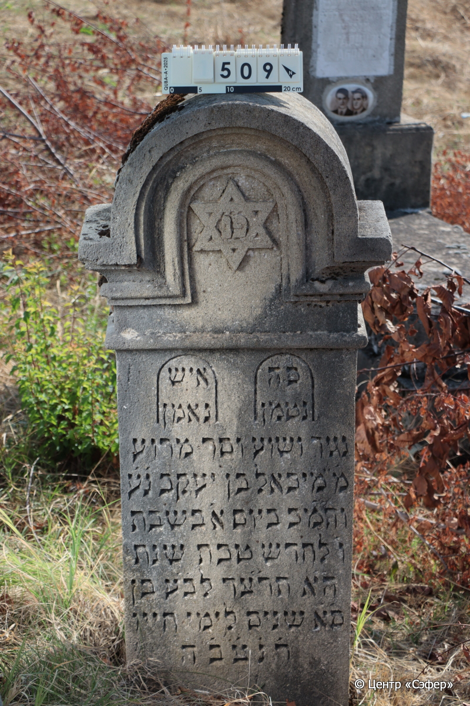
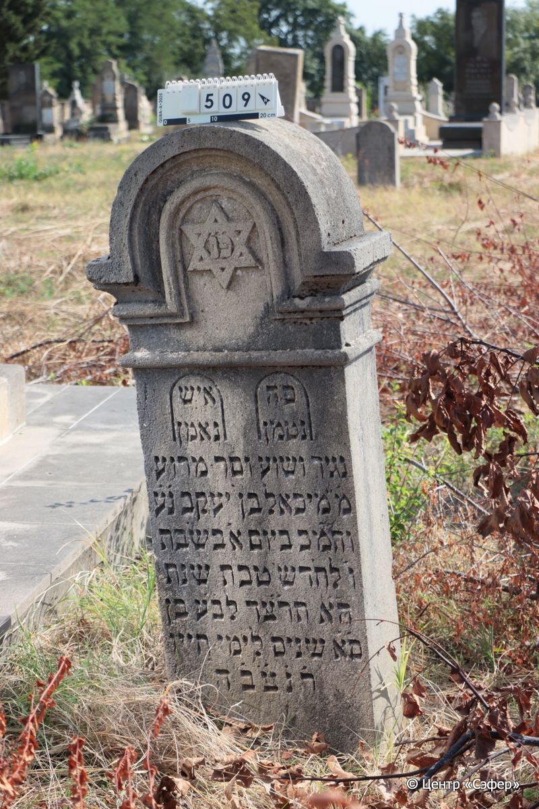

::: {style="font-size: 1em; margin-bottom: 1.2em"}
[Куба (центральное)](../cemeteries/QBA.html) > QBA0509
:::

```{r}
suppressPackageStartupMessages(library(tidyverse))
```


:::: {.columns}

::: {.column width="20%"}

```{r}
#| lightbox:
#|   group: photos




```
:::

::: {.column width="5%"}
:::

::: {.column width="74%"}

::: {.name-style}
Михаэль, сын Иакова
:::

::: {style="font-size: 1.2em;"}
מיכאל בן יעקב
:::

:::: {.columns}
::: {.column width="5%"}
{width=1.3em}
:::

::: {.column style="width: 40%; padding-left: 0.2em;"}
  /  
:::

::: {.column width="5%"}
{width=1.3em}
:::

::: {.column style="width: 50%; padding-left: 0.2em;"}
24.12.1933* / 6.Te.5694
:::

::::


::: {.panel-tabset}

#### Эпитафия

```{r}
tibble(`Оригинал` = "פ׳נ׳
справа
פה
נטמן
слева
איש נאמן
по центру
נגיד ושוע וסר מרוע
מ״ מיכאל בן יעקב נ׳ע׳
והמ״כ ביום א׳ בשבת
ו׳ לחדש טבת שנת
ה״א תר״צד לב׳ע׳ בן
ס״א שנים לימי חייו
ת֗נ֗צ֗ב֗ה֗",
       `Перевод` = "Здесь покоится,

здесь 
покоится

верный человек,

благородный и знатный и избегающий зла, 
господин Михаэль, сын Яакова. 
Скончался в воскресенье, 
6 числа месяца тевет, 
5694 года от сотворения мира,
в возрасте 61 года, пусть душа его будет в Эдеме. 
Да будет душа его завязана в узел жизни.") |>
  mutate(`Оригинал` = str_split(`Оригинал`, "
"),
         `Перевод` = str_split(`Перевод`, "
")) |>
  unnest_longer(c(`Оригинал`, `Перевод`)) |> 
  mutate(id = 1:n()) |> 
  relocate(id, .before = Перевод) |> 
  rename(` ` = id) |> 
  knitr::kable(align = c("r", "c", "l"))
```

|||
|-|---|
|**Примечания**| |
|**Язык**      |иврит    |
|**Метки**     |     |
: {tbl-colwidths="[25,75]"}

#### Памятник

|||
|-|---|
|**Тип памятника**   |стела                                                                         |
|**Материал**        |известняк (следы эрозии; сколы)                                                     |
|**Размеры**         |130×57×23  --- стела                                                                        |
|**Тип декора**      |архитектурно-орнаментальный, традиционная символика                                                                        |
|**Элементы декора** |полукруглое завершение; портал со звездой Давида в нем; два портала с началом текста эпитафии.                                                                          |
|**Координаты**      |[41.37070918, 48.50791005](https://www.google.com/maps/place/41.37070918, 48.50791005)                    |
: {tbl-colwidths="[25,75]"}

#### Источник

|||
|-|---|
|**Место хранения**        |Архив полевых исследований Центра «Сэфер»     |
|**Контакты**              |students@sefer.ru    |
|**Ссылка**                |https://sfira.org        |
|**Исходный ID**           |  |
|**Условия использования** |[CC BY-NC 4.0](https://creativecommons.org/licenses/by-nc/4.0/deed.ru)     |
: {tbl-colwidths="[25,75]"}

:::

:::

::::

