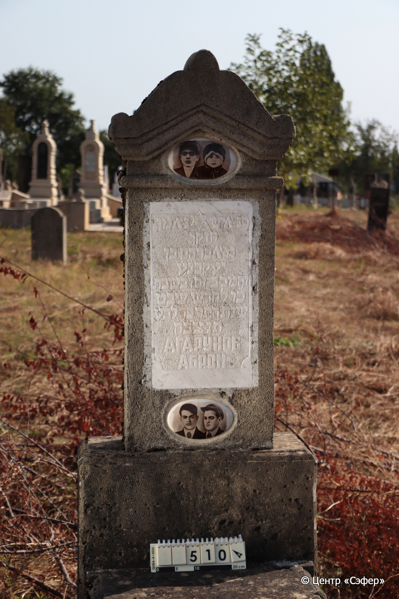
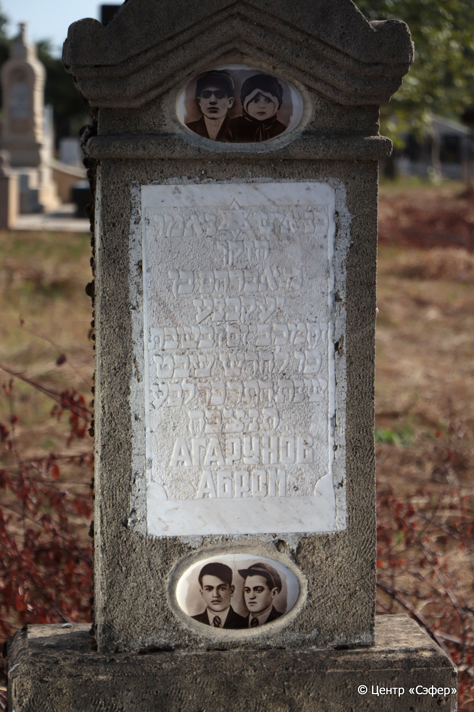
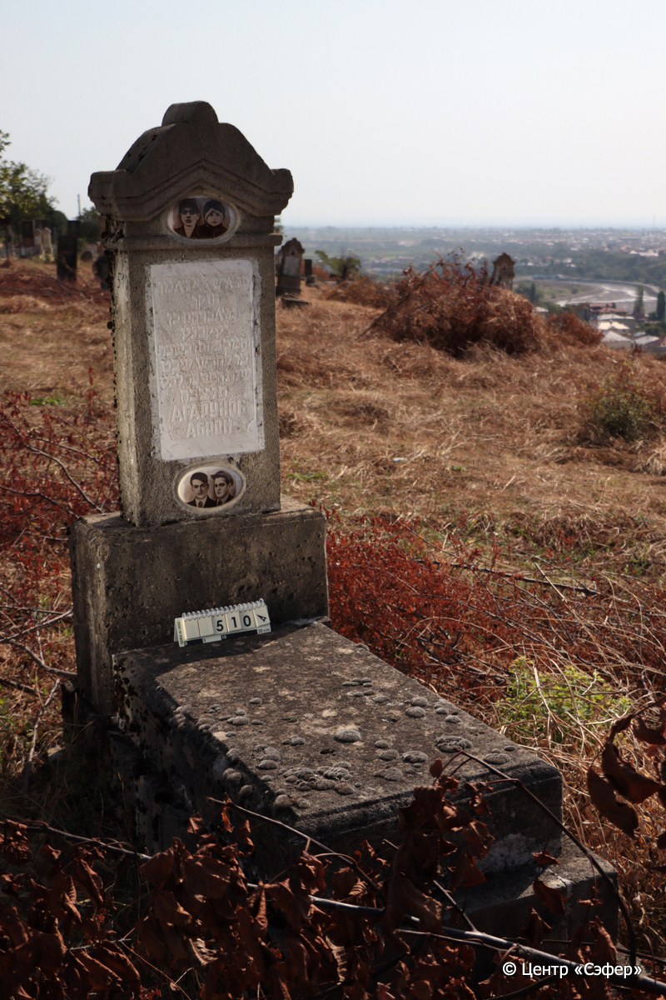

::: {style="font-size: 1em; margin-bottom: 1.2em"}
[Куба (центр.) Азербайджан](../cemeteries/QBA.html) > QBA0510
:::

```{r}
suppressPackageStartupMessages(library(tidyverse))
```


:::: {.columns}

::: {.column width="20%"}

```{r}
#| lightbox:
#|   group: photos





```
:::

::: {.column width="5%"}
:::

::: {.column width="74%"}

::: {.name-style}
АГАРУНОВ Абром, сын Иякова
:::

::: {style="font-size: 1.2em;"}
אברהם בן יעקב
:::

:::: {.columns}
::: {.column width="5%"}
{width=1.3em}
:::

::: {.column style="width: 40%; padding-left: 0.2em;"}
  /  
:::

::: {.column width="5%"}
{width=1.3em}
:::

::: {.column style="width: 50%; padding-left: 0.2em;"}
01.02.1924* / 26.Sh.5684
:::

::::


::: {.panel-tabset}

#### Эпитафия

```{r}
tibble(`Оригинал` = "פנ״ איש נאמן
הזקן
מ אברהם בן
יעקב נ׳ע׳
ו֗ה֗מ֗כ֗ ביום ו֗ בשבת 
כ״ו לחדש שבט
שנת ה֗ת֗ר֗פ֗ד֗ לב״ע
ת֗נ֗צ֗ב֗ה֗
Агарунов
Абром",
       `Перевод` = "здесь похоронен верный человек,
старец,
Господин Авраам, сын 
Яакова, да упокоится душа его в раю. 
Скончался в пятницу
26 числа месяца шват 
5684 год от сотворения мира. 
Да будет душа его связана в узле жизни.
Агарунов
Абром") |>
  mutate(`Оригинал` = str_split(`Оригинал`, "
"),
         `Перевод` = str_split(`Перевод`, "
")) |>
  unnest_longer(c(`Оригинал`, `Перевод`)) |> 
  mutate(id = 1:n()) |> 
  relocate(id, .before = Перевод) |> 
  rename(` ` = id) |> 
  knitr::kable(align = c("r", "c", "l"))
```

|||
|-|---|
|**Примечания**| |
|**Язык**      |иврит, русский    |
|**Метки**     |муж


    |
: {tbl-colwidths="[25,75]"}

#### Памятник

|||
|-|---|
|**Тип памятника**   |L-образный                                                                         |
|**Материал**        |известняк, мрамор (два керамических медальона с парными фотопортретами; мраморная табличка с текстом эпитафии; трещены)                                                     |
|**Размеры**         |155×64×29  --- стела; 112×60×21  --- плита; 24×81×182  --- основание                                                                        |
|**Тип декора**      |архитектурно-орнаментальный, традиционная символика                                                                        |
|**Элементы декора** |фигурное завершение; два керамических медальона с фотопортретами: верхний с мужчиной и ребенком, нижний с двумя мужчинами; мраморная табличка: текст эпитафии в фигурной раме, в верхней части звезда Давида                                                                          |
|**Координаты**      |[41.37071541, 48.50794494](https://www.google.com/maps/place/41.37071541, 48.50794494)                    |
: {tbl-colwidths="[25,75]"}

#### Источник

|||
|-|---|
|**Место хранения**        |Архив полевых исследований Центра «Сэфер»     |
|**Контакты**              |students@sefer.ru    |
|**Ссылка**                |https://sfira.org        |
|**Исходный ID**           |  |
|**Условия использования** |[CC BY-NC 4.0](https://creativecommons.org/licenses/by-nc/4.0/deed.ru)     |
: {tbl-colwidths="[25,75]"}

:::

:::

::::

