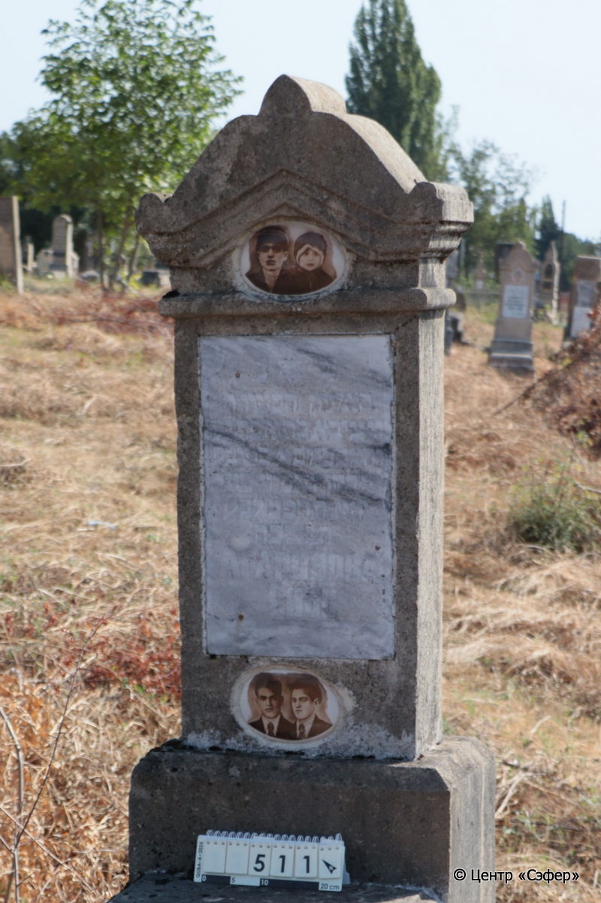
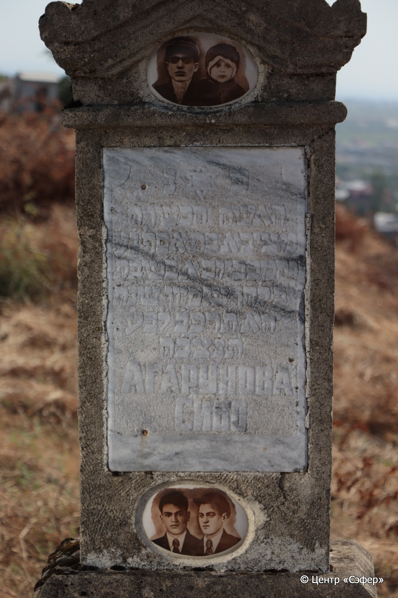
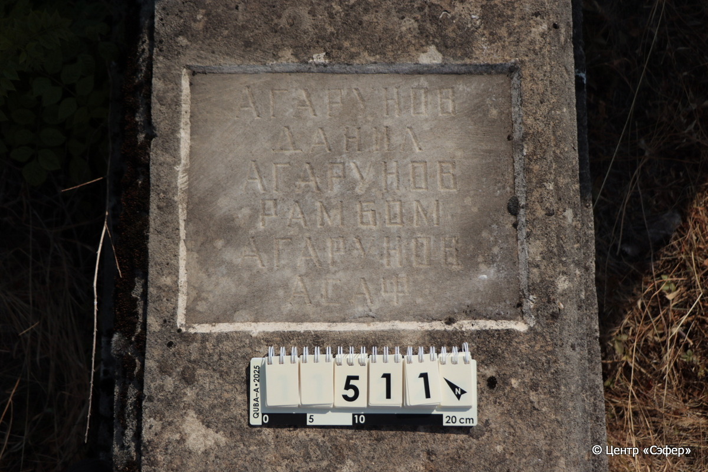
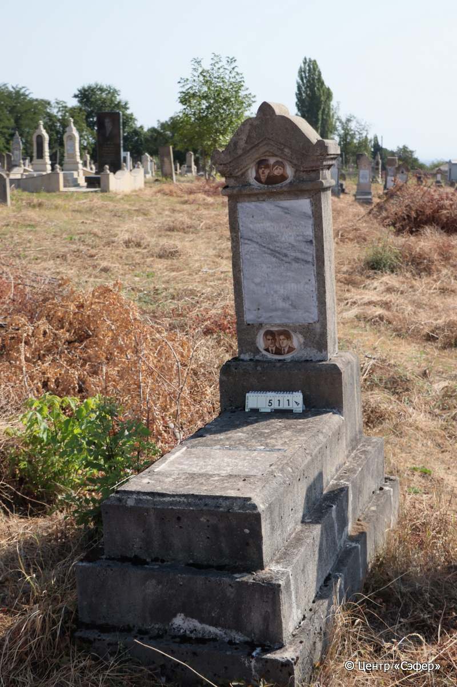

::: {style="font-size: 1em; margin-bottom: 1.2em"}
[Куба (центральное)](../cemeteries/QBA.html) > QBA0511
:::

```{r}
suppressPackageStartupMessages(library(tidyverse))
```


:::: {.columns}

::: {.column width="20%"}

```{r}
#| lightbox:
#|   group: photos






```
:::

::: {.column width="5%"}
:::

::: {.column width="74%"}

::: {.name-style}
АГАРУНОВА Сибо, дочь Асафа
:::

::: {style="font-size: 1.2em;"}
ציבא בת אסף דניאל
:::

:::: {.columns}
::: {.column width="5%"}
{width=1.3em}
:::

::: {.column style="width: 40%; padding-left: 0.2em;"}
  /  
:::

::: {.column width="5%"}
{width=1.3em}
:::

::: {.column style="width: 50%; padding-left: 0.2em;"}
  / 12.Si.5682
:::

::::

---

::: {.name-style}
АГАРУНОВ Даниэль Данил
:::

::: {style="font-size: 1.2em;"}

:::

:::: {.columns}
::: {.column width="5%"}
{width=1.3em}
:::

::: {.column style="width: 40%; padding-left: 0.2em;"}
  /  
:::

::: {.column width="5%"}
{width=1.3em}
:::

::: {.column style="width: 50%; padding-left: 0.2em;"}
  /  
:::

::::

---

::: {.name-style}
АГАРУНОВ Рамбам Рамбом
:::

::: {style="font-size: 1.2em;"}

:::

:::: {.columns}
::: {.column width="5%"}
{width=1.3em}
:::

::: {.column style="width: 40%; padding-left: 0.2em;"}
  /  
:::

::: {.column width="5%"}
{width=1.3em}
:::

::: {.column style="width: 50%; padding-left: 0.2em;"}
  /  
:::

::::

---

::: {.name-style}
АГАРУНОВ Асаф
:::

::: {style="font-size: 1.2em;"}

:::

:::: {.columns}
::: {.column width="5%"}
{width=1.3em}
:::

::: {.column style="width: 40%; padding-left: 0.2em;"}
  /  
:::

::: {.column width="5%"}
{width=1.3em}
:::

::: {.column style="width: 50%; padding-left: 0.2em;"}
  /  
:::

::::


::: {.panel-tabset}

#### Эпитафия

```{r}
tibble(`Оригинал` = "сверху
פ֗ נ֗
האשה הכשרה
מ׳ ציבא בת אסף נ״ע
והמכ ביום א בשבת
י֗ב֗ לחדש סיון שנת
ה֗א֗ ת֗ר֗פ֗ב֗ לב״ע
ת֗נ֗צ֗ב֗ה֗
АГАРУНОВА
СИБО

снизу
АГАРУНОВ
ДАНИЛ
АГАРУНОВ
РАМБОМ
АГАРУНОВ 
АСАФ",
       `Перевод` = "
Здесь покоится 
праведная женщина,
Сибо, дочь Асафа, да будет душа его в эдеме. 
Скончалась в воскресенье,
12 числа месяца сивана,
 5682 года от сотворения мира.
Да будет душа ее связана в узле жизни.
Агарунова
Сибо

 
Агарунов
Данил
Агарунов
Рамбом
Агарунов
Асаф") |>
  mutate(`Оригинал` = str_split(`Оригинал`, "
"),
         `Перевод` = str_split(`Перевод`, "
")) |>
  unnest_longer(c(`Оригинал`, `Перевод`)) |> 
  mutate(id = 1:n()) |> 
  relocate(id, .before = Перевод) |> 
  rename(` ` = id) |> 
  knitr::kable(align = c("r", "c", "l"))
```

|||
|-|---|
|**Примечания**| |
|**Язык**      |иврит, русский    |
|**Метки**     |     |
: {tbl-colwidths="[25,75]"}

#### Памятник

|||
|-|---|
|**Тип памятника**   |L-образный                                                                         |
|**Материал**        |известняк, мрамор (следы эрозии; цементного раствора; два керамических медальона с фото; две мраморные таблички с текстом эпитафии; сколы; трещины)                                                     |
|**Размеры**         |148×54×32  --- стела; 22×57×115  --- плита; 20×80×181  --- основание                                                                        |
|**Тип декора**      |архитектурно-орнаментальный, традиционная символика                                                                        |
|**Элементы декора** |треугольное завершение с волютами; два парных керамических фотопортрета: верхний с мужчиной и ребенком и нижний с двумя мужчинами; звезда Давида на мраморной табличке с текстом эпитафии                                                                          |
|**Координаты**      |[41.37066892, 48.50793184](https://www.google.com/maps/place/41.37066892, 48.50793184)                    |
: {tbl-colwidths="[25,75]"}

#### Источник

|||
|-|---|
|**Место хранения**        |Архив полевых исследований Центра «Сэфер»     |
|**Контакты**              |students@sefer.ru    |
|**Ссылка**                |https://sfira.org        |
|**Исходный ID**           |  |
|**Условия использования** |[CC BY-NC 4.0](https://creativecommons.org/licenses/by-nc/4.0/deed.ru)     |
: {tbl-colwidths="[25,75]"}

:::

:::

::::

