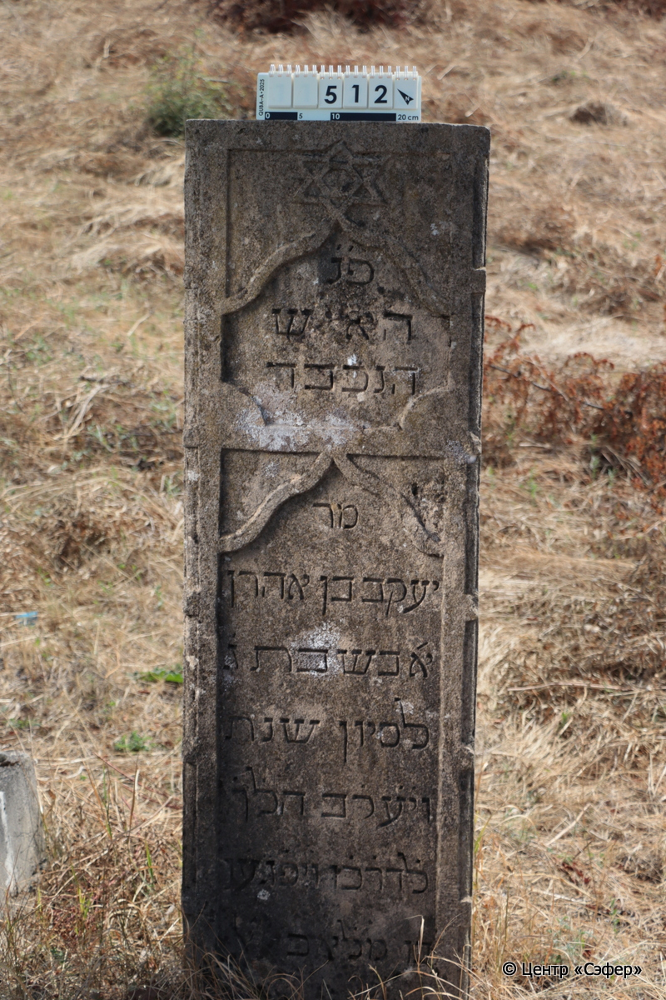
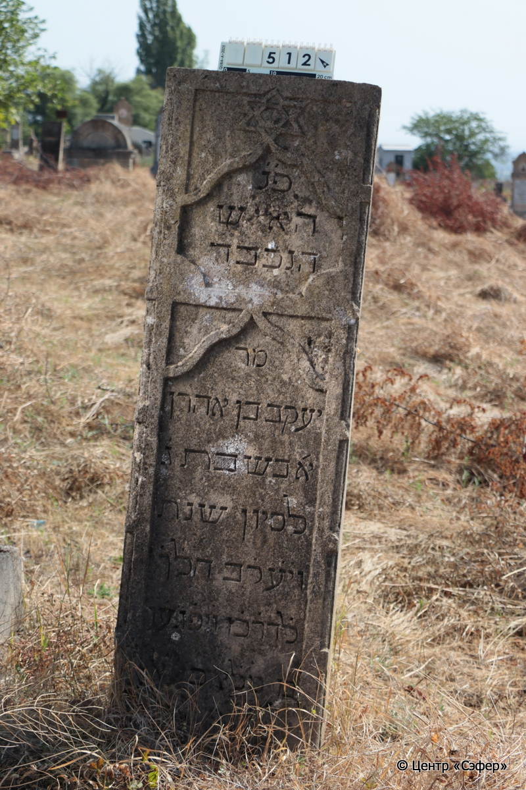

::: {style="font-size: 1em; margin-bottom: 1.2em"}
[Куба (центральное)](../cemeteries/QBA.html) > QBA0512
:::

```{r}
suppressPackageStartupMessages(library(tidyverse))
```


:::: {.columns}

::: {.column width="20%"}

```{r}
#| lightbox:
#|   group: photos




```
:::

::: {.column width="5%"}
:::

::: {.column width="74%"}

::: {.name-style}
Яаков, сын Аарона
:::

::: {style="font-size: 1.2em;"}
יעקב בן אהרן
:::

:::: {.columns}
::: {.column width="5%"}
{width=1.3em}
:::

::: {.column style="width: 40%; padding-left: 0.2em;"}
  /  
:::

::: {.column width="5%"}
{width=1.3em}
:::

::: {.column style="width: 50%; padding-left: 0.2em;"}
08.06.1902* / 03.Si.5662
:::

::::


::: {.panel-tabset}

#### Эпитафия

```{r}
tibble(`Оригинал` = "פ׳ נ׳
האיש
הנכבד
מר
יעקב בן אהרן
א׳ בשבת ג׳
לסיון שנת 
וי֗ע֗ק֗ב הל֗ך֗
ל֗דר֗כ֗ו ויפ֗גע֗ו
ב֗ו מל֗אכי אל׳",
       `Перевод` = "Здесь покоится 
человек
уважаемый
господин,
Яаков, сын Аарона.
<Скончался> в воскресенье, 3
сивана, год
«А Иаков пошел
своей дорогой,
и встретили его ангелы Всевышнего* {662}**.") |>
  mutate(`Оригинал` = str_split(`Оригинал`, "
"),
         `Перевод` = str_split(`Перевод`, "
")) |>
  unnest_longer(c(`Оригинал`, `Перевод`)) |> 
  mutate(id = 1:n()) |> 
  relocate(id, .before = Перевод) |> 
  rename(` ` = id) |> 
  knitr::kable(align = c("r", "c", "l"))
```

|||
|-|---|
|**Примечания**|*Быт. 32:2

Год зашифрован с помощью хроностиха в виде цитаты, в которой числовые значения отмеченных букв составляют 662.|
|**Язык**      |иврит    |
|**Метки**     |     |
: {tbl-colwidths="[25,75]"}

#### Памятник

|||
|-|---|
|**Тип памятника**   |стела                                                                         |
|**Материал**        |известняк (следы эрозии; сколы)                                                     |
|**Размеры**         |153×46×23                                                                        |
|**Тип декора**      |архитектурно-орнаментальный, традиционная символика                                                                        |
|**Элементы декора** |две фигурные ниши для текста; звезда Давида над текстом эпитафии                                                                          |
|**Координаты**      |[41.37065965, 48.50793575](https://www.google.com/maps/place/41.37065965, 48.50793575)                    |
: {tbl-colwidths="[25,75]"}

#### Источник

|||
|-|---|
|**Место хранения**        |Архив полевых исследований Центра «Сэфер»     |
|**Контакты**              |students@sefer.ru    |
|**Ссылка**                |https://sfira.org        |
|**Исходный ID**           |  |
|**Условия использования** |[CC BY-NC 4.0](https://creativecommons.org/licenses/by-nc/4.0/deed.ru)     |
: {tbl-colwidths="[25,75]"}

:::

:::

::::

