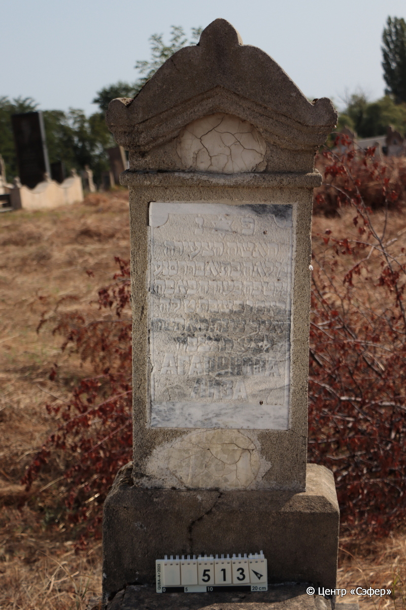
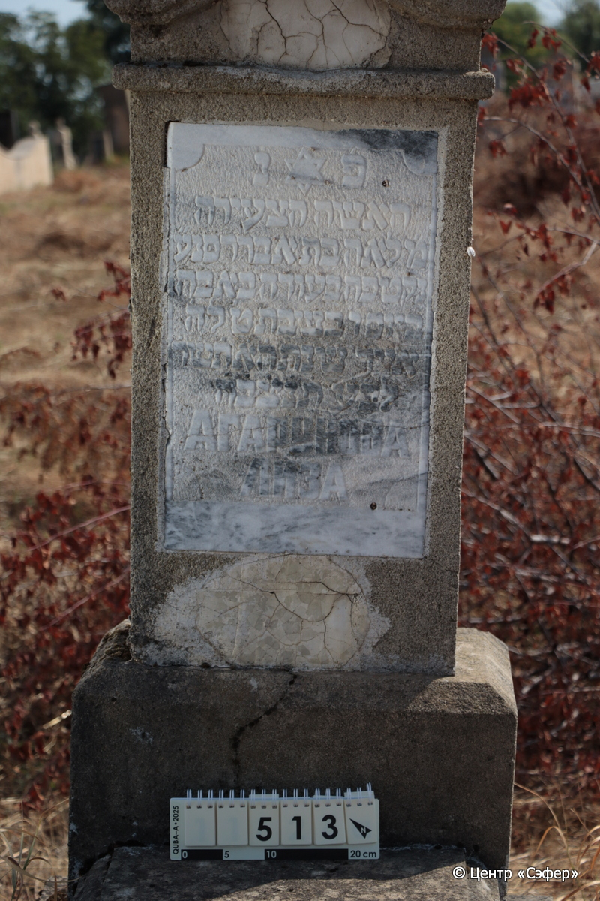
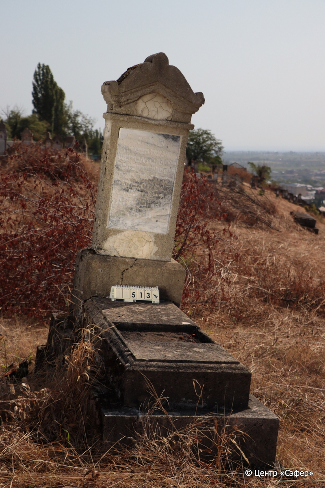

::: {style="font-size: 1em; margin-bottom: 1.2em"}
[Куба (центр.) Азербайджан](../cemeteries/QBA.html) > QBA0513
:::

```{r}
suppressPackageStartupMessages(library(tidyverse))
```


:::: {.columns}

::: {.column width="20%"}

```{r}
#| lightbox:
#|   group: photos





```
:::

::: {.column width="5%"}
:::

::: {.column width="74%"}

::: {.name-style}
АГАРУНОВА Лиза, дочь Авраама
:::

::: {style="font-size: 1.2em;"}
לאה בת אברהם
:::

:::: {.columns}
::: {.column width="5%"}
{width=1.3em}
:::

::: {.column style="width: 40%; padding-left: 0.2em;"}
  /  
:::

::: {.column width="5%"}
{width=1.3em}
:::

::: {.column style="width: 50%; padding-left: 0.2em;"}
02.05.1944* / 09.Iy.5704
:::

::::


::: {.panel-tabset}

#### Эпитафия

```{r}
tibble(`Оригинал` = "פ֗ נ֗
האשה הצעירה
מ֗ לאה בת אבררם נ״ ע
נקטפה בעודה באבה
ביום ו׳ בשבת ט׳ לח׳
אייר שנת ה֗א֗ ת֗ש֗ד֗
לב״ע ת֗נ֗צ֗ב֗ה֗
АГАРУНОВА
ЛИЗА",
       `Перевод` = "Здесь покоится
молодая женщина, госпожа, 
Леа, дочь Авраама. 
Скончалась преждевременно.
Умерла в пятницу, 9
ияра {5}704 года 
от сотворения мира. Да будет душа ее завязана в узле жизни.
Агарунова 
Лиза") |>
  mutate(`Оригинал` = str_split(`Оригинал`, "
"),
         `Перевод` = str_split(`Перевод`, "
")) |>
  unnest_longer(c(`Оригинал`, `Перевод`)) |> 
  mutate(id = 1:n()) |> 
  relocate(id, .before = Перевод) |> 
  rename(` ` = id) |> 
  knitr::kable(align = c("r", "c", "l"))
```

|||
|-|---|
|**Примечания**| |
|**Язык**      |иврит, русский    |
|**Метки**     |преждевременная смерть


    |
: {tbl-colwidths="[25,75]"}

#### Памятник

|||
|-|---|
|**Тип памятника**   |L-образный                                                                         |
|**Материал**        |известняк, мрамор (следы эрозии; трещины; сколы; ниша на плите для таблички; два эллипса для фото)                                                     |
|**Размеры**         |149×54×31  --- стела; 19×53×116  --- плита; 36×80×180  --- основание                                                                        |
|**Тип декора**      |архитектурно-орнаментальный, традиционная символика                                                                        |
|**Элементы декора** |треугольное завершение с волютами; звезда Давида над текстом эпитафии в мраморной табличке                                                                          |
|**Координаты**      |[41.3706372, 48.50793597](https://www.google.com/maps/place/41.3706372, 48.50793597)                    |
: {tbl-colwidths="[25,75]"}

#### Источник

|||
|-|---|
|**Место хранения**        |Архив полевых исследований Центра «Сэфер»     |
|**Контакты**              |students@sefer.ru    |
|**Ссылка**                |https://sfira.org        |
|**Исходный ID**           |  |
|**Условия использования** |[CC BY-NC 4.0](https://creativecommons.org/licenses/by-nc/4.0/deed.ru)     |
: {tbl-colwidths="[25,75]"}

:::

:::

::::

