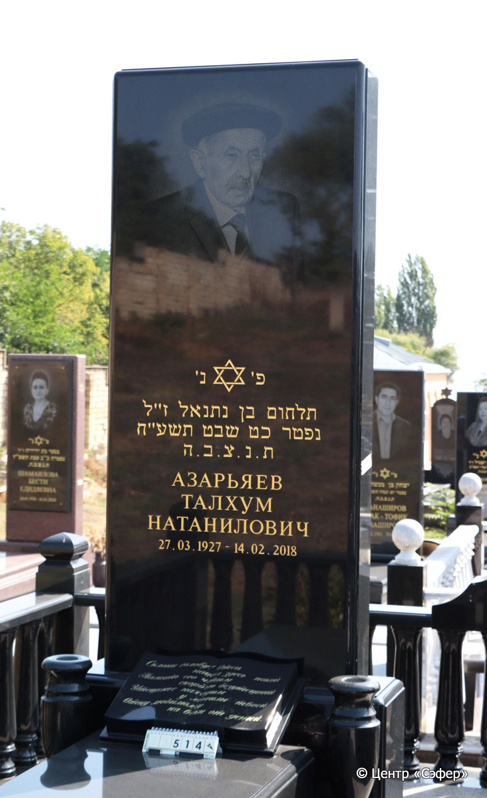
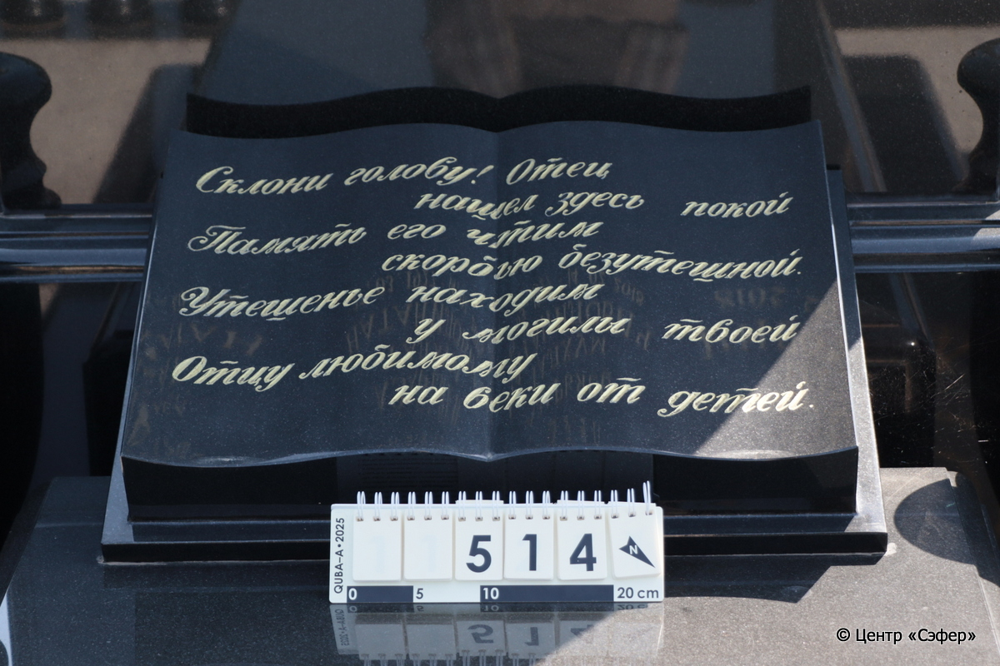
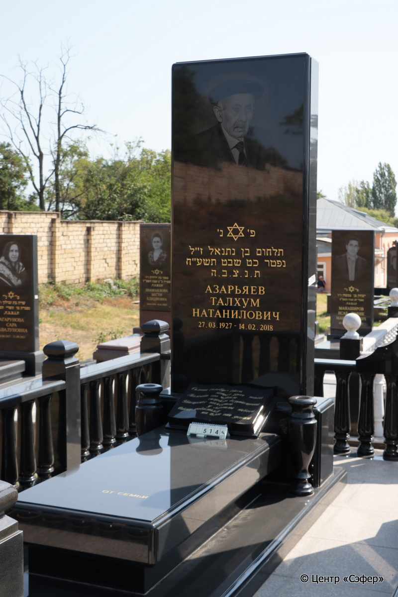

::: {style="font-size: 1em; margin-bottom: 1.2em"}
[Куба (центральное)](../cemeteries/QBA.html) > QBA0514
:::

```{r}
suppressPackageStartupMessages(library(tidyverse))
```


:::: {.columns}

::: {.column width="20%"}

```{r}
#| lightbox:
#|   group: photos





```
:::

::: {.column width="5%"}
:::

::: {.column width="74%"}

::: {.name-style}
АЗАРЬЯЕВ Талхум, сын Натаниэля (Натанилович)
:::

::: {style="font-size: 1.2em;"}
תלחום בן נתנאל
:::

:::: {.columns}
::: {.column width="5%"}
{width=1.3em}
:::

::: {.column style="width: 40%; padding-left: 0.2em;"}
27.03.1927 /  
:::

::: {.column width="5%"}
{width=1.3em}
:::

::: {.column style="width: 50%; padding-left: 0.2em;"}
14.02.2018 / 29.Sh.5778
:::

::::


::: {.panel-tabset}

#### Эпитафия

```{r}
tibble(`Оригинал` = "сверху
פ׳ נ׳
תלחום בן נתנאל ז״ל
נפטר כט שבט תשע״ח
ת. נ. צ. ב. ה.
АЗАРЬЯЕВ
ТАЛХУМ
НАТАНИЛОВИЧ
27.03.1927 - 14. 02. 2018

снизу
 Склони голову! Отец
нашел здесь покой
Память его чтим
скорбью безутешной. 
Утешенье находим
у могилы твоей
Отцу любимому
на веки от детей.
ОТ СЕМЬИ",
       `Перевод` = "
здесь покоится
Тальхом, сын Натаниэля покойного.
Умер 29 швата {5}778 года.
Да будет душа его связана в узеле жизни.
АЗАРЬЯЕВ
ТАЛХУМ
НАТАНИЛОВИЧ
27.03.1927 – 14.02.2018

 
 Склони голову! Отец
нашел здесь покой.
Память его чтим
скорбью безутешной.
Утешенье находим
у могилы твоей.
Отцу любимому
на веки от детей.
ОТ СЕМЬИ") |>
  mutate(`Оригинал` = str_split(`Оригинал`, "
"),
         `Перевод` = str_split(`Перевод`, "
")) |>
  unnest_longer(c(`Оригинал`, `Перевод`)) |> 
  mutate(id = 1:n()) |> 
  relocate(id, .before = Перевод) |> 
  rename(` ` = id) |> 
  knitr::kable(align = c("r", "c", "l"))
```

|||
|-|---|
|**Примечания**| |
|**Язык**      |иврит, русский    |
|**Метки**     |     |
: {tbl-colwidths="[25,75]"}

#### Памятник

|||
|-|---|
|**Тип памятника**   |L-образный                                                                         |
|**Материал**        |габбро-диорит (две габро-диоритные вазы справа и слева от плиты; книга из габро-диорита у основания стелы)                                                     |
|**Размеры**         |268×119×39  --- стела; 36×79×178  --- плита; 13×127×287  --- основание                                                                        |
|**Тип декора**      |традиционная символика                                                                        |
|**Элементы декора** |звезда Давида над текстом эпитафии; золотая гравировка букв; книга с текстом у основания стелы; на обратной стороне менора со звездой Давида, внизу домик для свечи                                                                          |
|**Координаты**      |[41.37119114, 48.50781245](https://www.google.com/maps/place/41.37119114, 48.50781245)                    |
: {tbl-colwidths="[25,75]"}

#### Источник

|||
|-|---|
|**Место хранения**        |Архив полевых исследований Центра «Сэфер»     |
|**Контакты**              |students@sefer.ru    |
|**Ссылка**                |https://sfira.org        |
|**Исходный ID**           |  |
|**Условия использования** |[CC BY-NC 4.0](https://creativecommons.org/licenses/by-nc/4.0/deed.ru)     |
: {tbl-colwidths="[25,75]"}

:::

:::

::::

