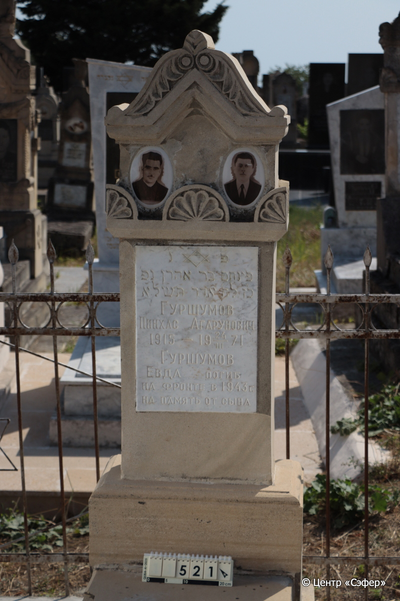
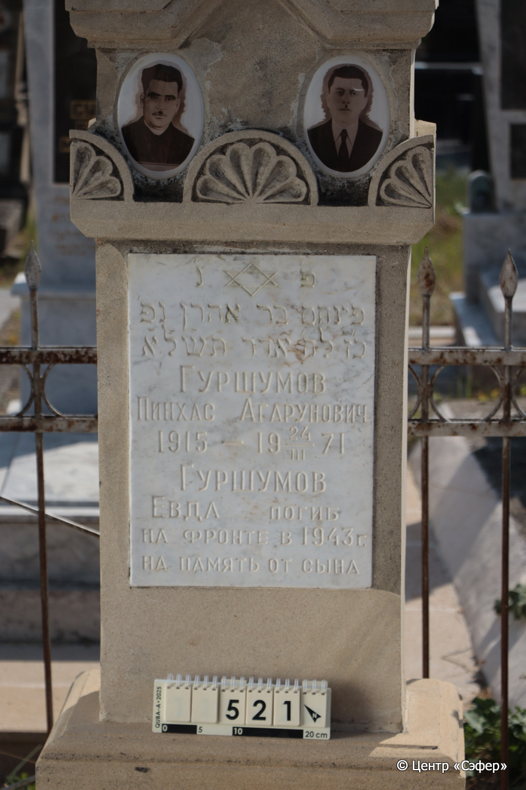
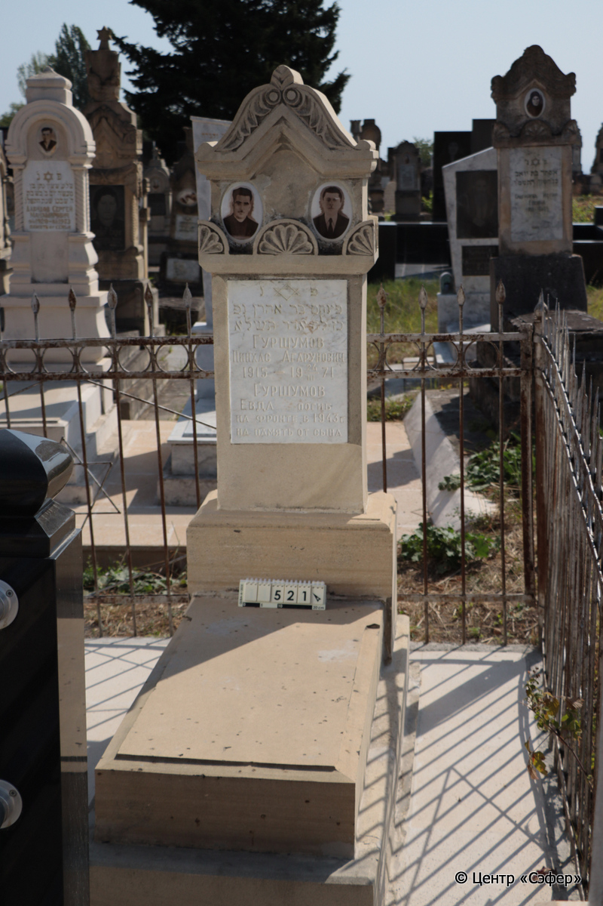

::: {style="font-size: 1em; margin-bottom: 1.2em"}
[Куба (центральное)](../cemeteries/QBA.html) > QBA0521
:::

```{r}
suppressPackageStartupMessages(library(tidyverse))
```


:::: {.columns}

::: {.column width="20%"}

```{r}
#| lightbox:
#|   group: photos





```
:::

::: {.column width="5%"}
:::

::: {.column width="74%"}

::: {.name-style}
ГУРШУМОВ Пинхас, сын Аарона (Агарунович)
:::

::: {style="font-size: 1.2em;"}
פינחס בן אהרן
:::

:::: {.columns}
::: {.column width="5%"}
{width=1.3em}
:::

::: {.column style="width: 40%; padding-left: 0.2em;"}
-.-.1915 /  
:::

::: {.column width="5%"}
{width=1.3em}
:::

::: {.column style="width: 50%; padding-left: 0.2em;"}
24.03.1971 / 27.Ad.5731
:::

::::

---

::: {.name-style}
ГУРШУМОВ Йехуда Евда
:::

::: {style="font-size: 1.2em;"}
יהודה
:::

:::: {.columns}
::: {.column width="5%"}
{width=1.3em}
:::

::: {.column style="width: 40%; padding-left: 0.2em;"}
 /  
:::

::: {.column width="5%"}
{width=1.3em}
:::

::: {.column style="width: 50%; padding-left: 0.2em;"}
-.-.1943 / 
:::

::::


::: {.panel-tabset}

#### Эпитафия

```{r}
tibble(`Оригинал` = "פ׳ נ׳
פינחס בר אהרן נפ׳
כ״ז לח׳ אדר ת֗ש֗ל֗א֗
ГУРШУМОВ
ПИНХАС АГАРУНОВИЧ
1915 - 19 24/III 71
ГУРШУМОВ
ЕВДА погиб
на фронте в 1943 г.
на память от сына",
       `Перевод` = "Здесь покоится 
Пинхас, сын Аарона скончался 
27 месяца адара {5}731.
ГУРШУМОВ
ПИНХАС АГАРУНОВИЧ
1915 - 24.03.1971
ГУРШУМОВ
ЕВДА погиб
на фронте в 1943 г.
на память от сына") |>
  mutate(`Оригинал` = str_split(`Оригинал`, "
"),
         `Перевод` = str_split(`Перевод`, "
")) |>
  unnest_longer(c(`Оригинал`, `Перевод`)) |> 
  mutate(id = 1:n()) |> 
  relocate(id, .before = Перевод) |> 
  rename(` ` = id) |> 
  knitr::kable(align = c("r", "c", "l"))
```

|||
|-|---|
|**Примечания**| |
|**Язык**      |иврит, русский    |
|**Метки**     |     |
: {tbl-colwidths="[25,75]"}

#### Памятник

|||
|-|---|
|**Тип памятника**   |L-образный                                                                         |
|**Материал**        |песчаник (следы эрозии; следы цементного раствора; два керамических медальона с фотопортретами; мраморная табличка с эпитафией)                                                     |
|**Размеры**         |168×60×37  --- стела; 17×57×117  --- плита; 24×80×179  --- основание                                                                        |
|**Тип декора**      |архитектурно-орнаментальный, традиционная символика                                                                        |
|**Элементы декора** |треугольное завершение с волютами и коньком в форме листка; пять пальметкок по периметру; звезда Давида над текстом эпитафии                                                                          |
|**Координаты**      |[41.3710281, 48.50778624](https://www.google.com/maps/place/41.3710281, 48.50778624)                    |
: {tbl-colwidths="[25,75]"}

#### Источник

|||
|-|---|
|**Место хранения**        |Архив полевых исследований Центра «Сэфер»     |
|**Контакты**              |students@sefer.ru    |
|**Ссылка**                |https://sfira.org        |
|**Исходный ID**           |  |
|**Условия использования** |[CC BY-NC 4.0](https://creativecommons.org/licenses/by-nc/4.0/deed.ru)     |
: {tbl-colwidths="[25,75]"}

:::

:::

::::

