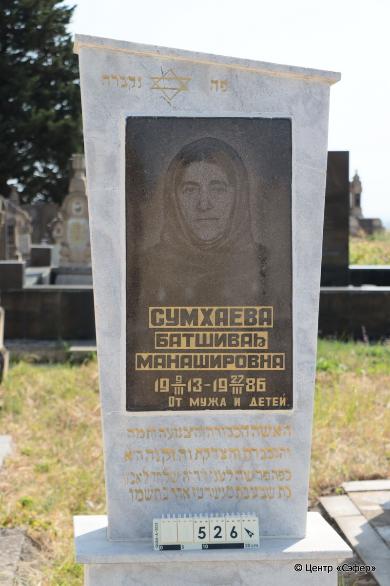
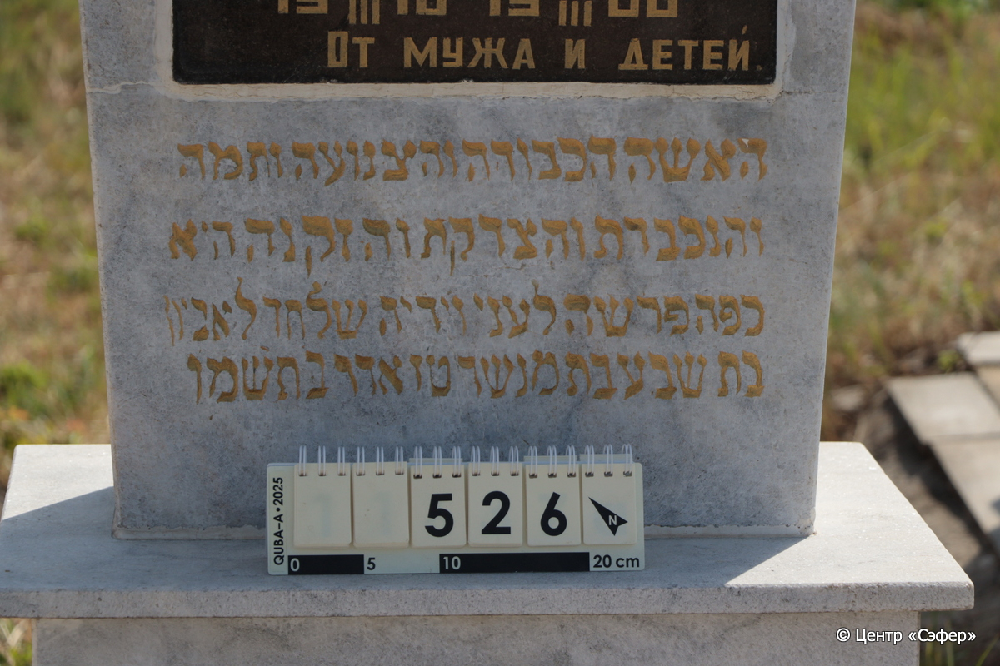
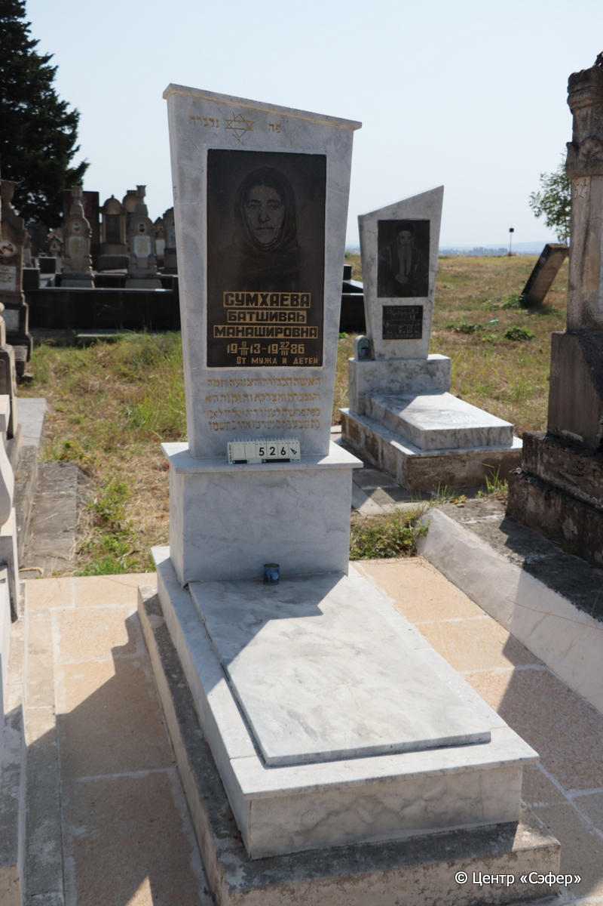

::: {style="font-size: 1em; margin-bottom: 1.2em"}
[Куба (центральное)](../cemeteries/QBA.html) > QBA0526
:::

```{r}
suppressPackageStartupMessages(library(tidyverse))
```


:::: {.columns}

::: {.column width="20%"}

```{r}
#| lightbox:
#|   group: photos





```
:::

::: {.column width="5%"}
:::

::: {.column width="74%"}

::: {.name-style}
СУМХАЕВА Батшева, дочь Менаше (Батшиваh Манашировна)
:::

::: {style="font-size: 1.2em;"}
בתשבע בת מנשה
:::

:::: {.columns}
::: {.column width="5%"}
{width=1.3em}
:::

::: {.column style="width: 40%; padding-left: 0.2em;"}
09.03.1913 /  
:::

::: {.column width="5%"}
{width=1.3em}
:::

::: {.column style="width: 50%; padding-left: 0.2em;"}
27.03.1986 / 16.Ad.5756
:::

::::


::: {.panel-tabset}

#### Эпитафия

```{r}
tibble(`Оригинал` = "פה נקברה
СУМХАЕВА
БАТШИВАh
МАНАШИРОВНА
 9/III 1913 - 27/III 1986
От мужа и детей.
האשה הכבודה והצנועה ותמה
והנכבדת והצדקת והזקנה היא
כפה פרשה לעני וידיה שלחה לאביון
בתשבע בת מנשה טז אדר ב׳ תשמו",
       `Перевод` = "Здесь покоится
СУМХАЕВА
БАТШИВА
МАНАШИРОВНА
 09.03.1913 - 27.03.1986
От мужа и детей.
Женщина уважаемая и скромная, честная
и почитаемая, праведная и пожилая, она
длань свою открывает бедному, и руку свою подает нуждающемуся*.
Батшева, дочь Менаше. 16 адара-II 746 года.") |>
  mutate(`Оригинал` = str_split(`Оригинал`, "
"),
         `Перевод` = str_split(`Перевод`, "
")) |>
  unnest_longer(c(`Оригинал`, `Перевод`)) |> 
  mutate(id = 1:n()) |> 
  relocate(id, .before = Перевод) |> 
  rename(` ` = id) |> 
  knitr::kable(align = c("r", "c", "l"))
```

|||
|-|---|
|**Примечания**|*Притч 31:20|
|**Язык**      |иврит, русский    |
|**Метки**     |     |
: {tbl-colwidths="[25,75]"}

#### Памятник

|||
|-|---|
|**Тип памятника**   |L-образный                                                                         |
|**Материал**        |гранит, мрамор (гранитная табличка с текстом и  фотографией)                                                     |
|**Размеры**         |161×59×40  --- стела; 2×55×115  --- плита; 30×77×187  --- основание                                                                        |
|**Тип декора**      |традиционная символика, другое                                                                        |
|**Элементы декора** |золотая гравировка и обрамление текста эпитафии; фотопортрет женщины; звезда Давида в завершении; скошенное завершение; домик для свечи с обратной стороны                                                                          |
|**Координаты**      |[41.37103801, 48.50783652](https://www.google.com/maps/place/41.37103801, 48.50783652)                    |
: {tbl-colwidths="[25,75]"}

#### Источник

|||
|-|---|
|**Место хранения**        |Архив полевых исследований Центра «Сэфер»     |
|**Контакты**              |students@sefer.ru    |
|**Ссылка**                |https://sfira.org        |
|**Исходный ID**           |  |
|**Условия использования** |[CC BY-NC 4.0](https://creativecommons.org/licenses/by-nc/4.0/deed.ru)     |
: {tbl-colwidths="[25,75]"}

:::

:::

::::

