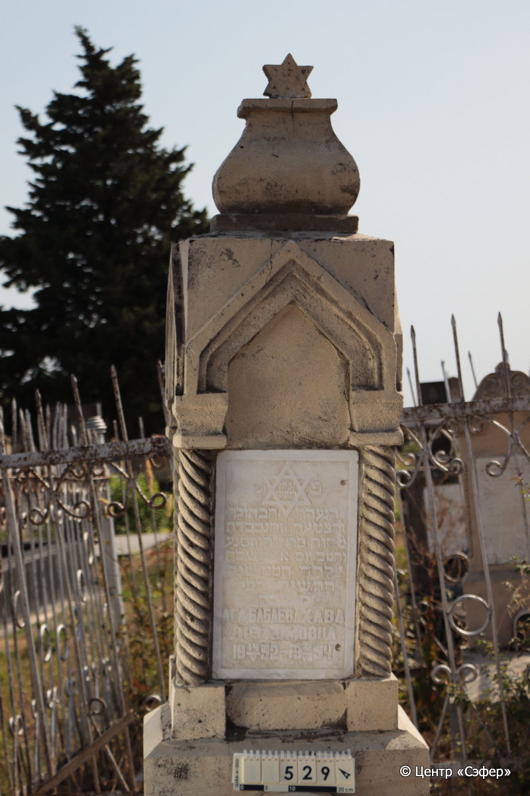
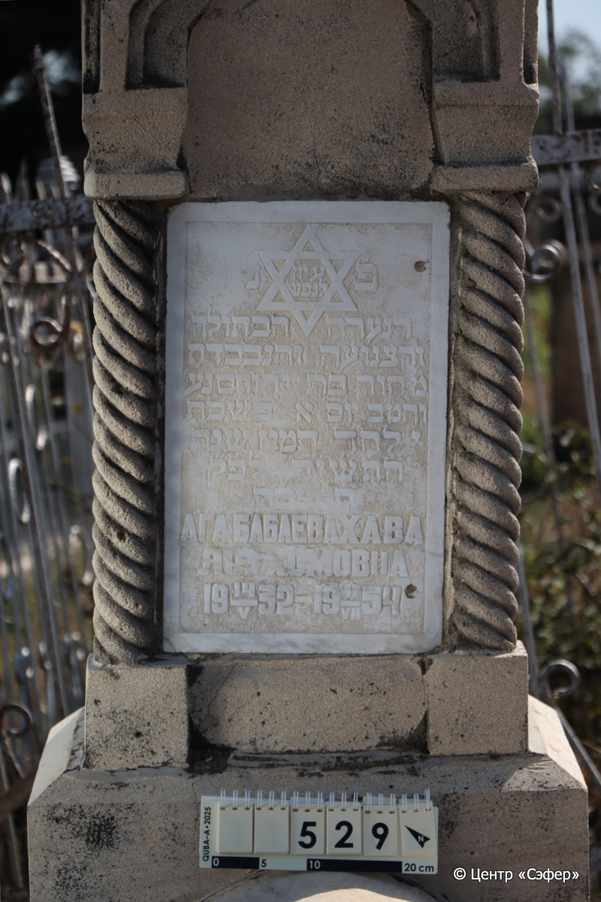
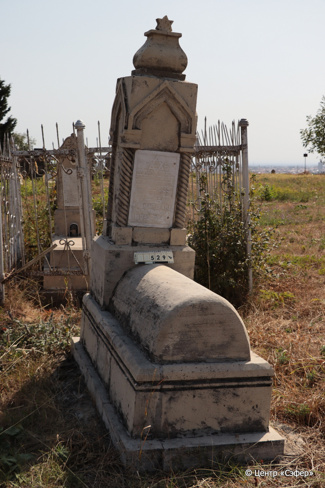

::: {style="font-size: 1em; margin-bottom: 1.2em"}
[Куба (центральное)](../cemeteries/QBA.html) > QBA0529
:::

```{r}
suppressPackageStartupMessages(library(tidyverse))
```


:::: {.columns}

::: {.column width="20%"}

```{r}
#| lightbox:
#|   group: photos





```
:::

::: {.column width="5%"}
:::

::: {.column width="74%"}

::: {.name-style}
АГАБАБАЕВА Хава, дочь Йерухама (Ярухомовна)
:::

::: {style="font-size: 1.2em;"}
חוה בת ירוחם
:::

:::: {.columns}
::: {.column width="5%"}
{width=1.3em}
:::

::: {.column style="width: 40%; padding-left: 0.2em;"}
14.05.1932 /  
:::

::: {.column width="5%"}
{width=1.3em}
:::

::: {.column style="width: 50%; padding-left: 0.2em;"}
11.07.1954 / 10.Ta.5714
:::

::::


::: {.panel-tabset}

#### Эпитафия

```{r}
tibble(`Оригинал` = "פ״ ציון לנפש נ״
הנערה הבתולה
והצנועה והנכבדת
מ״ חוה בת ירוחם נע
והמ״כ יום א״ בשבת
י לח״ד תמוז שנת
ה֗ת֗ש֗י֗ד֗ ל֗פ֗ק֗
ת֗נ֗צ֗֗ב֗ה֗
АГАБАБАЕВА ХАВА
ЯРУХОМОВНА
 14/V 1932 -  11/VII 1954",
       `Перевод` = "Здесь покоится. Знак душе
юной девушки,
скромной и уважаемой.
Г-жа Хава, дочь Йерухама, душа ее в раю
и благословен ее покой. Воскресенье, 
10 число месяца таммуз года
5714 по малому летоисчислению.
Да будет душа ее завязана в узле жизни.
АГАБАБАЕВА ХАВА
ЯРУХОМОВНА
14/V 1932 -  11/VII 1954") |>
  mutate(`Оригинал` = str_split(`Оригинал`, "
"),
         `Перевод` = str_split(`Перевод`, "
")) |>
  unnest_longer(c(`Оригинал`, `Перевод`)) |> 
  mutate(id = 1:n()) |> 
  relocate(id, .before = Перевод) |> 
  rename(` ` = id) |> 
  knitr::kable(align = c("r", "c", "l"))
```

|||
|-|---|
|**Примечания**| |
|**Язык**      |иврит, русский    |
|**Метки**     |     |
: {tbl-colwidths="[25,75]"}

#### Памятник

|||
|-|---|
|**Тип памятника**   |L-образный                                                                         |
|**Материал**        |песчаник, мрамор (следы эрозии, трещины, мраморная вставка для текста, цементный раствор)                                                     |
|**Размеры**         |188×60×45  --- стела; 33×53×103  --- плита; 42×81×180  --- основание                                                                        |
|**Тип декора**      |архитектурно-орнаментальный, традиционная символика                                                                        |
|**Элементы декора** |навершие со звездой Давида, стрельчатый портал на полуколоннах, Звезда Давида на текстовой вставке                                                                          |
|**Координаты**      |[41.37094475, 48.50783832](https://www.google.com/maps/place/41.37094475, 48.50783832)                    |
: {tbl-colwidths="[25,75]"}

#### Источник

|||
|-|---|
|**Место хранения**        |Архив полевых исследований Центра «Сэфер»     |
|**Контакты**              |students@sefer.ru    |
|**Ссылка**                |https://sfira.org        |
|**Исходный ID**           |  |
|**Условия использования** |[CC BY-NC 4.0](https://creativecommons.org/licenses/by-nc/4.0/deed.ru)     |
: {tbl-colwidths="[25,75]"}

:::

:::

::::

