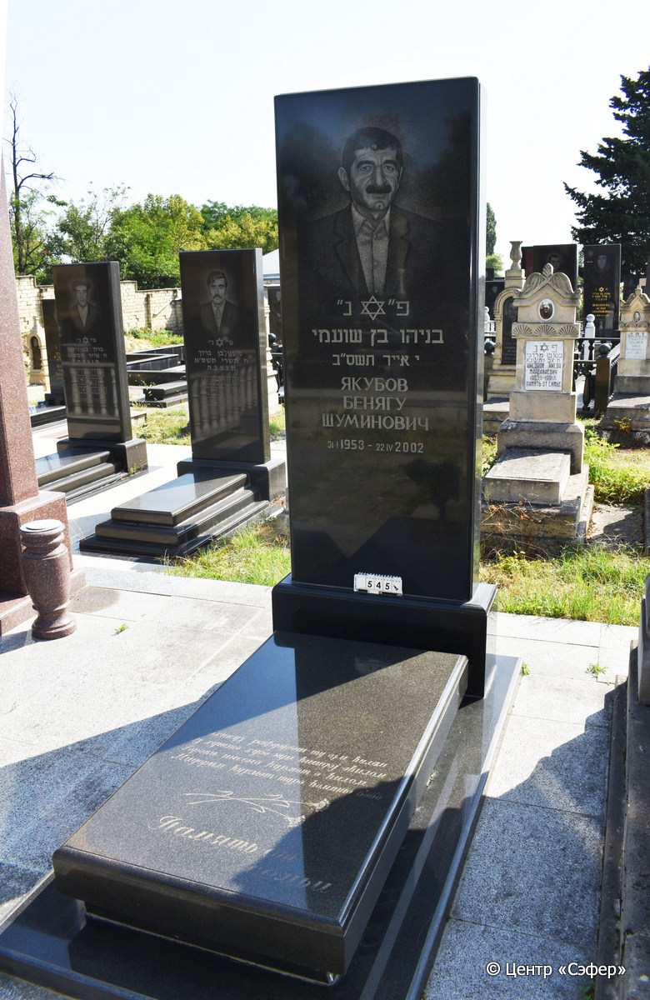
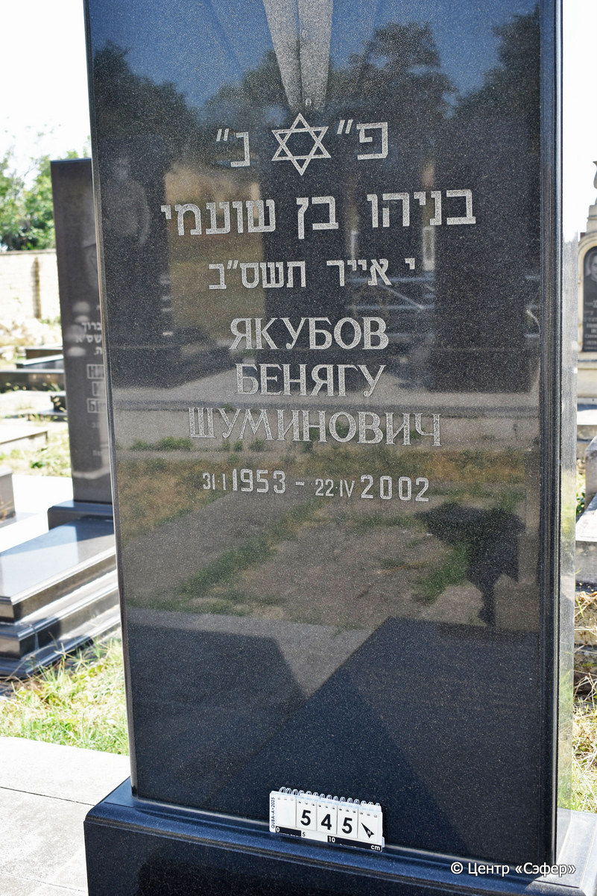
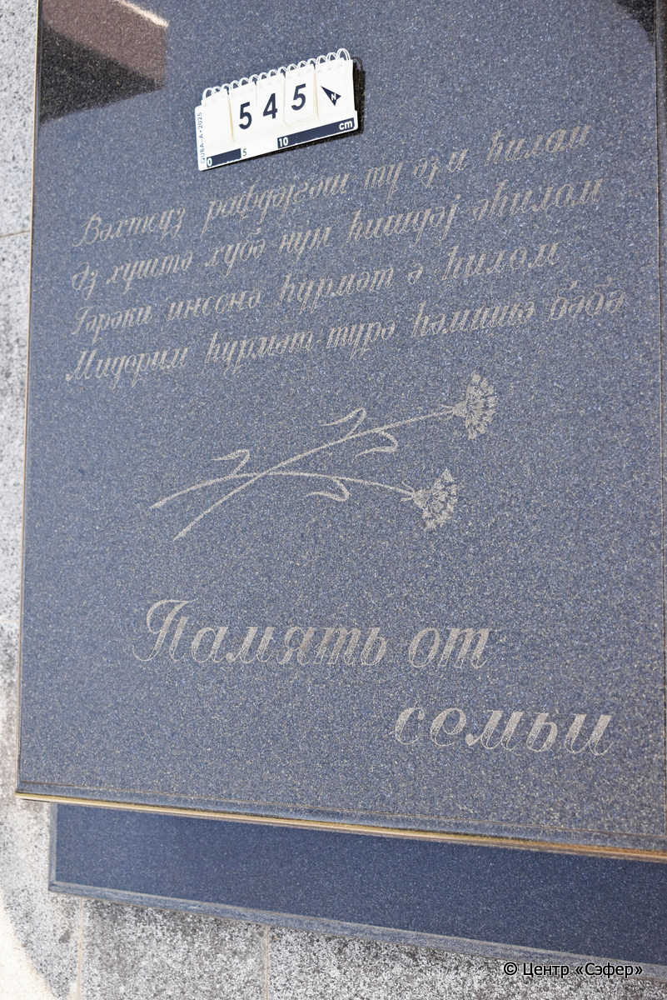

::: {style="font-size: 1em; margin-bottom: 1.2em"}
[Куба (центральное)](../cemeteries/QBA.html) > QBA0545
:::

```{r}
suppressPackageStartupMessages(library(tidyverse))
```


:::: {.columns}

::: {.column width="20%"}

```{r}
#| lightbox:
#|   group: photos





```
:::

::: {.column width="5%"}
:::

::: {.column width="74%"}

::: {.name-style}
ЯКУБОВ Бенягу, сын Шуми (Шуминович)
:::

::: {style="font-size: 1.2em;"}
בניהו בן שועמי
:::

:::: {.columns}
::: {.column width="5%"}
{width=1.3em}
:::

::: {.column style="width: 40%; padding-left: 0.2em;"}
31.01.1953 /  
:::

::: {.column width="5%"}
{width=1.3em}
:::

::: {.column style="width: 50%; padding-left: 0.2em;"}
22.04.2002 / 10.Iy.5762
:::

::::


::: {.panel-tabset}

#### Эпитафия

```{r}
tibble(`Оригинал` = "сверху
פ״נ״
בניהו בן שועמי
י אייר תשס״ב
Якубов
Бенягу
Шуминович
31.I 1953-22.IV 2002 

снизу
Вәхтоуз рафдәjгәш ту әз и ћилом
Әз хуштә хубә нум hишдәj әћилом
Гәрәки инсонә hурмәт ә ћилом
Мидорим hурмәт турә hәмшиә бәбә

Память от
семьи",
       `Перевод` = "
Здесь покоится
Бенаяху, сын Шуами.
10 ияра 762 года.
Якубов
Бенягу
Шуминович
31.I 1953-22.IV 2002 

 
Хоть ты и ушёл из этого мира безвременно,
О себе оставил хорошее имя на свете.
Человеку необходимо уважение в этом мире.
К тебе, отец, уважение сохраним навсегда!

Память от
семьи") |>
  mutate(`Оригинал` = str_split(`Оригинал`, "
"),
         `Перевод` = str_split(`Перевод`, "
")) |>
  unnest_longer(c(`Оригинал`, `Перевод`)) |> 
  mutate(id = 1:n()) |> 
  relocate(id, .before = Перевод) |> 
  rename(` ` = id) |> 
  knitr::kable(align = c("r", "c", "l"))
```

|||
|-|---|
|**Примечания**| |
|**Язык**      |иврит, русский, джуури    |
|**Метки**     |     |
: {tbl-colwidths="[25,75]"}

#### Памятник

|||
|-|---|
|**Тип памятника**   |L-образный                                                                         |
|**Материал**        |гранит (цементный раствор, стоит на площадке из известняковых плит)                                                     |
|**Размеры**         |225×95×33  --- стела; 25×85×150  --- плита; 7×120×215  --- основание                                                                        |
|**Тип декора**      |растительный, традиционная символика                                                                        |
|**Элементы декора** |фотопортрет, звезда Давида, два цветка на плите, менора на оборотной стороне стелы                                                                          |
|**Координаты**      |[41.37109708, 48.50789481](https://www.google.com/maps/place/41.37109708, 48.50789481)                    |
: {tbl-colwidths="[25,75]"}

#### Источник

|||
|-|---|
|**Место хранения**        |Архив полевых исследований Центра «Сэфер»     |
|**Контакты**              |students@sefer.ru    |
|**Ссылка**                |https://sfira.org        |
|**Исходный ID**           |  |
|**Условия использования** |[CC BY-NC 4.0](https://creativecommons.org/licenses/by-nc/4.0/deed.ru)     |
: {tbl-colwidths="[25,75]"}

:::

:::

::::

