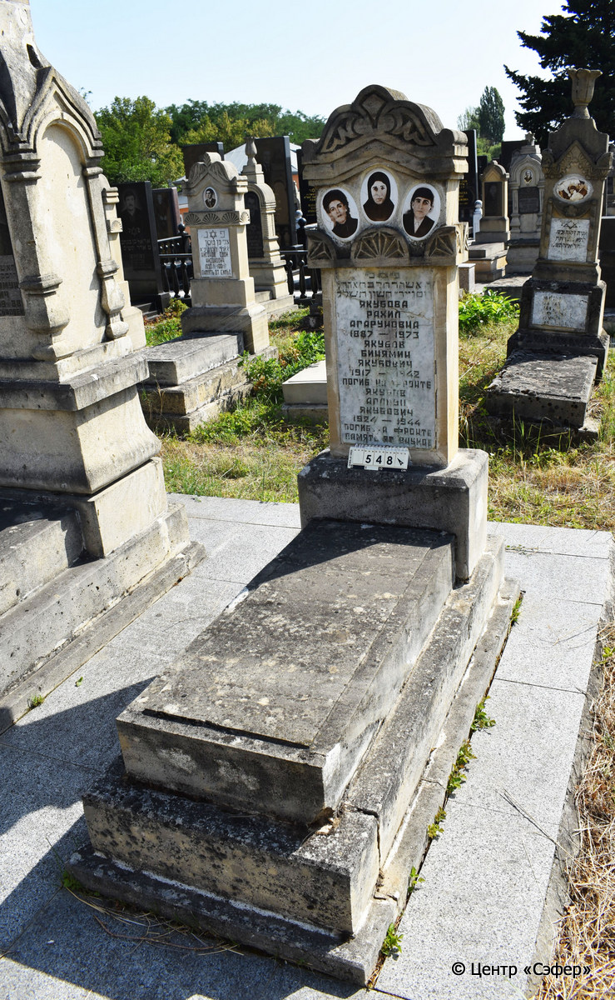
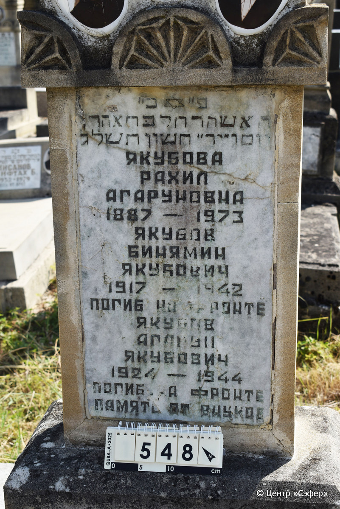

::: {style="font-size: 1em; margin-bottom: 1.2em"}
[Куба (центральное)](../cemeteries/QBA.html) > QBA0548
:::

```{r}
suppressPackageStartupMessages(library(tidyverse))
```


:::: {.columns}

::: {.column width="20%"}

```{r}
#| lightbox:
#|   group: photos




```
:::

::: {.column width="5%"}
:::

::: {.column width="74%"}

::: {.name-style}
ЯКУБОВА Рахель, дочь Аарона (Рахил Агаруновна)
:::

::: {style="font-size: 1.2em;"}
רחל בת אהרן
:::

:::: {.columns}
::: {.column width="5%"}
{width=1.3em}
:::

::: {.column style="width: 40%; padding-left: 0.2em;"}
-.-.1887 /  
:::

::: {.column width="5%"}
{width=1.3em}
:::

::: {.column style="width: 50%; padding-left: 0.2em;"}
-.-.1973 / 14.Ch.5733
:::

::::

---

::: {.name-style}
ЯКУБОВ Бинямин Якубович
:::

::: {style="font-size: 1.2em;"}

:::

:::: {.columns}
::: {.column width="5%"}
{width=1.3em}
:::

::: {.column style="width: 40%; padding-left: 0.2em;"}
-.-.1917 /  
:::

::: {.column width="5%"}
{width=1.3em}
:::

::: {.column style="width: 50%; padding-left: 0.2em;"}
-.-.1942 / 
:::

::::

---

::: {.name-style}
ЯКУБОВ Агарун Якубович
:::

::: {style="font-size: 1.2em;"}

:::

:::: {.columns}
::: {.column width="5%"}
{width=1.3em}
:::

::: {.column style="width: 40%; padding-left: 0.2em;"}
-.-.1924 /  
:::

::: {.column width="5%"}
{width=1.3em}
:::

::: {.column style="width: 50%; padding-left: 0.2em;"}
-.-.1944 / 
:::

::::


::: {.panel-tabset}

#### Эпитафия

```{r}
tibble(`Оригинал` = "פ״כ״
האשה רחל בּת אהרן
יום ו״ יד״ חשון ת֗ש֗ל֗ג֗
Якубова
Рахил
Агаруновна
1887-1973
Якубов
Бинямин
Якубович
1917-1942
погиб на фронте
Якубов
Агарун Якубович
1924-1944
погиб на фронте
память от внуков",
       `Перевод` = "Здесь покоится
женщина Рахедь, дочь Аарона.
Пятница, 14 хешвана {5}733.
Якубова
Рахил
Агаруновна
1887-1973,
Якубов
Бинямин
Якубович
1917-1942,
погиб на фронте.
Якубов
Агарун Якубович
1924-1944
погиб на фронте.
Память от внуков.") |>
  mutate(`Оригинал` = str_split(`Оригинал`, "
"),
         `Перевод` = str_split(`Перевод`, "
")) |>
  unnest_longer(c(`Оригинал`, `Перевод`)) |> 
  mutate(id = 1:n()) |> 
  relocate(id, .before = Перевод) |> 
  rename(` ` = id) |> 
  knitr::kable(align = c("r", "c", "l"))
```

|||
|-|---|
|**Примечания**| |
|**Язык**      |иврит, русский    |
|**Метки**     |     |
: {tbl-colwidths="[25,75]"}

#### Памятник

|||
|-|---|
|**Тип памятника**   |L-образный                                                                         |
|**Материал**        |песчаник, известняк, мрамор (следы эрозии, трещины, мраморная вставка для текста, керамические медальоны)                                                     |
|**Размеры**         |160×60×34  --- стела; 20×52×120  --- плита; 25×80×180  --- основание                                                                        |
|**Тип декора**      |архитектурно-орнаментальный, растительный, традиционная символика                                                                        |
|**Элементы декора** |фигурное завершение с волютами и растительными мотивами, конек, три фотопортрета на медальонах, пояс из розеток, звезда Давида на вставке                                                                          |
|**Координаты**      |[41.37105855, 48.50790171](https://www.google.com/maps/place/41.37105855, 48.50790171)                    |
: {tbl-colwidths="[25,75]"}

#### Источник

|||
|-|---|
|**Место хранения**        |Архив полевых исследований Центра «Сэфер»     |
|**Контакты**              |students@sefer.ru    |
|**Ссылка**                |https://sfira.org        |
|**Исходный ID**           |  |
|**Условия использования** |[CC BY-NC 4.0](https://creativecommons.org/licenses/by-nc/4.0/deed.ru)     |
: {tbl-colwidths="[25,75]"}

:::

:::

::::

