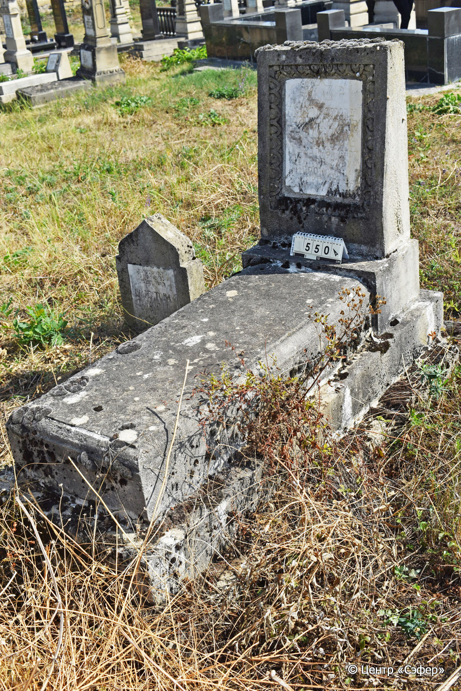
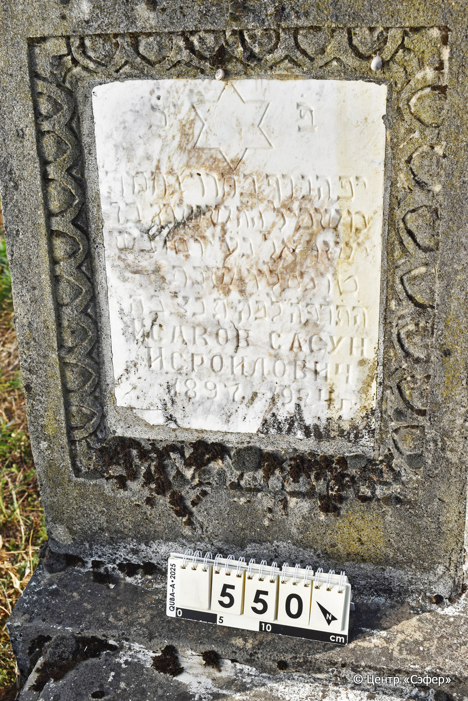

::: {style="font-size: 1em; margin-bottom: 1.2em"}
[Куба (центральное)](../cemeteries/QBA.html) > QBA0550
:::

```{r}
suppressPackageStartupMessages(library(tidyverse))
```


:::: {.columns}

::: {.column width="20%"}

```{r}
#| lightbox:
#|   group: photos




```
:::

::: {.column width="5%"}
:::

::: {.column width="74%"}

::: {.name-style}
ИСАКОВ Шушан, сын Исраэля (Сасун Исроилович)
:::

::: {style="font-size: 1.2em;"}
ששון בן ישראל
:::

:::: {.columns}
::: {.column width="5%"}
{width=1.3em}
:::

::: {.column style="width: 40%; padding-left: 0.2em;"}
-.-.1897 /  
:::

::: {.column width="5%"}
{width=1.3em}
:::

::: {.column style="width: 50%; padding-left: 0.2em;"}
-.-.1924 / 15.Ki.5685
:::

::::


::: {.panel-tabset}

#### Эпитафия

```{r}
tibble(`Оригинал` = "פ֗נ֗
יפה [נרף] בחור נחמד 
משכיל ה׳ה ששון בר 
ישראל נ״ע יום ו֗ ב״ש
ט״ו כסליו שנת
ה֗ת֗ר֗פ֗ה֗ לפ֗ק֗ ת֗נ֗צ֗ב֗ה֗
Исаков Сасун
Исроилович
1897-1924 г.",
       `Перевод` = "Здесь покоится 
прекрасный, молодой* и милый юноша,
просвещённый в Торе, по имени Сасон, сын р.
Исраэля, душа его в раю. В пятницу,
15 кислева года
5685 по малому летоисчислению. Да будет душа его завязана в узле жизни.
Исаков Сасун
Исроилович.
1897 - 1924 гг.") |>
  mutate(`Оригинал` = str_split(`Оригинал`, "
"),
         `Перевод` = str_split(`Перевод`, "
")) |>
  unnest_longer(c(`Оригинал`, `Перевод`)) |> 
  mutate(id = 1:n()) |> 
  relocate(id, .before = Перевод) |> 
  rename(` ` = id) |> 
  knitr::kable(align = c("r", "c", "l"))
```

|||
|-|---|
|**Примечания**|Предположительно, ошибка резчика. Вероятно имелось в виду ורך - 'юный'.|
|**Язык**      |иврит, русский    |
|**Метки**     |знаток Писания, юноша    |
: {tbl-colwidths="[25,75]"}

#### Памятник

|||
|-|---|
|**Тип памятника**   |L-образный                                                                         |
|**Материал**        |известняк, мрамор (следы эрозии, мраморная вставка для текста)                                                     |
|**Размеры**         |90×50×33  --- Стелла; 20×49×114  --- плита; 30×82×176  --- основание                                                                        |
|**Тип декора**      |архитектурно-орнаментальный, традиционная символика                                                                        |
|**Элементы декора** |орнамент вокруг рамки для текста, звезда Давида на вставке                                                                          |
|**Координаты**      |[41.37095445, 48.50791073](https://www.google.com/maps/place/41.37095445, 48.50791073)                    |
: {tbl-colwidths="[25,75]"}

#### Источник

|||
|-|---|
|**Место хранения**        |Архив полевых исследований Центра «Сэфер»     |
|**Контакты**              |students@sefer.ru    |
|**Ссылка**                |https://sfira.org        |
|**Исходный ID**           |  |
|**Условия использования** |[CC BY-NC 4.0](https://creativecommons.org/licenses/by-nc/4.0/deed.ru)     |
: {tbl-colwidths="[25,75]"}

:::

:::

::::

