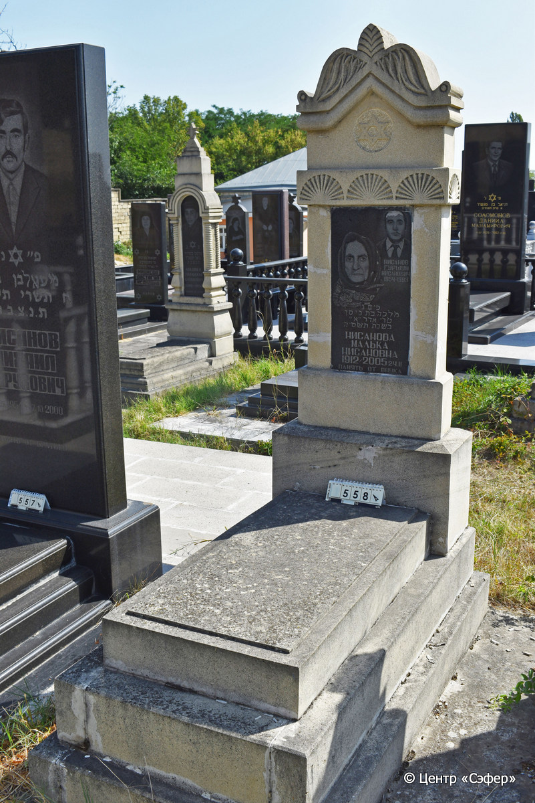
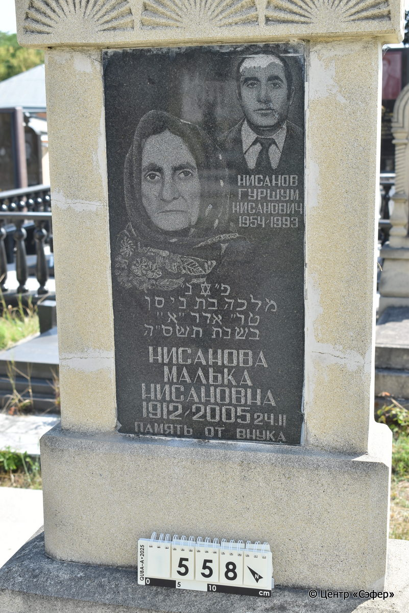

::: {style="font-size: 1em; margin-bottom: 1.2em"}
[Куба (центральное)](../cemeteries/QBA.html) > QBA0558
:::

```{r}
suppressPackageStartupMessages(library(tidyverse))
```


:::: {.columns}

::: {.column width="20%"}

```{r}
#| lightbox:
#|   group: photos




```
:::

::: {.column width="5%"}
:::

::: {.column width="74%"}

::: {.name-style}
НИСАНОВ Гуршум Нисанович
:::

::: {style="font-size: 1.2em;"}

:::

:::: {.columns}
::: {.column width="5%"}
{width=1.3em}
:::

::: {.column style="width: 40%; padding-left: 0.2em;"}
-.-.1954 /  
:::

::: {.column width="5%"}
{width=1.3em}
:::

::: {.column style="width: 50%; padding-left: 0.2em;"}
-.-.1993 /  
:::

::::

---

::: {.name-style}
НИСАНОВА Малка, дочь Нисана (Малька Нисановна)
:::

::: {style="font-size: 1.2em;"}
מלכה בת ניסן
:::

:::: {.columns}
::: {.column width="5%"}
{width=1.3em}
:::

::: {.column style="width: 40%; padding-left: 0.2em;"}
-.-.1912 /  
:::

::: {.column width="5%"}
{width=1.3em}
:::

::: {.column style="width: 50%; padding-left: 0.2em;"}
24.02.2005 / 15.Ad1.5765
:::

::::


::: {.panel-tabset}

#### Эпитафия

```{r}
tibble(`Оригинал` = "Нисанов 
Гуршум 
Нисанович
1954-1993
פ״נ״
מלכה בת ניסן
טו״ ארר ״א״
בשנת תשס״ה
 Нисанова
Малька
Нисановна
1912-2005 24.II
Память от внука",
       `Перевод` = "Нисанов 
Гуршум 
Нисанович
1954-1993.
Здесь покоится
Малка, дочь Нисана.
15 адара-I
года {5}765.
Нисанова
Малька
Нисановна,
1912 -24.02.2005.
Память от внука.") |>
  mutate(`Оригинал` = str_split(`Оригинал`, "
"),
         `Перевод` = str_split(`Перевод`, "
")) |>
  unnest_longer(c(`Оригинал`, `Перевод`)) |> 
  mutate(id = 1:n()) |> 
  relocate(id, .before = Перевод) |> 
  rename(` ` = id) |> 
  knitr::kable(align = c("r", "c", "l"))
```

|||
|-|---|
|**Примечания**| |
|**Язык**      |иврит, русский    |
|**Метки**     |     |
: {tbl-colwidths="[25,75]"}

#### Памятник

|||
|-|---|
|**Тип памятника**   |L-образный                                                                         |
|**Материал**        |песчаник, известняк, гранит (следы эрозии, трещины, гранитная табличка для текста)                                                     |
|**Размеры**         |180×69×32  --- стела; 16×57×114  --- плита; 38×85×170  --- основание                                                                        |
|**Тип декора**      |архитектурно-орнаментальный, растительный, традиционная символика                                                                        |
|**Элементы декора** |фигурное завершение с волютами и растительными мотивами, конек, звезда Давида в нише, пояс из розеток, два фотопортрета на вставке, звезда Давида на вставке                                                                          |
|**Координаты**      |[41.37111179, 48.50793829](https://www.google.com/maps/place/41.37111179, 48.50793829)                    |
: {tbl-colwidths="[25,75]"}

#### Источник

|||
|-|---|
|**Место хранения**        |Архив полевых исследований Центра «Сэфер»     |
|**Контакты**              |students@sefer.ru    |
|**Ссылка**                |https://sfira.org        |
|**Исходный ID**           |  |
|**Условия использования** |[CC BY-NC 4.0](https://creativecommons.org/licenses/by-nc/4.0/deed.ru)     |
: {tbl-colwidths="[25,75]"}

:::

:::

::::

