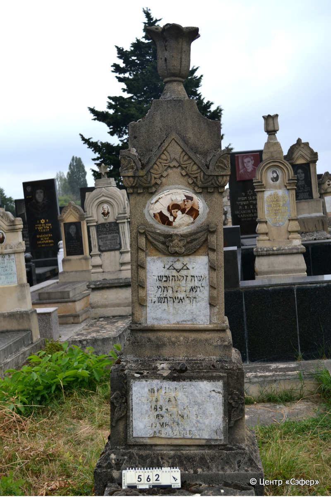
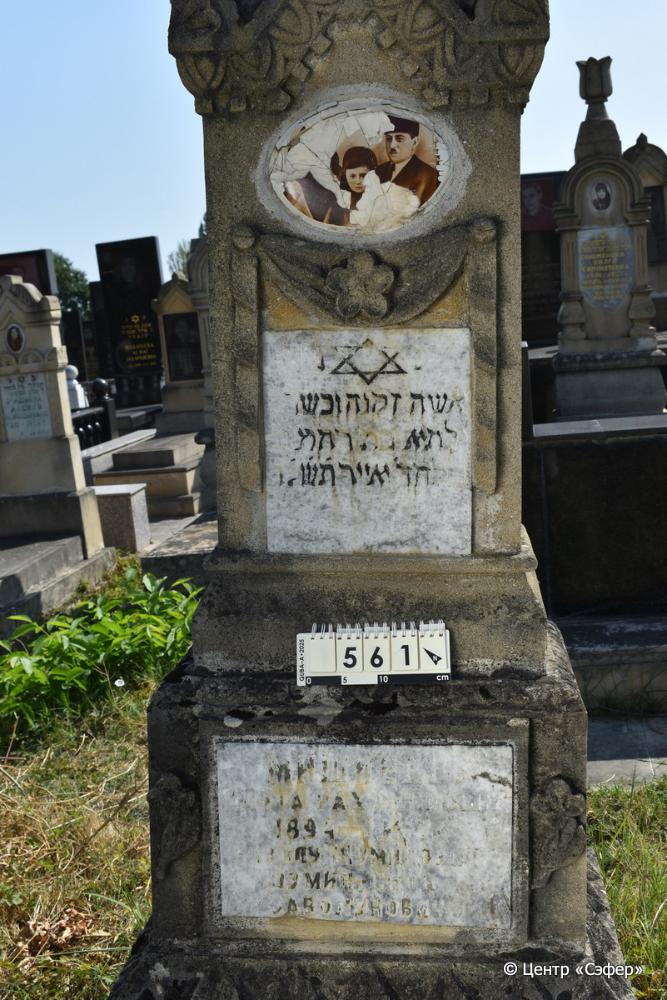
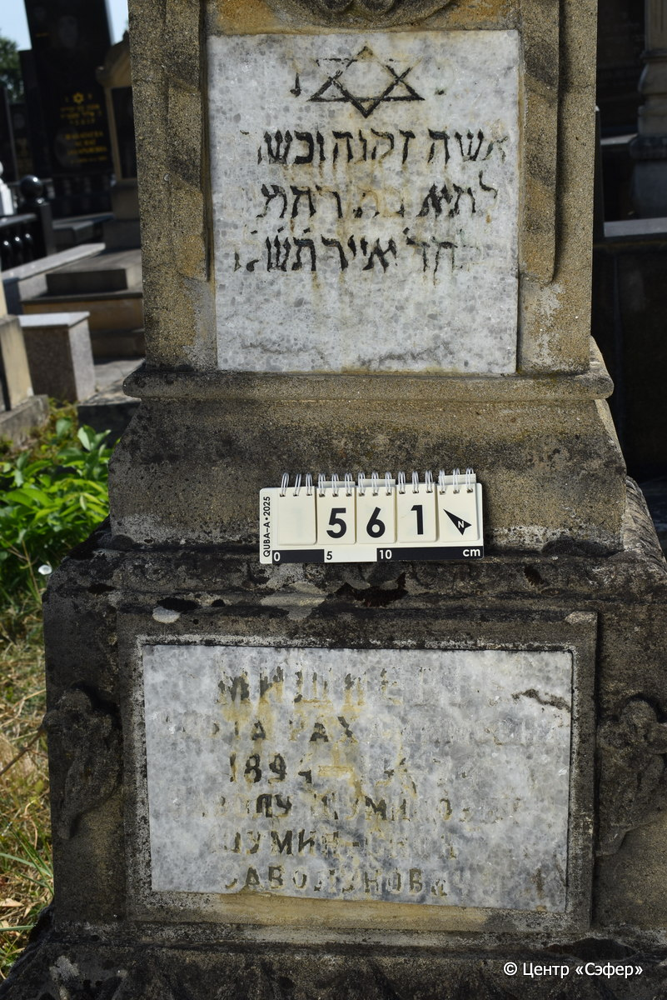
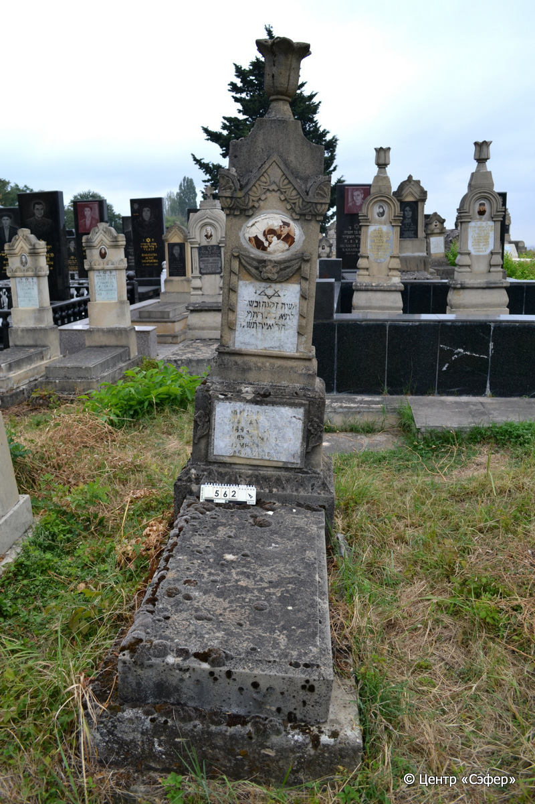

::: {style="font-size: 1em; margin-bottom: 1.2em"}
[Куба (центральное)](../cemeteries/QBA.html) > QBA0562
:::

```{r}
suppressPackageStartupMessages(library(tidyverse))
```


:::: {.columns}

::: {.column width="20%"}

```{r}
#| lightbox:
#|   group: photos






```
:::

::: {.column width="5%"}
:::

::: {.column width="74%"}

::: {.name-style}
МИШИЕВЫ Йалта, дочь Рахамима (Яльта Рахамимовна)
:::

::: {style="font-size: 1.2em;"}
ילתא בת רחמים
:::

:::: {.columns}
::: {.column width="5%"}
{width=1.3em}
:::

::: {.column style="width: 40%; padding-left: 0.2em;"}
-.-.1894 /  
:::

::: {.column width="5%"}
{width=1.3em}
:::

::: {.column style="width: 50%; padding-left: 0.2em;"}
24.04.1974 / 02.Iy.5734
:::

::::


::: {.panel-tabset}

#### Эпитафия

```{r}
tibble(`Оригинал` = "פנ
אשה זקנה וכשרה
ילתא בת רחמים
ב לחד׳ אייר ת׳ש׳ל׳ד׳
Мишиевы
Яльта Рахамимовна
1894 -1974 24/IV
Заволу Шуминович
Шумин-сион
Заволунович",
       `Перевод` = "Здесь покоится
пожилая и добродетельная женщина,
Ялта, дочь Рахамима.
2 число месяца ияр, {5}734.
Мишиевы
Яльта Рахамимовна
1894 - 24.04.1974
Заволу Шуминович
Шумин-сион
Заволунович") |>
  mutate(`Оригинал` = str_split(`Оригинал`, "
"),
         `Перевод` = str_split(`Перевод`, "
")) |>
  unnest_longer(c(`Оригинал`, `Перевод`)) |> 
  mutate(id = 1:n()) |> 
  relocate(id, .before = Перевод) |> 
  rename(` ` = id) |> 
  knitr::kable(align = c("r", "c", "l"))
```

|||
|-|---|
|**Примечания**| |
|**Язык**      |иврит, русский    |
|**Метки**     |     |
: {tbl-colwidths="[25,75]"}

#### Памятник

|||
|-|---|
|**Тип памятника**   |L-образный                                                                         |
|**Материал**        |известняк, мрамор (следы эрозии и цементного раствора; две мраморные вставки для текста; полуразрушенный керамический медальон с фотопортретом)                                                     |
|**Размеры**         |228×74×57  --- стела; 17×64×116  --- плита; 31×91×184  --- основание                                                                        |
|**Тип декора**      |архитектурно-орнаментальный, растительный, традиционная символика                                                                        |
|**Элементы декора** |архитектурное завершение с бутоном; три орнаментальных пояса;  гирлянда из лент и цветка; два цветка по обеим сторонам от таблички с текстом; рамы с вогнутыми углами по обеим сторонам стелы; звезда Давида на текстовой вставке и портрет                                                                          |
|**Координаты**      |[41.37106223, 48.50795032](https://www.google.com/maps/place/41.37106223, 48.50795032)                    |
: {tbl-colwidths="[25,75]"}

#### Источник

|||
|-|---|
|**Место хранения**        |Архив полевых исследований Центра «Сэфер»     |
|**Контакты**              |students@sefer.ru    |
|**Ссылка**                |https://sfira.org        |
|**Исходный ID**           |  |
|**Условия использования** |[CC BY-NC 4.0](https://creativecommons.org/licenses/by-nc/4.0/deed.ru)     |
: {tbl-colwidths="[25,75]"}

:::

:::

::::

