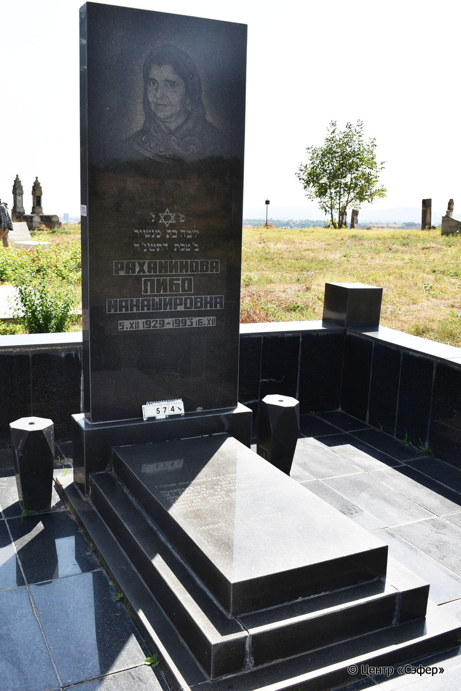
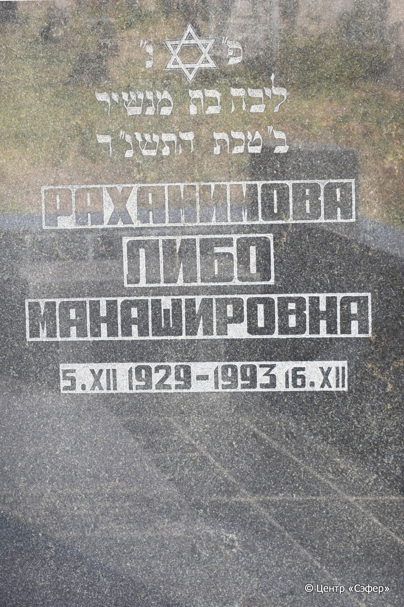
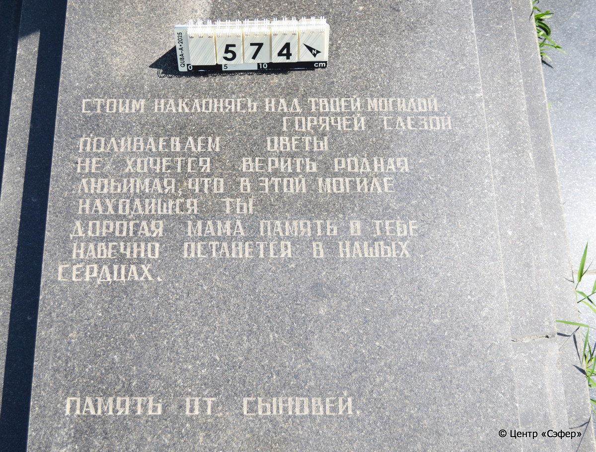

::: {style="font-size: 1em; margin-bottom: 1.2em"}
[Куба (центральное)](../cemeteries/QBA.html) > QBA0574
:::

```{r}
suppressPackageStartupMessages(library(tidyverse))
```


:::: {.columns}

::: {.column width="20%"}

```{r}
#| lightbox:
#|   group: photos





```
:::

::: {.column width="5%"}
:::

::: {.column width="74%"}

::: {.name-style}
РАХАМИМОВА Либа, дочь Маншира (Либо Манашировна)
:::

::: {style="font-size: 1.2em;"}
ליבה בת מנשיר
:::

:::: {.columns}
::: {.column width="5%"}
{width=1.3em}
:::

::: {.column style="width: 40%; padding-left: 0.2em;"}
05.12.1929 /  
:::

::: {.column width="5%"}
{width=1.3em}
:::

::: {.column style="width: 50%; padding-left: 0.2em;"}
16.12.1993 / 02.Te.5754
:::

::::


::: {.panel-tabset}

#### Эпитафия

```{r}
tibble(`Оригинал` = "сверху
פ״ נ״
ליבה בת מנשיר
ב״ טבת התשנ״ד
Рахамимова
Либо
Манашировна
5.XII 1929 - 1993 16.XII

снизу
Стоим наклонясь над твоей могилой
Горячей слезой
Поливаеваем цветы
Нех хочется верить родная
Любимая, что в этой могиле
Находишься ты
Дорогая мама память о тебе
Навечно останется в нашых
Сердцах
Память от сыновей",
       `Перевод` = "
Здесь покоится
Либа, дочь Манашира.
2 тевета 5754.
Рахамимова
Либо
Манашировна
05.12.1929 - 16.12.1993

 
Стоим, наклонясь, над твоей могилой,
Горячей слезой
Поливаеваем цветы
Не хочется верить, родная,
Любимая, что в этой могиле
Находишься ты
Дорогая мама, память о тебе
Навечно останется в наших
Сердцах.
Память от сыновей.") |>
  mutate(`Оригинал` = str_split(`Оригинал`, "
"),
         `Перевод` = str_split(`Перевод`, "
")) |>
  unnest_longer(c(`Оригинал`, `Перевод`)) |> 
  mutate(id = 1:n()) |> 
  relocate(id, .before = Перевод) |> 
  rename(` ` = id) |> 
  knitr::kable(align = c("r", "c", "l"))
```

|||
|-|---|
|**Примечания**| |
|**Язык**      |иврит, русский    |
|**Метки**     |     |
: {tbl-colwidths="[25,75]"}

#### Памятник

|||
|-|---|
|**Тип памятника**   |L-образный                                                                         |
|**Материал**        |гранит (следы цементного раствора)                                                     |
|**Размеры**         |223×87×26  --- стела; 12×60×130  --- плита; 19×99×186  --- основание                                                                        |
|**Тип декора**      |традиционная символика                                                                        |
|**Элементы декора** |звезда Давида и фотопортрет на стеле; две вазы по бокам от плиты                                                                          |
|**Координаты**      |[41.37102832, 48.50801331](https://www.google.com/maps/place/41.37102832, 48.50801331)                    |
: {tbl-colwidths="[25,75]"}

#### Источник

|||
|-|---|
|**Место хранения**        |Архив полевых исследований Центра «Сэфер»     |
|**Контакты**              |students@sefer.ru    |
|**Ссылка**                |https://sfira.org        |
|**Исходный ID**           |  |
|**Условия использования** |[CC BY-NC 4.0](https://creativecommons.org/licenses/by-nc/4.0/deed.ru)     |
: {tbl-colwidths="[25,75]"}

:::

:::

::::

