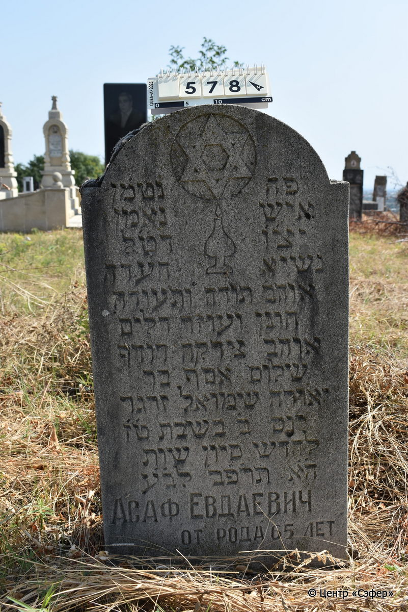
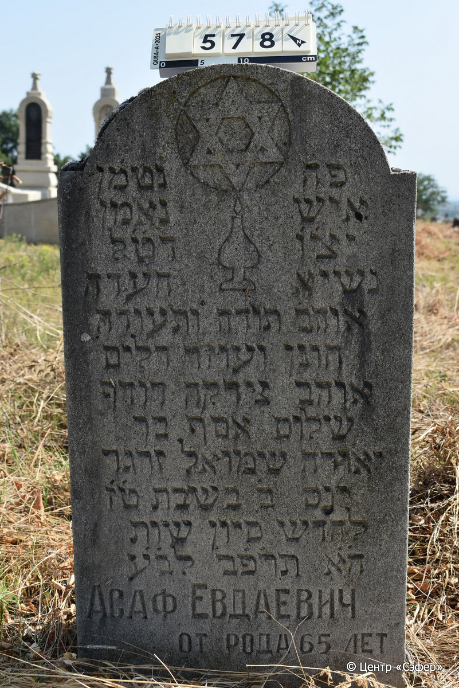

::: {style="font-size: 1em; margin-bottom: 1.2em"}
[Куба (центральное)](../cemeteries/QBA.html) > QBA0578
:::

```{r}
suppressPackageStartupMessages(library(tidyverse))
```


:::: {.columns}

::: {.column width="20%"}

```{r}
#| lightbox:
#|   group: photos




```
:::

::: {.column width="5%"}
:::

::: {.column width="74%"}

::: {.name-style}
Асаф, сын Йехуды Шмуэля (Евдаевич)
:::

::: {style="font-size: 1.2em;"}
אסף בן יאודה שמואל
:::

:::: {.columns}
::: {.column width="5%"}
{width=1.3em}
:::

::: {.column style="width: 40%; padding-left: 0.2em;"}
  /  
:::

::: {.column width="5%"}
{width=1.3em}
:::

::: {.column style="width: 50%; padding-left: 0.2em;"}
12.06.1922* / 16.Si.5682
:::

::::


::: {.panel-tabset}

#### Эпитафия

```{r}
tibble(`Оригинал` = "פה נטמן
איש נאמן
יצ׳ו דט׳ל
נשיא העדה 
אוהב תורה ותעודה
חונן ועוזר דלים
אוהב צדקה רודף
שלום אסף בר
יאודה שמואל זרגר
יום ב׳ בשבת ט׳ז׳
לחדש סיון שנת
ה׳א׳ תר׳פ׳ב לב׳ע׳
Асаф Евдаевич
от рода 65 лет",
       `Перевод` = "Здесь покоится
человек верный,
да хранит его Твердыня и Избавитель его, желавший добра своему народу,
глава общины,
любивший Тору и учение,
милосердный и помогавший обездоленным,
любивший праведность и стремившийся
к миру, Асаф, сын 
Йехуды Шмуэля Заргара.
В понедельник, 16
числа месяца сиван, года
5682 от сотворения мира.
Асаф Евдаевич,
от рода 65 лет.") |>
  mutate(`Оригинал` = str_split(`Оригинал`, "
"),
         `Перевод` = str_split(`Перевод`, "
")) |>
  unnest_longer(c(`Оригинал`, `Перевод`)) |> 
  mutate(id = 1:n()) |> 
  relocate(id, .before = Перевод) |> 
  rename(` ` = id) |> 
  knitr::kable(align = c("r", "c", "l"))
```

|||
|-|---|
|**Примечания**| |
|**Язык**      |иврит, русский    |
|**Метки**     |глава общины (парнас), знаток Писания    |
: {tbl-colwidths="[25,75]"}

#### Памятник

|||
|-|---|
|**Тип памятника**   |стела                                                                         |
|**Материал**        |известняк (следы эрозии)                                                     |
|**Размеры**         |14×45×84  --- стела                                                                        |
|**Тип декора**      |архитектурно-орнаментальный, традиционная символика                                                                        |
|**Элементы декора** |полукруглое завершение с плечиками; свеча, над пламенем которой звезда Давида в розетке                                                                          |
|**Координаты**      |[41.37080186, 48.50808901](https://www.google.com/maps/place/41.37080186, 48.50808901)                    |
: {tbl-colwidths="[25,75]"}

#### Источник

|||
|-|---|
|**Место хранения**        |Архив полевых исследований Центра «Сэфер»     |
|**Контакты**              |students@sefer.ru    |
|**Ссылка**                |https://sfira.org        |
|**Исходный ID**           |  |
|**Условия использования** |[CC BY-NC 4.0](https://creativecommons.org/licenses/by-nc/4.0/deed.ru)     |
: {tbl-colwidths="[25,75]"}

:::

:::

::::

