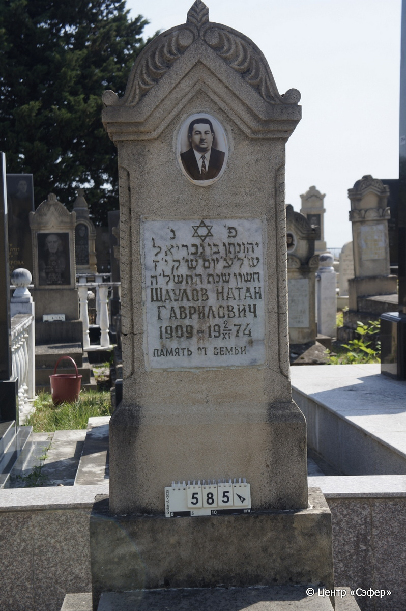
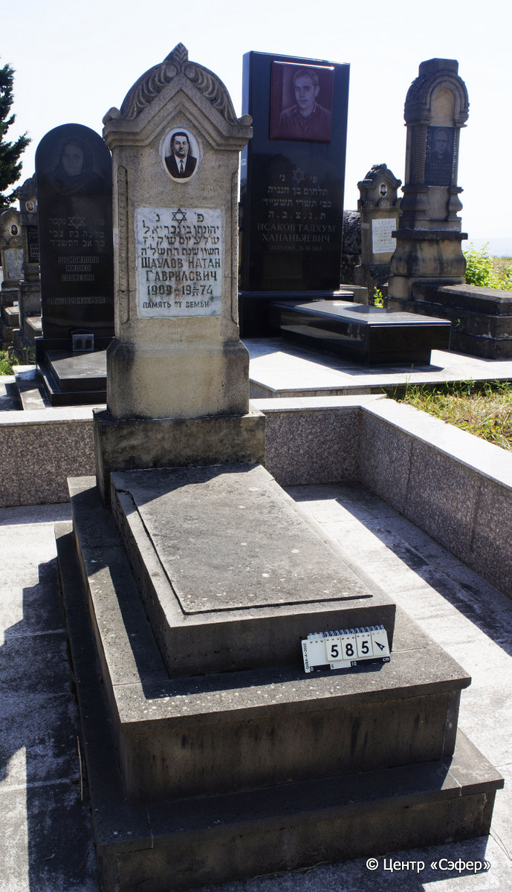

::: {style="font-size: 1em; margin-bottom: 1.2em"}
[Куба (центральное)](../cemeteries/QBA.html) > QBA0585
:::

```{r}
suppressPackageStartupMessages(library(tidyverse))
```


:::: {.columns}

::: {.column width="20%"}

```{r}
#| lightbox:
#|   group: photos




```
:::

::: {.column width="5%"}
:::

::: {.column width="74%"}

::: {.name-style}
ШАУЛОВ Йонатан, сын Гавриэля (Натан Гаврилович)
:::

::: {style="font-size: 1.2em;"}
יהונתן בן גבריאל
:::

:::: {.columns}
::: {.column width="5%"}
{width=1.3em}
:::

::: {.column style="width: 40%; padding-left: 0.2em;"}
-.-.1909 /  
:::

::: {.column width="5%"}
{width=1.3em}
:::

::: {.column style="width: 50%; padding-left: 0.2em;"}
02.11.1974 / 17.Ch.5735
:::

::::


::: {.panel-tabset}

#### Эпитафия

```{r}
tibble(`Оригинал` = "פ׳נ׳
יהונתן בן גבריאל
ש׳ל׳ע׳ יום ש׳ק י׳ז
חשון שנת התשל׳ה
Шаулов Натан
Гаврилович
1909 -  2/XI 1974
память от семьи",
       `Перевод` = "Здесь покоится
Йехунатан, сын Гавриэля, 
который ушел навеки в день святой субботы, 17
хешвана, года 5735.
Шаулов Натан
Гаврилович
1909 - 02.11.1974
Память от семьи.") |>
  mutate(`Оригинал` = str_split(`Оригинал`, "
"),
         `Перевод` = str_split(`Перевод`, "
")) |>
  unnest_longer(c(`Оригинал`, `Перевод`)) |> 
  mutate(id = 1:n()) |> 
  relocate(id, .before = Перевод) |> 
  rename(` ` = id) |> 
  knitr::kable(align = c("r", "c", "l"))
```

|||
|-|---|
|**Примечания**| |
|**Язык**      |иврит, русский    |
|**Метки**     |     |
: {tbl-colwidths="[25,75]"}

#### Памятник

|||
|-|---|
|**Тип памятника**   |L-образный                                                                         |
|**Материал**        |известняк, мрамор (мраморная вставка для текста, керамический медальон с фото, цементный раствор, следы эрозии, стоит на площадке из плит)                                                     |
|**Размеры**         |160×62×28  --- стела; 15×55×117  --- плита; 40×92×192  --- основание                                                                        |
|**Тип декора**      |архитектурно-орнаментальный, растительный, традиционная символика                                                                        |
|**Элементы декора** |фигурное завершение с волютами и растительными мотивами, конек, фотопортрет на медальоне, звезда Давида на вставке, витые полуколонны                                                                          |
|**Координаты**      |[41.37107979, 48.50805172](https://www.google.com/maps/place/41.37107979, 48.50805172)                    |
: {tbl-colwidths="[25,75]"}

#### Источник

|||
|-|---|
|**Место хранения**        |Архив полевых исследований Центра «Сэфер»     |
|**Контакты**              |students@sefer.ru    |
|**Ссылка**                |https://sfira.org        |
|**Исходный ID**           |  |
|**Условия использования** |[CC BY-NC 4.0](https://creativecommons.org/licenses/by-nc/4.0/deed.ru)     |
: {tbl-colwidths="[25,75]"}

:::

:::

::::

