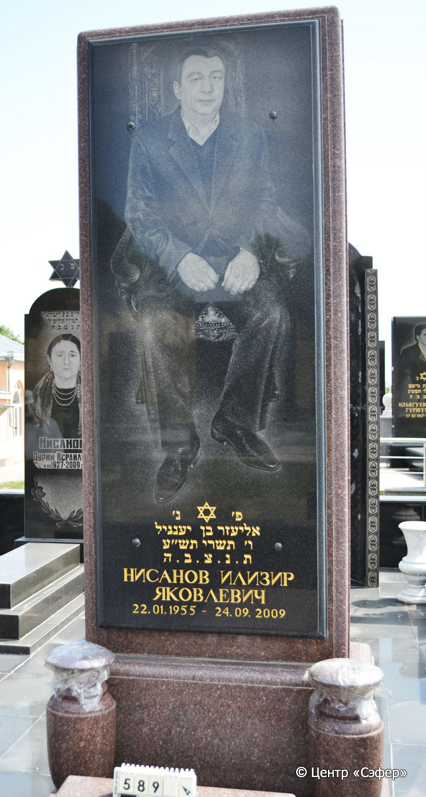
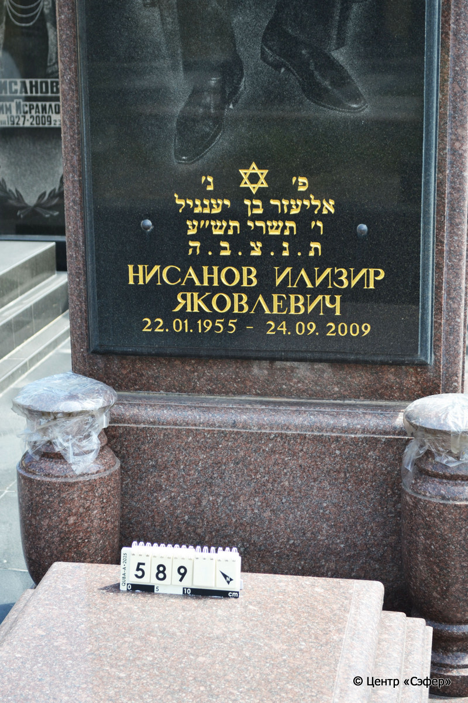
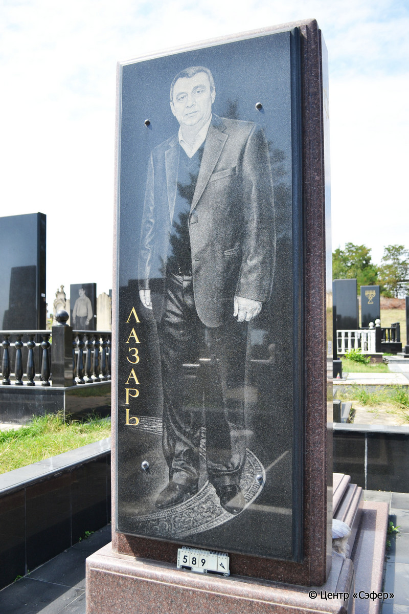
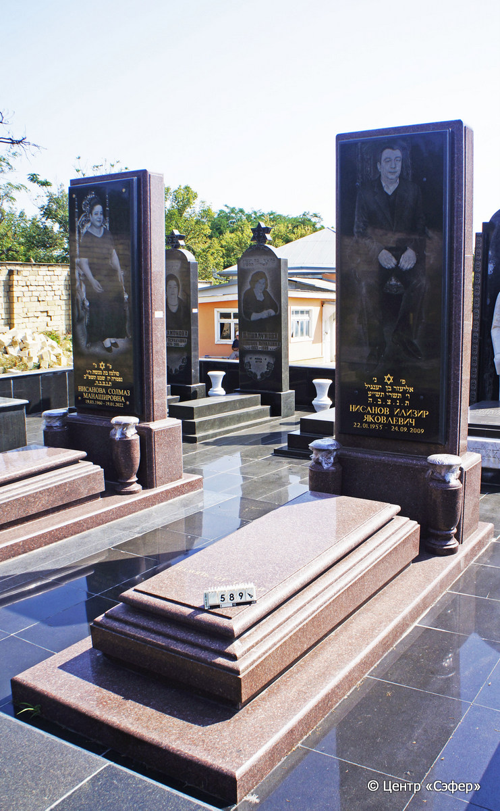

::: {style="font-size: 1em; margin-bottom: 1.2em"}
[Куба (центральное)](../cemeteries/QBA.html) > QBA0589
:::

```{r}
suppressPackageStartupMessages(library(tidyverse))
```


:::: {.columns}

::: {.column width="20%"}

```{r}
#| lightbox:
#|   group: photos






```
:::

::: {.column width="5%"}
:::

::: {.column width="74%"}

::: {.name-style}
НИСАНОВ Элиэзер, сын Янкиля (Илизир Яковлевич)
:::

::: {style="font-size: 1.2em;"}
אליעזר בן יענגיל
:::

:::: {.columns}
::: {.column width="5%"}
{width=1.3em}
:::

::: {.column style="width: 40%; padding-left: 0.2em;"}
22.01.1955 /  
:::

::: {.column width="5%"}
{width=1.3em}
:::

::: {.column style="width: 50%; padding-left: 0.2em;"}
24.09.2009 / 06.Ti.5770
:::

::::


::: {.panel-tabset}

#### Эпитафия

```{r}
tibble(`Оригинал` = "פ׳נ׳
אליעזר בן יענגיל
ו׳ תשרי תש״ע
ת.נ.צ.ב.ה.
НИСАНОВ ИЛИЗИР
ЯКОВЛЕВИЧ
22.01.1955 - 24.09.2009

снизу
память от семьи

обратная сторона
ЛАЗАРЬ",
       `Перевод` = "Здесь покоится
Элиэзер, сын Яангиля.
6 тишрея {5}770.
Да будет душа его завязана в узле жизни.
НИСАНОВ ИЛИЗИР
ЯКОВЛЕВИЧ
22.01.1955 - 24.09.2009

 
память от семьи

 
ЛАЗАРЬ") |>
  mutate(`Оригинал` = str_split(`Оригинал`, "
"),
         `Перевод` = str_split(`Перевод`, "
")) |>
  unnest_longer(c(`Оригинал`, `Перевод`)) |> 
  mutate(id = 1:n()) |> 
  relocate(id, .before = Перевод) |> 
  rename(` ` = id) |> 
  knitr::kable(align = c("r", "c", "l"))
```

|||
|-|---|
|**Примечания**| |
|**Язык**      |иврит, русский    |
|**Метки**     |     |
: {tbl-colwidths="[25,75]"}

#### Памятник

|||
|-|---|
|**Тип памятника**   |L-образный                                                                         |
|**Материал**        |гранит (на площадке из гранитных плит с гранитной оградой, две гранитные таблички для текста и фотопортрета)                                                     |
|**Размеры**         |258×108×43  --- стела; 42×82×178  --- плита; 10×120×313  --- основе                                                                        |
|**Тип декора**      |традиционная символика                                                                        |
|**Элементы декора** |две вазы, фотопортрет на лицевой и на оборотной сторонах, звезда Давида, звезда Давида с левой стороны                                                                          |
|**Координаты**      |[41.37119881, 48.5081126](https://www.google.com/maps/place/41.37119881, 48.5081126)                    |
: {tbl-colwidths="[25,75]"}

#### Источник

|||
|-|---|
|**Место хранения**        |Архив полевых исследований Центра «Сэфер»     |
|**Контакты**              |students@sefer.ru    |
|**Ссылка**                |https://sfira.org        |
|**Исходный ID**           |  |
|**Условия использования** |[CC BY-NC 4.0](https://creativecommons.org/licenses/by-nc/4.0/deed.ru)     |
: {tbl-colwidths="[25,75]"}

:::

:::

::::

