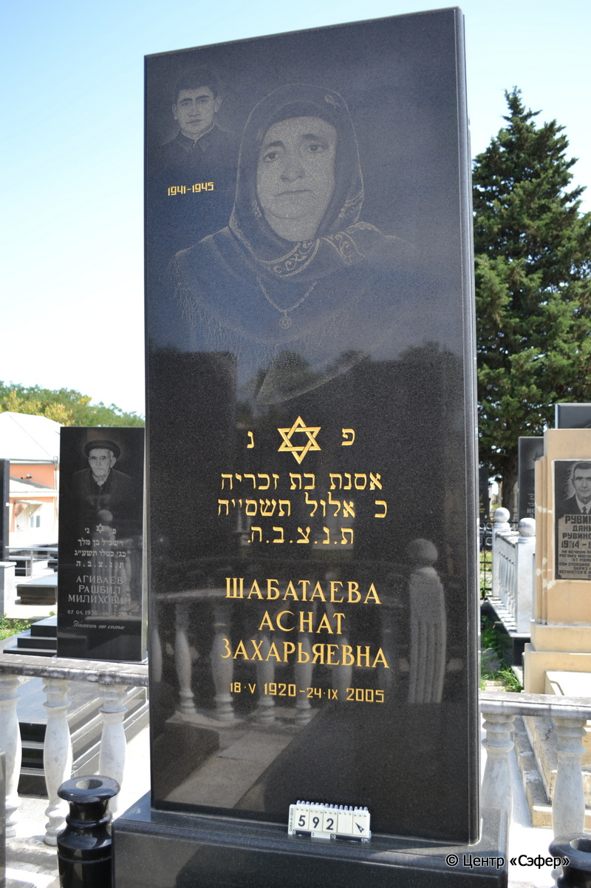
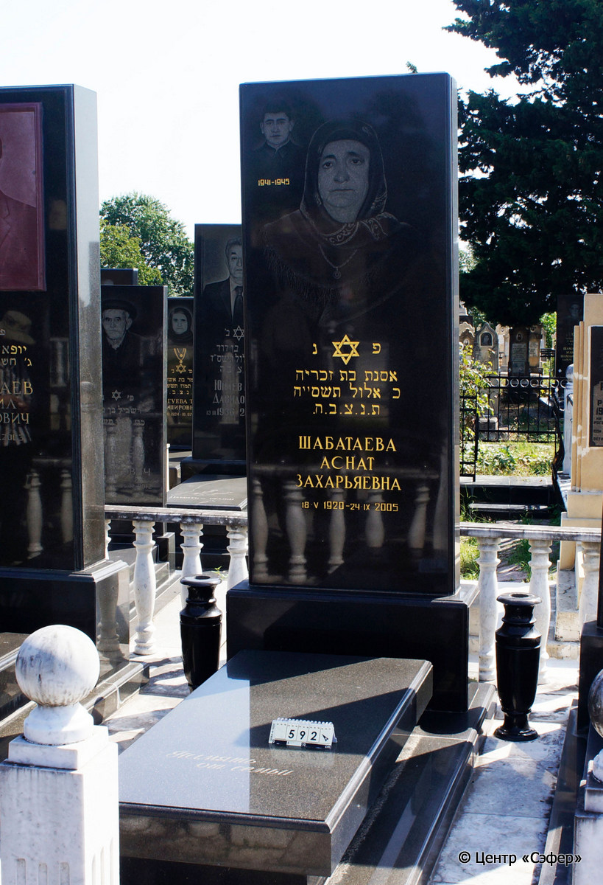
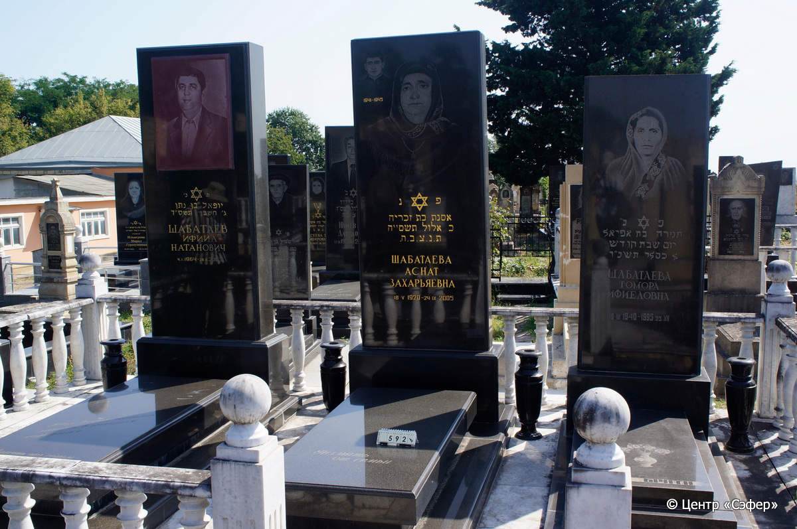

::: {style="font-size: 1em; margin-bottom: 1.2em"}
[Куба (центральное)](../cemeteries/QBA.html) > QBA0592
:::

```{r}
suppressPackageStartupMessages(library(tidyverse))
```


:::: {.columns}

::: {.column width="20%"}

```{r}
#| lightbox:
#|   group: photos





```
:::

::: {.column width="5%"}
:::

::: {.column width="74%"}

::: {.name-style}
ШАБАТАЕВА Оснат, дочь Захарии (Аснат Захарьяевна)
:::

::: {style="font-size: 1.2em;"}
אסנת בת זכריה
:::

:::: {.columns}
::: {.column width="5%"}
{width=1.3em}
:::

::: {.column style="width: 40%; padding-left: 0.2em;"}
18.05.1920 /  
:::

::: {.column width="5%"}
{width=1.3em}
:::

::: {.column style="width: 50%; padding-left: 0.2em;"}
24.09.2005 / 20.El.5768
:::

::::

---

::: {.name-style}
Неизвестный
:::

::: {style="font-size: 1.2em;"}
אלמוני
:::

:::: {.columns}
::: {.column width="5%"}
{width=1.3em}
:::

::: {.column style="width: 40%; padding-left: 0.2em;"}
  /  
:::

::: {.column width="5%"}
{width=1.3em}
:::

::: {.column style="width: 50%; padding-left: 0.2em;"}
  /  
:::

::::


::: {.panel-tabset}

#### Эпитафия

```{r}
tibble(`Оригинал` = "сверху
1941-1945
פנ
אסנת בת זכריה
כ אלול תשס״ח
ת.נ.צ.ב.ה.
ШАБАТАЕВА
АСНАТ
ЗАХАРЬЯЕВНА
18/V 1920 - 24/IX 2005

снизу
Память от семьи",
       `Перевод` = "
1941–1945
Здесь покоится
Аснат, дочь Захарии
20 элула {5}768 года.
Да будет душа ее завязана в узле жизни.
Шабатаева
Аснат
Захарьевна
18.05.1920 – 24.09.2005

 
Память от семьи") |>
  mutate(`Оригинал` = str_split(`Оригинал`, "
"),
         `Перевод` = str_split(`Перевод`, "
")) |>
  unnest_longer(c(`Оригинал`, `Перевод`)) |> 
  mutate(id = 1:n()) |> 
  relocate(id, .before = Перевод) |> 
  rename(` ` = id) |> 
  knitr::kable(align = c("r", "c", "l"))
```

|||
|-|---|
|**Примечания**| |
|**Язык**      |иврит, русский    |
|**Метки**     |     |
: {tbl-colwidths="[25,75]"}

#### Памятник

|||
|-|---|
|**Тип памятника**   |L-образный                                                                         |
|**Материал**        |габбро-диорит (цементный раствор, стоит на площадке из мрамора)                                                     |
|**Размеры**         |265×105×40  --- стела; 30×78×175  --- плита; 15×120×250  --- основание                                                                        |
|**Тип декора**      |традиционная символика                                                                        |
|**Элементы декора** |звезда Давида, фотопортрет, минора на оборотной стороне, вазы у основания                                                                          |
|**Координаты**      |[41.37111678, 48.5081215](https://www.google.com/maps/place/41.37111678, 48.5081215)                    |
: {tbl-colwidths="[25,75]"}

#### Источник

|||
|-|---|
|**Место хранения**        |Архив полевых исследований Центра «Сэфер»     |
|**Контакты**              |students@sefer.ru    |
|**Ссылка**                |https://sfira.org        |
|**Исходный ID**           |  |
|**Условия использования** |[CC BY-NC 4.0](https://creativecommons.org/licenses/by-nc/4.0/deed.ru)     |
: {tbl-colwidths="[25,75]"}

:::

:::

::::

