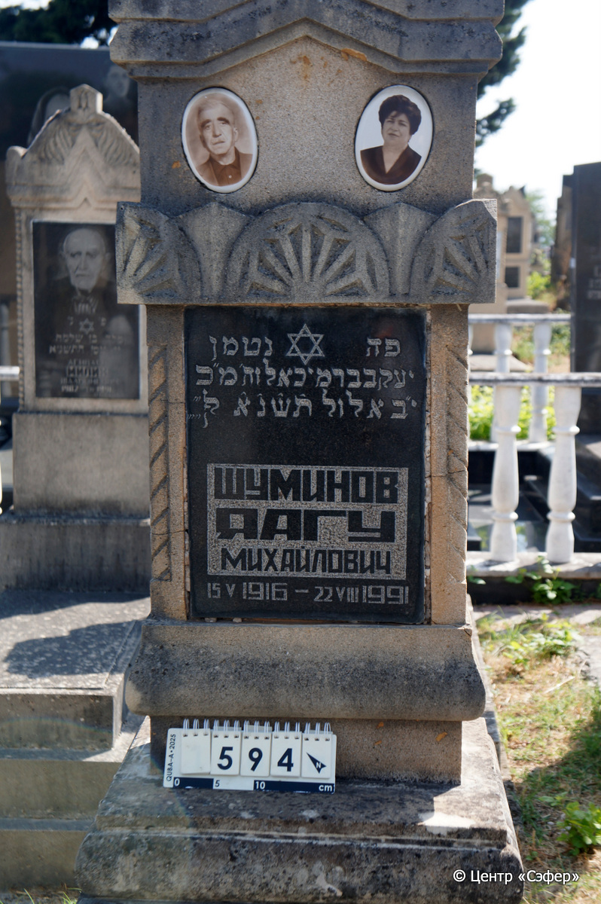
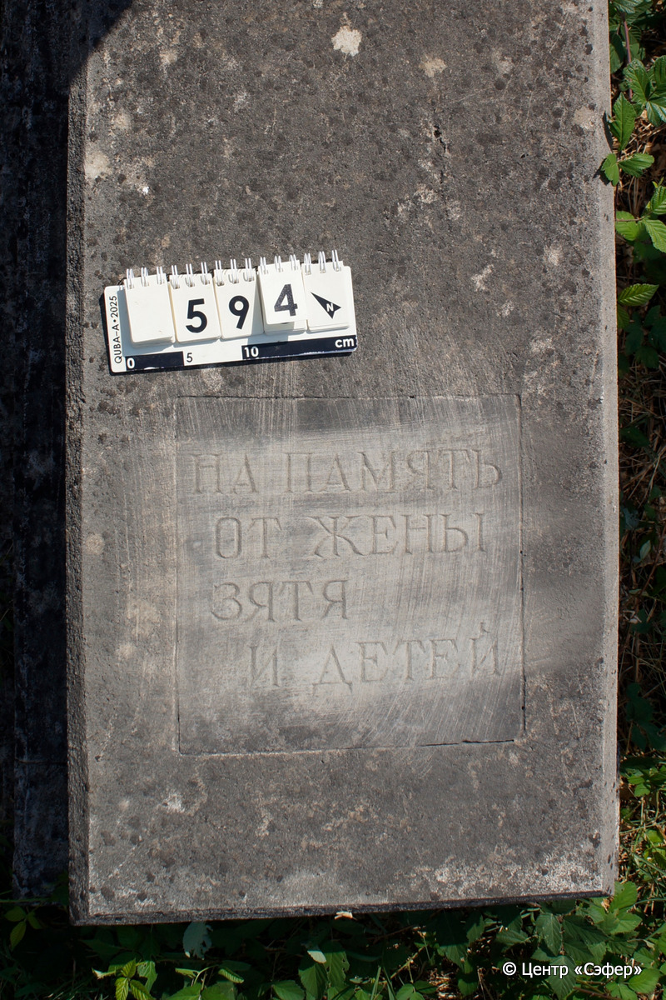
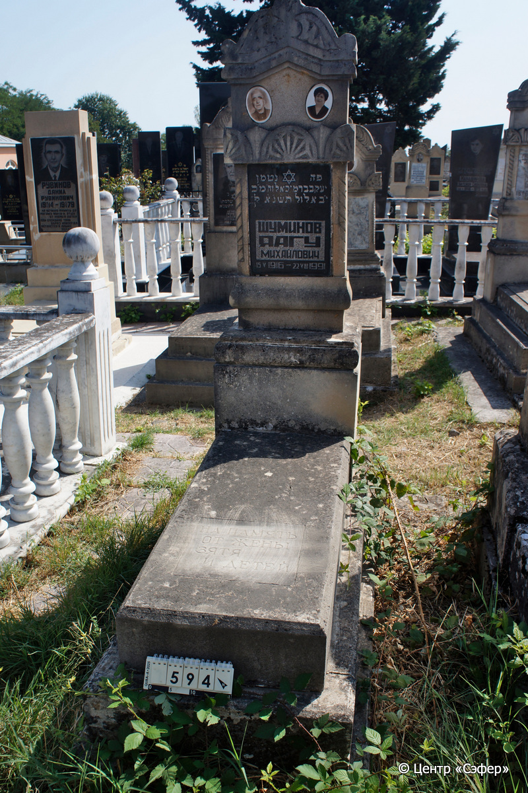

::: {style="font-size: 1em; margin-bottom: 1.2em"}
[Куба (центральное)](../cemeteries/QBA.html) > QBA0594
:::

```{r}
suppressPackageStartupMessages(library(tidyverse))
```


:::: {.columns}

::: {.column width="20%"}

```{r}
#| lightbox:
#|   group: photos





```
:::

::: {.column width="5%"}
:::

::: {.column width="74%"}

::: {.name-style}
ШУМИНОВ Яаков, сын Михаэля (Яагу Михайлович)
:::

::: {style="font-size: 1.2em;"}
יעקב בן מיכאל
:::

:::: {.columns}
::: {.column width="5%"}
{width=1.3em}
:::

::: {.column style="width: 40%; padding-left: 0.2em;"}
15.05.1916 /  
:::

::: {.column width="5%"}
{width=1.3em}
:::

::: {.column style="width: 50%; padding-left: 0.2em;"}
22.08.1991 / 12.El.5751
:::

::::


::: {.panel-tabset}

#### Эпитафия

```{r}
tibble(`Оригинал` = "сверху
פה נטמן
יעקב בר מיכאל וה׳מ׳כ׳
י״ב אלול ת֗ש֗נ֗א֗ לפק״
ШУМИНОВ
ЯАГУ
МИХАЙЛОВИЧ
15 V 1916 - 22 VIII 1991

снизу
НА ПАМЯТЬ
ОТ ЖЕНЫ
ЗЯТЯ
И ДЕТЕЙ",
       `Перевод` = "
Здесь покоится
Яаков, сын Михаэля, благословен ее покой.
12 элуля {5}751 по малому летоисчислению.
ШУМИНОВ
ЯАГУ
МИХАЙЛОВИЧ
15.05.1916 - 22.08.1991

 
НА ПАМЯТЬ
ОТ ЖЕНЫ,
ЗЯТЯ
И ДЕТЕЙ.") |>
  mutate(`Оригинал` = str_split(`Оригинал`, "
"),
         `Перевод` = str_split(`Перевод`, "
")) |>
  unnest_longer(c(`Оригинал`, `Перевод`)) |> 
  mutate(id = 1:n()) |> 
  relocate(id, .before = Перевод) |> 
  rename(` ` = id) |> 
  knitr::kable(align = c("r", "c", "l"))
```

|||
|-|---|
|**Примечания**| |
|**Язык**      |иврит, русский    |
|**Метки**     |     |
: {tbl-colwidths="[25,75]"}

#### Памятник

|||
|-|---|
|**Тип памятника**   |L-образный                                                                         |
|**Материал**        |известняк, гранит, мрамор (следы эрозии, мраморная вставка для текста, гранитная вставка для текста, керамические медальоны, цементный раствор)                                                     |
|**Размеры**         |173×52×43  --- стела; 20×50×114  --- плита; 40×78×185  --- основание                                                                        |
|**Тип декора**      |архитектурно-орнаментальный, традиционная символика                                                                        |
|**Элементы декора** |фигурное завершение с волютами и растительным мотивом и коньком, два фотопортрета на медальонах, пояс из розеток, витые полуколонны, звезда Давида на вставке                                                                          |
|**Координаты**      |[41.37108489, 48.50812666](https://www.google.com/maps/place/41.37108489, 48.50812666)                    |
: {tbl-colwidths="[25,75]"}

#### Источник

|||
|-|---|
|**Место хранения**        |Архив полевых исследований Центра «Сэфер»     |
|**Контакты**              |students@sefer.ru    |
|**Ссылка**                |https://sfira.org        |
|**Исходный ID**           |  |
|**Условия использования** |[CC BY-NC 4.0](https://creativecommons.org/licenses/by-nc/4.0/deed.ru)     |
: {tbl-colwidths="[25,75]"}

:::

:::

::::

