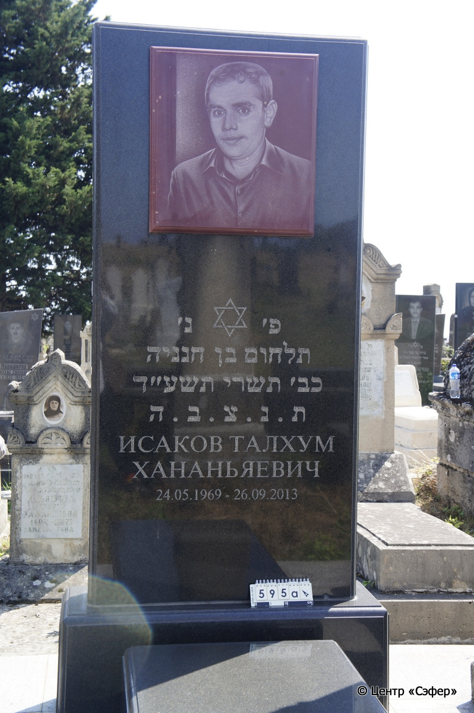
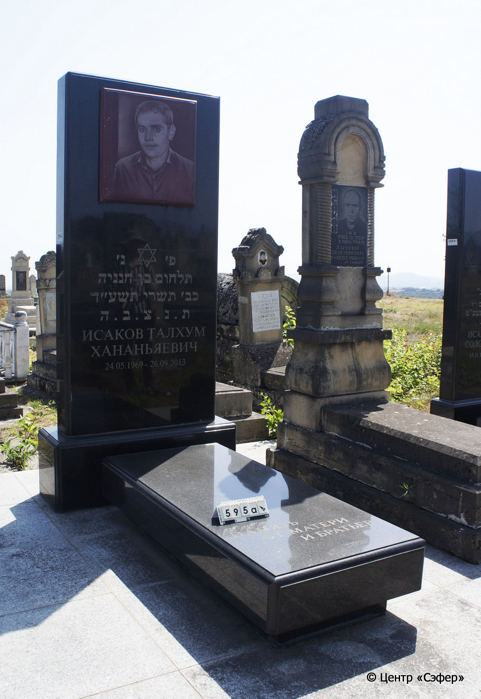

::: {style="font-size: 1em; margin-bottom: 1.2em"}
[Куба (центральное)](../cemeteries/QBA.html) > QBA0595a
:::

```{r}
suppressPackageStartupMessages(library(tidyverse))
```


:::: {.columns}

::: {.column width="20%"}

```{r}
#| lightbox:
#|   group: photos




```
:::

::: {.column width="5%"}
:::

::: {.column width="74%"}

::: {.name-style}
ИСАКОВ Талхум, сын Ханании (Талхум Хананьяевич)
:::

::: {style="font-size: 1.2em;"}
תלחום בן חנניה
:::

:::: {.columns}
::: {.column width="5%"}
{width=1.3em}
:::

::: {.column style="width: 40%; padding-left: 0.2em;"}
24.05.1969 /  
:::

::: {.column width="5%"}
{width=1.3em}
:::

::: {.column style="width: 50%; padding-left: 0.2em;"}
26.09.2013 / 22.Ti.5774
:::

::::


::: {.panel-tabset}

#### Эпитафия

```{r}
tibble(`Оригинал` = "сверху
פ׳נ׳
תלחום בן חנניה
כב׳ תשרי תשע״ד
ת.נ.צ.ב.ה.
ИСАКОВ ТАЛХУМ
ХАНАНЬЯЕВИЧ
24.05.1969 - 26.09.2013

снизу
ПАМЯТЬ
ОТ МАТЕРИ
И БРАТЬЕВ

обратная сторона
ЗОРИК",
       `Перевод` = "
Здесь покоится
Талхум, сын Хананьи.
22 тишрея {5}774 года.
Да будет душа его завязана в узле жизни.
ИСАКОВ ТАЛХУМ
ХАНАНЬЯЕВИЧ
24.05.1969 - 26.09.2013

 
ПАМЯТЬ
ОТ МАТЕРИ
И БРАТЬЕВ

 
ЗОРИК") |>
  mutate(`Оригинал` = str_split(`Оригинал`, "
"),
         `Перевод` = str_split(`Перевод`, "
")) |>
  unnest_longer(c(`Оригинал`, `Перевод`)) |> 
  mutate(id = 1:n()) |> 
  relocate(id, .before = Перевод) |> 
  rename(` ` = id) |> 
  knitr::kable(align = c("r", "c", "l"))
```

|||
|-|---|
|**Примечания**| |
|**Язык**      |иврит, русский    |
|**Метки**     |     |
: {tbl-colwidths="[25,75]"}

#### Памятник

|||
|-|---|
|**Тип памятника**   |L-образный                                                                         |
|**Материал**        |габбро-диорит (цементный раствор, стоит на плитах)                                                     |
|**Размеры**         |227×107×40  --- стела; 35×70×157  --- плита                                                                        |
|**Тип декора**      |традиционная символика                                                                        |
|**Элементы декора** |звезда Давида, фотопортрет с лицевой и оборотной стороны                                                                          |
|**Координаты**      |[41.37106534, 48.50809941](https://www.google.com/maps/place/41.37106534, 48.50809941)                    |
: {tbl-colwidths="[25,75]"}

#### Источник

|||
|-|---|
|**Место хранения**        |Архив полевых исследований Центра «Сэфер»     |
|**Контакты**              |students@sefer.ru    |
|**Ссылка**                |https://sfira.org        |
|**Исходный ID**           |  |
|**Условия использования** |[CC BY-NC 4.0](https://creativecommons.org/licenses/by-nc/4.0/deed.ru)     |
: {tbl-colwidths="[25,75]"}

:::

:::

::::

