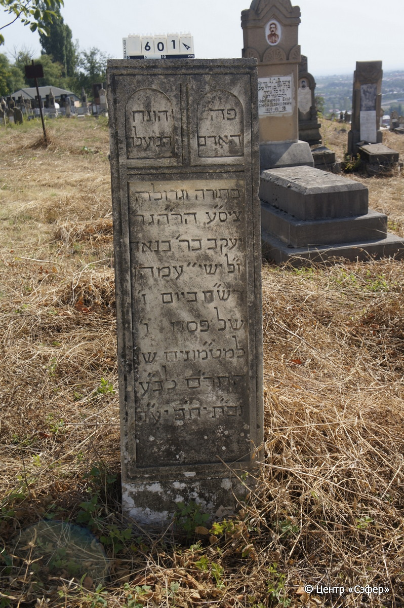

::: {style="font-size: 1em; margin-bottom: 1.2em"}
[Куба (центральное)](../cemeteries/QBA.html) > QBA0601
:::

```{r}
suppressPackageStartupMessages(library(tidyverse))
```


:::: {.columns}

::: {.column width="20%"}

```{r}
#| lightbox:
#|   group: photos



```
:::

::: {.column width="5%"}
:::

::: {.column width="74%"}

::: {.name-style}
Яаков, сын Баны
:::

::: {style="font-size: 1.2em;"}
יעקב בן בנאה
:::

:::: {.columns}
::: {.column width="5%"}
{width=1.3em}
:::

::: {.column style="width: 40%; padding-left: 0.2em;"}
  /  
:::

::: {.column width="5%"}
{width=1.3em}
:::

::: {.column style="width: 50%; padding-left: 0.2em;"}
02.04.1880* / 21.Ni.5640
:::

::::


::: {.panel-tabset}

#### Эпитафия

```{r}
tibble(`Оригинал` = "פה הונח
האדם המעלה
בתורה וגדולה
ציס״ע הר״הג ר׳
יעקב בר׳ בנאה
ז״ל ישי״ עמהן
דש״ח ביום ז׳
של פסח ו׳
למט״מונים שנ׳
התר״ם לב״ע
נב״ת יה״ב יע״ם",
       `Перевод` = "Здесь лежит
человек выдающийся
в Торе и величии,
праведник, опора мира, великий раввин р.
Яаков, сын р. Бана,
благословенной памяти, он обретёт покой, и те, кто идёт путем прямым, возлягут и отдохнут,
который оставил жизнь на седьмой
день Песаха, на 6 <день> 
отсчета Омера, года
{5}640 от сотворения мира.
Да упокоится его душа в раю. Пусть торжествуют праведники во славе и радуются на ложах своих*.") |>
  mutate(`Оригинал` = str_split(`Оригинал`, "
"),
         `Перевод` = str_split(`Перевод`, "
")) |>
  unnest_longer(c(`Оригинал`, `Перевод`)) |> 
  mutate(id = 1:n()) |> 
  relocate(id, .before = Перевод) |> 
  rename(` ` = id) |> 
  knitr::kable(align = c("r", "c", "l"))
```

|||
|-|---|
|**Примечания**|*Цит. Пс 149:2|
|**Язык**      |иврит    |
|**Метки**     |знаток Писания, раввин    |
: {tbl-colwidths="[25,75]"}

#### Памятник

|||
|-|---|
|**Тип памятника**   |стела                                                                         |
|**Материал**        |известняк (следы эрозии, сколы)                                                     |
|**Размеры**         |145×45×23                                                                        |
|**Тип декора**      |архитектурно-орнаментальный                                                                        |
|**Элементы декора** |три фигурные ниши для текста                                                                          |
|**Координаты**      |[41.37081696, 48.50827226](https://www.google.com/maps/place/41.37081696, 48.50827226)                    |
: {tbl-colwidths="[25,75]"}

#### Источник

|||
|-|---|
|**Место хранения**        |Архив полевых исследований Центра «Сэфер»     |
|**Контакты**              |students@sefer.ru    |
|**Ссылка**                |https://sfira.org        |
|**Исходный ID**           |  |
|**Условия использования** |[CC BY-NC 4.0](https://creativecommons.org/licenses/by-nc/4.0/deed.ru)     |
: {tbl-colwidths="[25,75]"}

:::

:::

::::

