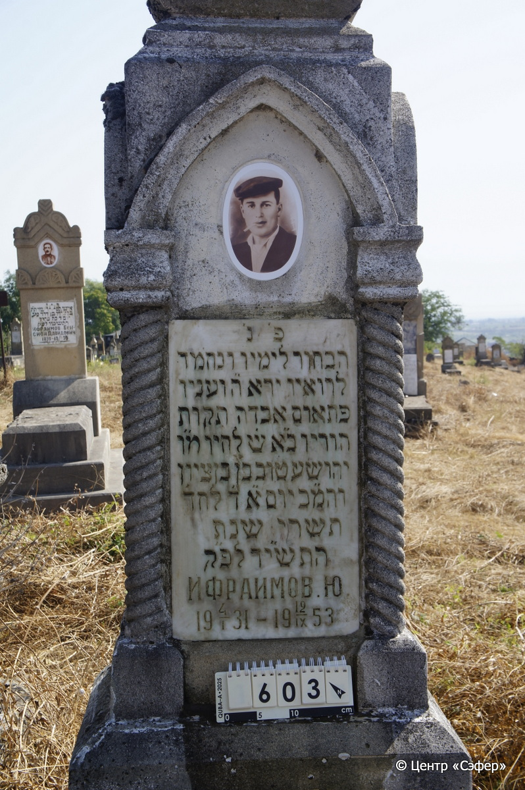
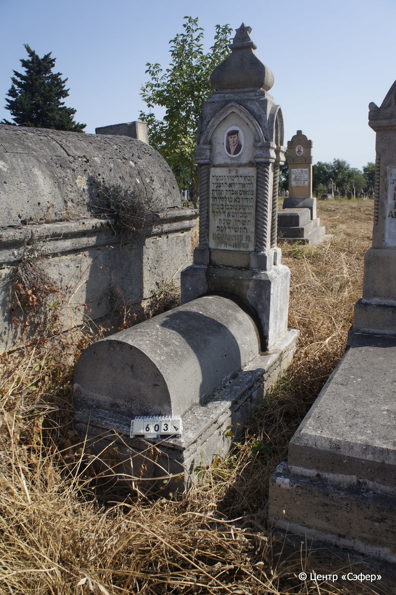

::: {style="font-size: 1em; margin-bottom: 1.2em"}
[Куба (центр.) Азербайджан](../cemeteries/QBA.html) > QBA0603
:::

```{r}
suppressPackageStartupMessages(library(tidyverse))
```


:::: {.columns}

::: {.column width="20%"}

```{r}
#| lightbox:
#|   group: photos




```
:::

::: {.column width="5%"}
:::

::: {.column width="74%"}

::: {.name-style}
ИФРАИМОВ Йехошуа Тов, сын Бенциона
:::

::: {style="font-size: 1.2em;"}
יהושע טוב בן בן ציון
:::

:::: {.columns}
::: {.column width="5%"}
{width=1.3em}
:::

::: {.column style="width: 40%; padding-left: 0.2em;"}
04.01.1931 /  
:::

::: {.column width="5%"}
{width=1.3em}
:::

::: {.column style="width: 50%; padding-left: 0.2em;"}
12.09.1953 / 04.Ti.5714
:::

::::


::: {.panel-tabset}

#### Эпитафия

```{r}
tibble(`Оригинал` = "פ׳נ׳
הבחור לימיו ונחמד
לרואיו ירא ה״ ועניו
פתאום אבדה תקות 
הוריו  כ״א ש׳ לחיו מ״ו
יהושע טוב בן בן ציון
והמ״כ יום א״ ד׳ לחד׳
תשרי שנת
התש״יד לפ״ק
Ифраимов. Ю. 
4/I 1931 - 12/IX 1953",
       `Перевод` = "Здесь покоится
юный днями и приятный
видевшим его, богобоязненный и смиренный.
Вдруг пропала надежда
родителей его, 21 лет от роду, господин
Йехоше Тов, сын Бенциона, 
благословен его покой. В воскресенье, 4 числа месяца
тишрей, года
5714 по малому летоисчислению.
Ифраимов. Ю. 
04.01.1931 - 12.09.1953") |>
  mutate(`Оригинал` = str_split(`Оригинал`, "
"),
         `Перевод` = str_split(`Перевод`, "
")) |>
  unnest_longer(c(`Оригинал`, `Перевод`)) |> 
  mutate(id = 1:n()) |> 
  relocate(id, .before = Перевод) |> 
  rename(` ` = id) |> 
  knitr::kable(align = c("r", "c", "l"))
```

|||
|-|---|
|**Примечания**| |
|**Язык**      |иврит, русский    |
|**Метки**     |     |
: {tbl-colwidths="[25,75]"}

#### Памятник

|||
|-|---|
|**Тип памятника**   |L-образный                                                                         |
|**Материал**        |известняк, мрамор (мраморная вставка для текста, керамический медальон, сколы, следы эрозии)                                                     |
|**Размеры**         |44×60×195  --- стела; 45×50×110  --- плита; 30×60×178  --- основание                                                                        |
|**Тип декора**      |архитектурно-орнаментальный, традиционная символика                                                                        |
|**Элементы декора** |навершие со звездой Давида, стрельчатый портал с витыми полуколоннами, фотопортрет в медальоне                                                                          |
|**Координаты**      |[41.37078929, 48.50826729](https://www.google.com/maps/place/41.37078929, 48.50826729)                    |
: {tbl-colwidths="[25,75]"}

#### Источник

|||
|-|---|
|**Место хранения**        |Архив полевых исследований Центра «Сэфер»     |
|**Контакты**              |students@sefer.ru    |
|**Ссылка**                |https://sfira.org        |
|**Исходный ID**           |  |
|**Условия использования** |[CC BY-NC 4.0](https://creativecommons.org/licenses/by-nc/4.0/deed.ru)     |
: {tbl-colwidths="[25,75]"}

:::

:::

::::

