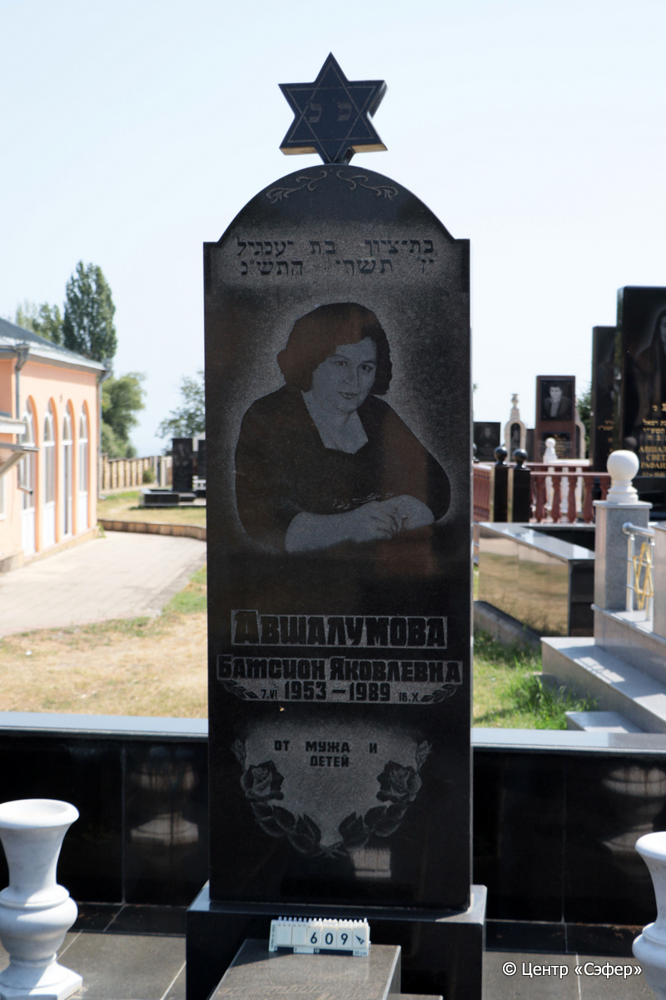
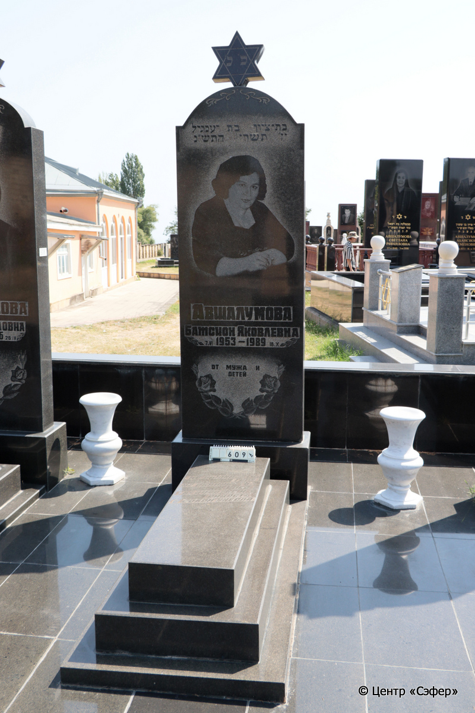
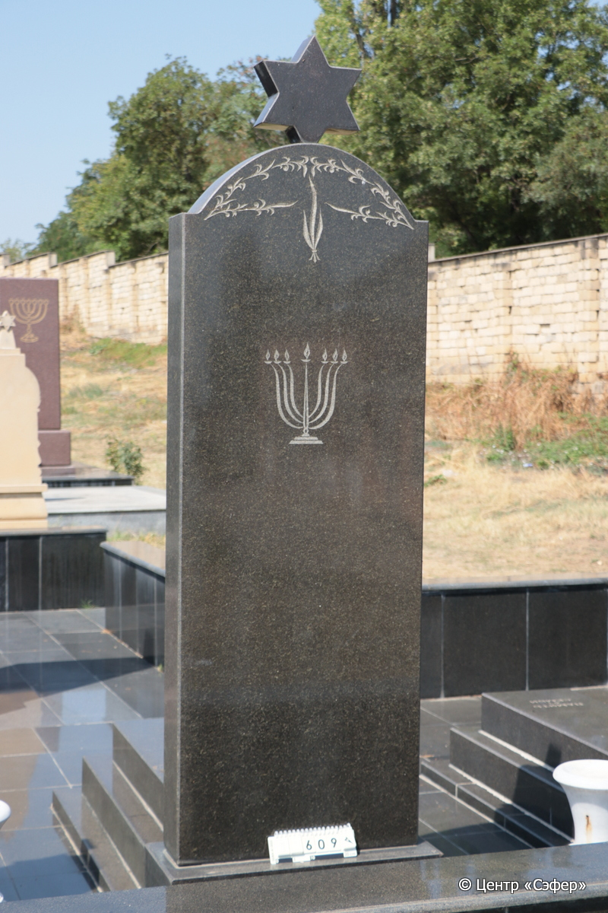

::: {style="font-size: 1em; margin-bottom: 1.2em"}
[Куба (центральное)](../cemeteries/QBA.html) > QBA0609
:::

```{r}
suppressPackageStartupMessages(library(tidyverse))
```


:::: {.columns}

::: {.column width="20%"}

```{r}
#| lightbox:
#|   group: photos





```
:::

::: {.column width="5%"}
:::

::: {.column width="74%"}

::: {.name-style}
АВШАЛУМОВА Бат Цион, дочь Янгиля (Батсион Яковлевна)
:::

::: {style="font-size: 1.2em;"}
בת ציון בת יענגיל
:::

:::: {.columns}
::: {.column width="5%"}
{width=1.3em}
:::

::: {.column style="width: 40%; padding-left: 0.2em;"}
07.06.1953 /  
:::

::: {.column width="5%"}
{width=1.3em}
:::

::: {.column style="width: 50%; padding-left: 0.2em;"}
16.10.1989 / 17.Ti.5750
:::

::::


::: {.panel-tabset}

#### Эпитафия

```{r}
tibble(`Оригинал` = "פ״נ
בת־ציון בת יענגיל
יז״ תשרי התש״נ
АВШАЛУМОВА
БАТСИОН ЯКОВЛЕВНА
7.VI 1953 - 1989 16.X
от мужа и
детей
снизу
не высказать
горе
не выплакать
слез
ты счастье и
радость
с собой унесла",
       `Перевод` = "Здесь покоится
Бат Цион, дочь Яангила.
17 тишрея 5750.
АВШАЛУМОВА
БАТСИОН ЯКОВЛЕВНА
07.06.1953 - 16.10.1989
от мужа и
детей

Не высказать
горе,
не выплакать
слез,
ты счастье и
радость
с собой унесла.") |>
  mutate(`Оригинал` = str_split(`Оригинал`, "
"),
         `Перевод` = str_split(`Перевод`, "
")) |>
  unnest_longer(c(`Оригинал`, `Перевод`)) |> 
  mutate(id = 1:n()) |> 
  relocate(id, .before = Перевод) |> 
  rename(` ` = id) |> 
  knitr::kable(align = c("r", "c", "l"))
```

|||
|-|---|
|**Примечания**| |
|**Язык**      |иврит, русский    |
|**Метки**     |     |
: {tbl-colwidths="[25,75]"}

#### Памятник

|||
|-|---|
|**Тип памятника**   |L-образный                                                                         |
|**Материал**        |гранит, мрамор (цементный раствор, мраморная ваза)                                                     |
|**Размеры**         |260×82×35  --- стела; 38×60×160  --- плита; 7×79×182  --- основание                                                                        |
|**Тип декора**      |архитектурно-орнаментальный, растительный, традиционная символика                                                                        |
|**Элементы декора** |навершие в виде звезды Давида, фотопортрет, минора на оборотной стороне, растительный орнамент                                                                          |
|**Координаты**      |[41.37123144, 48.50815672](https://www.google.com/maps/place/41.37123144, 48.50815672)                    |
: {tbl-colwidths="[25,75]"}

#### Источник

|||
|-|---|
|**Место хранения**        |Архив полевых исследований Центра «Сэфер»     |
|**Контакты**              |students@sefer.ru    |
|**Ссылка**                |https://sfira.org        |
|**Исходный ID**           |  |
|**Условия использования** |[CC BY-NC 4.0](https://creativecommons.org/licenses/by-nc/4.0/deed.ru)     |
: {tbl-colwidths="[25,75]"}

:::

:::

::::

