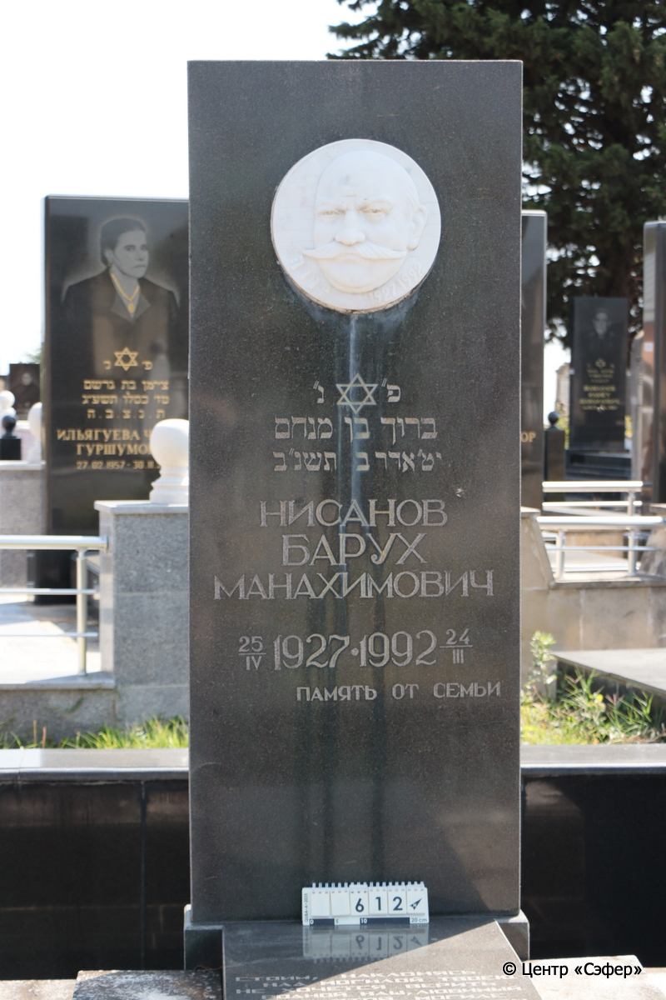
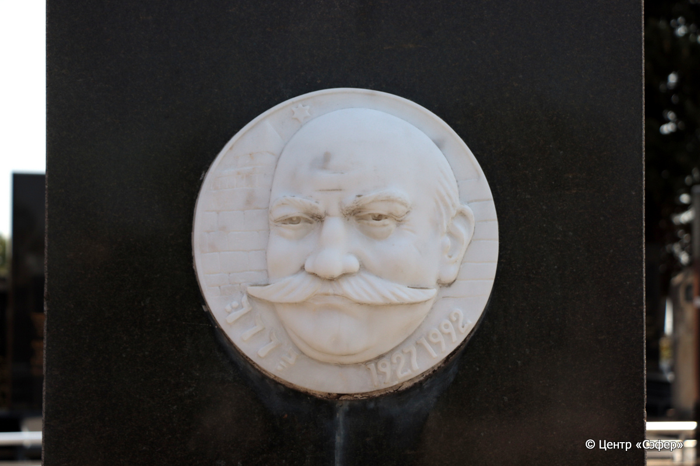
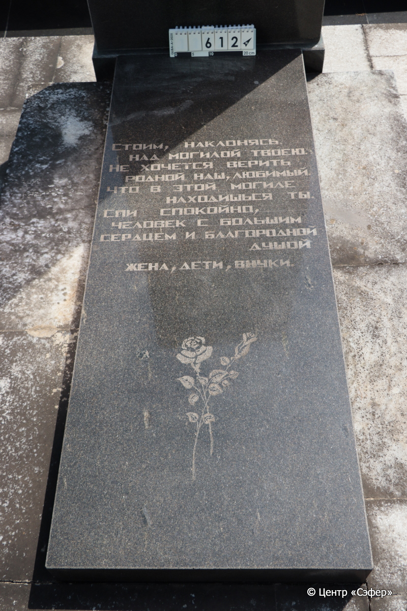
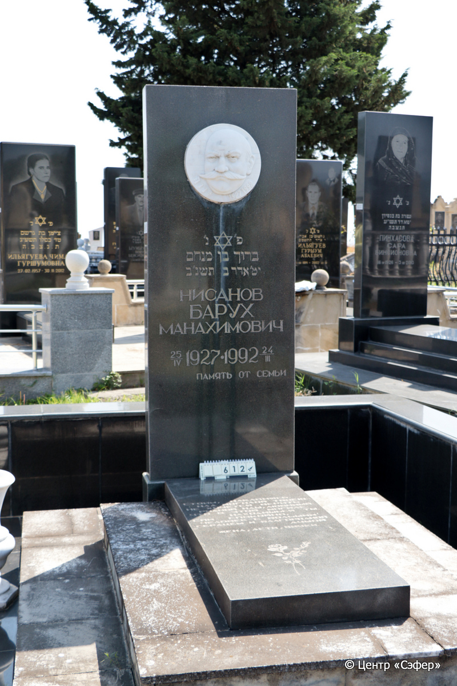
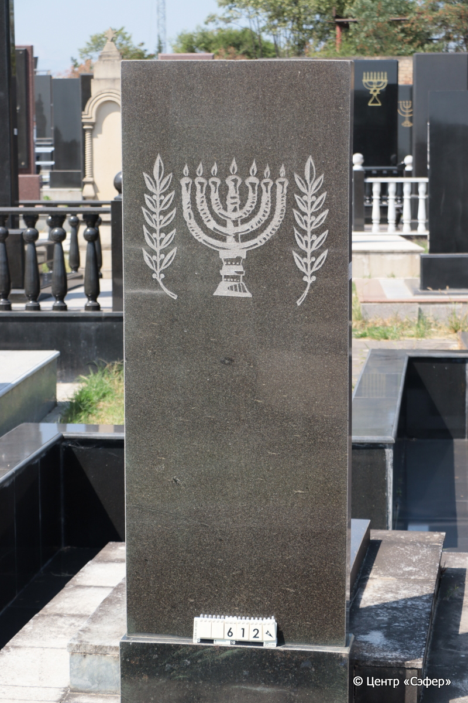

::: {style="font-size: 1em; margin-bottom: 1.2em"}
[Куба (центральное)](../cemeteries/QBA.html) > QBA0612
:::

```{r}
suppressPackageStartupMessages(library(tidyverse))
```


:::: {.columns}

::: {.column width="20%"}

```{r}
#| lightbox:
#|   group: photos







```
:::

::: {.column width="5%"}
:::

::: {.column width="74%"}

::: {.name-style}
НИСАНОВ Барух, сын Менахема (Барух Манахимович)
:::

::: {style="font-size: 1.2em;"}
ברוך בן מנחם
:::

:::: {.columns}
::: {.column width="5%"}
{width=1.3em}
:::

::: {.column style="width: 40%; padding-left: 0.2em;"}
25.04.1927 /  
:::

::: {.column width="5%"}
{width=1.3em}
:::

::: {.column style="width: 50%; padding-left: 0.2em;"}
24.03.1992 / 19.Ad2.5752
:::

::::


::: {.panel-tabset}

#### Эпитафия

```{r}
tibble(`Оригинал` = "1927 1992 ברוך
פ׳נ׳
ברוך בן מנחם
יט׳ אדר ב תשנ׳ב
Нисанов
Барух
Манахимович
25/IV 1927•1992 24/III
 Память от семьи

снизу
Стоим, наклонясь, 
Над могилой твоею.
Не хочется верить
Родной наш, любимый.
Что в этой могиле 
находишься ты.
Спи спокойно,
человек с большим
сердцем и благородной
душой
жена, дети, внуки.",
       `Перевод` = "Барух 1927 - 1992.
Здесь покоится
Барух, сын Менахема.
19 адара-II {5}752 года.
Нисанов
Барух
Манахимович
25.04.1927 - 24.03.1992
Память от семьи.


Стоим, наклонясь, 
Над могилой твоею.
Не хочется верить,
Родной наш, любимый,
Что в этой могиле 
находишься ты.
Спи спокойно,
человек с большим
сердцем и благородной
душой.
Жена, дети, внуки.") |>
  mutate(`Оригинал` = str_split(`Оригинал`, "
"),
         `Перевод` = str_split(`Перевод`, "
")) |>
  unnest_longer(c(`Оригинал`, `Перевод`)) |> 
  mutate(id = 1:n()) |> 
  relocate(id, .before = Перевод) |> 
  rename(` ` = id) |> 
  knitr::kable(align = c("r", "c", "l"))
```

|||
|-|---|
|**Примечания**| |
|**Язык**      |иврит, русский    |
|**Метки**     |     |
: {tbl-colwidths="[25,75]"}

#### Памятник

|||
|-|---|
|**Тип памятника**   |L-образный                                                                         |
|**Материал**        |гранит, мрамор (цементный раствор, мраморный портрет, мраморное основание)                                                     |
|**Размеры**         |194×70×20  --- стела; 16×110×167  --- плита; 32×182×250  --- основание                                                                        |
|**Тип декора**      |растительный, традиционная символика                                                                        |
|**Элементы декора** |скульптурный портрет, звезда Давида на лицевой стороне, минора и растительный орнамент Ра оборотной стороне, цветы на плите                                                                          |
|**Координаты**      |[41.37118114, 48.50815509](https://www.google.com/maps/place/41.37118114, 48.50815509)                    |
: {tbl-colwidths="[25,75]"}

#### Источник

|||
|-|---|
|**Место хранения**        |Архив полевых исследований Центра «Сэфер»     |
|**Контакты**              |students@sefer.ru    |
|**Ссылка**                |https://sfira.org        |
|**Исходный ID**           |  |
|**Условия использования** |[CC BY-NC 4.0](https://creativecommons.org/licenses/by-nc/4.0/deed.ru)     |
: {tbl-colwidths="[25,75]"}

:::

:::

::::

