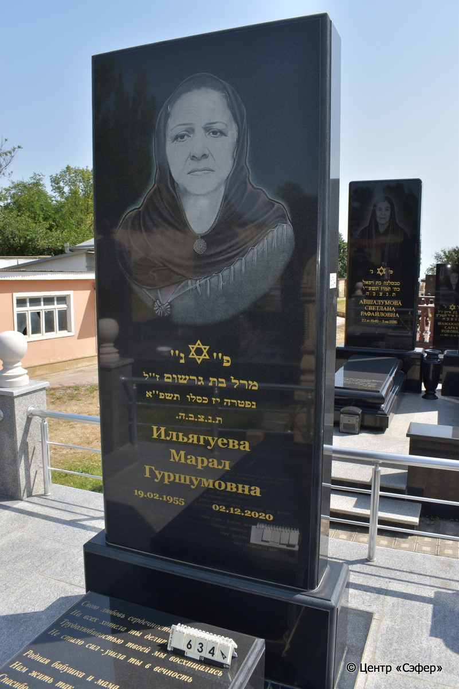
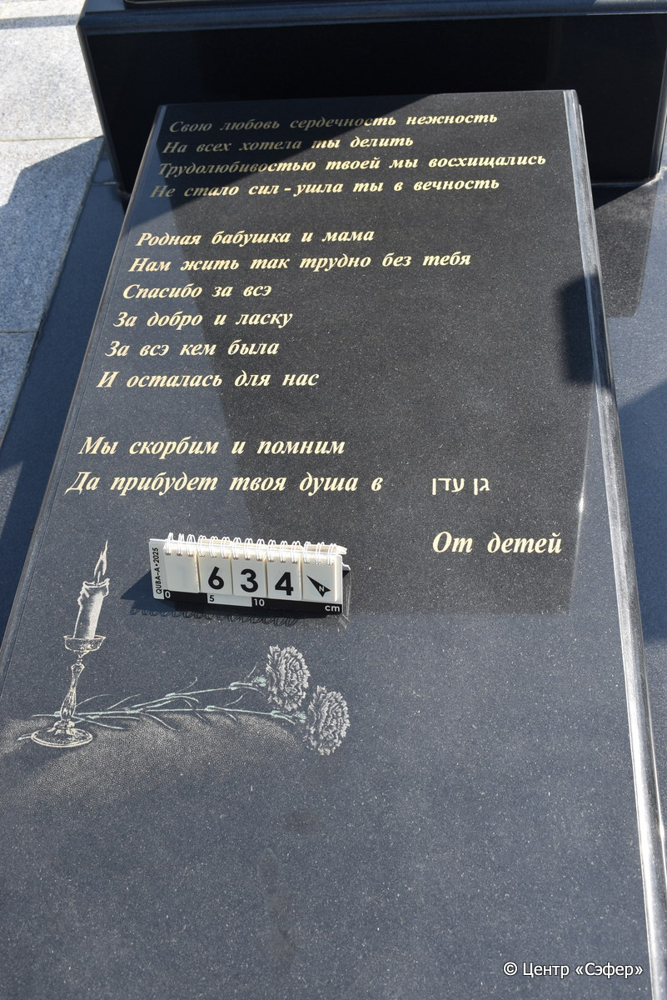
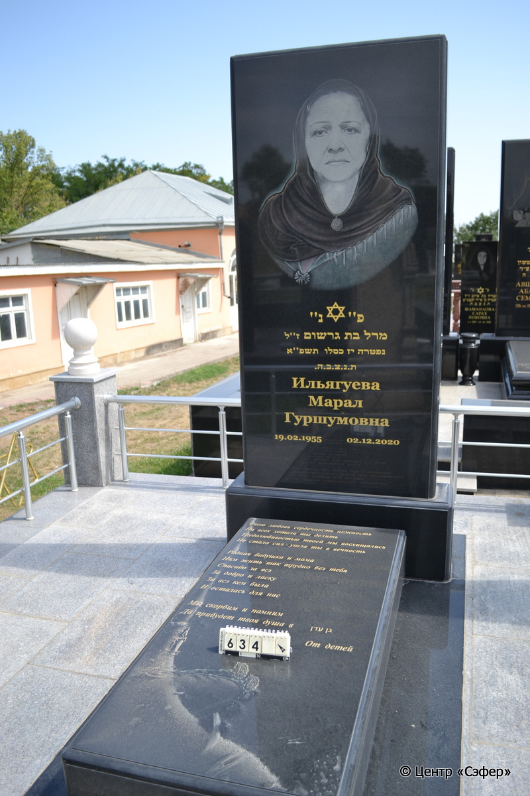
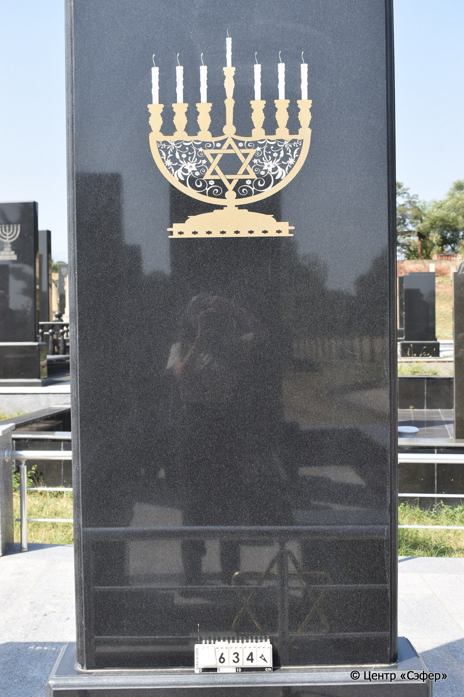

::: {style="font-size: 1em; margin-bottom: 1.2em"}
[Куба (центр.) Азербайджан](../cemeteries/QBA.html) > QBA0634
:::

```{r}
suppressPackageStartupMessages(library(tidyverse))
```


:::: {.columns}

::: {.column width="20%"}

```{r}
#| lightbox:
#|   group: photos






```
:::

::: {.column width="5%"}
:::

::: {.column width="74%"}

::: {.name-style}
ИЛЬЯГУЕВА Марал, дочь Гершома (Гуршумовна)
:::

::: {style="font-size: 1.2em;"}
מרל בת גרשום
:::

:::: {.columns}
::: {.column width="5%"}
{width=1.3em}
:::

::: {.column style="width: 40%; padding-left: 0.2em;"}
19.02.1955 /  
:::

::: {.column width="5%"}
{width=1.3em}
:::

::: {.column style="width: 50%; padding-left: 0.2em;"}
02.12.2020 / 17.Ki.5781
:::

::::


::: {.panel-tabset}

#### Эпитафия

```{r}
tibble(`Оригинал` = "сверху
פ״נ״
מרל בת גרשום ז״ל
נפטרה יז כסלו תשפ״א
ת.נ.צ.ב.ה.
Ильягуева
Марал
Гуршумовна
19.02.1955 02.12.2020

снизу
Свою любовь сердечность нежность
На всех хотела ты делить
Трудолюбивостью твоей мы восхищались
Не стало сил - ушла ты в вечность

Родная бабушка и мама
Нам жить так трудно без тебя
Спасибо за всэ
За добро и ласку
За всэ кем была
И осталась для нас

Мы скорбим и помним 
Да прибудет твоя душа в גן עדן

справа
От детей",
       `Перевод` = "Здесь покоится
Марал, дочь Гершома, благословенной памяти.
Скончалась 17 кислева {5}781 года.
Да будет душа ее завязана в узле жизни.
Ильягуева
Марал
Гуршумовна
19.02.1955 02.12.2020


Свою любовь, сердечность, нежность
На всех хотела ты делить.
Трудолюбивостью твоей мы
восхищались.
Не стало сил - ушла ты в вечность

Родная бабушка и мама
Нам жить так трудно без тебя
Спасибо за все,
За добро и ласку
За все, кем была
И осталась для нас

Мы скорбим и помним. 
Да прибудет твоя душа в раю.


От детей") |>
  mutate(`Оригинал` = str_split(`Оригинал`, "
"),
         `Перевод` = str_split(`Перевод`, "
")) |>
  unnest_longer(c(`Оригинал`, `Перевод`)) |> 
  mutate(id = 1:n()) |> 
  relocate(id, .before = Перевод) |> 
  rename(` ` = id) |> 
  knitr::kable(align = c("r", "c", "l"))
```

|||
|-|---|
|**Примечания**| |
|**Язык**      |иврит, русский    |
|**Метки**     |     |
: {tbl-colwidths="[25,75]"}

#### Памятник

|||
|-|---|
|**Тип памятника**   |L-образный                                                                         |
|**Материал**        |габбро-диорит (трещины, сколы, цементный раствор)                                                     |
|**Размеры**         |227×103×30  --- стела                                                                        |
|**Тип декора**      |растительный, традиционная символика                                                                        |
|**Элементы декора** |портрет и звезда Давида на стеле, с обратной стороны менора со звездой Давида и растительным орнаментом, два цветка и свеча на плите                                                                          |
|**Координаты**      |[41.37120144, 48.5082376](https://www.google.com/maps/place/41.37120144, 48.5082376)                    |
: {tbl-colwidths="[25,75]"}

#### Источник

|||
|-|---|
|**Место хранения**        |Архив полевых исследований Центра «Сэфер»     |
|**Контакты**              |students@sefer.ru    |
|**Ссылка**                |https://sfira.org        |
|**Исходный ID**           |  |
|**Условия использования** |[CC BY-NC 4.0](https://creativecommons.org/licenses/by-nc/4.0/deed.ru)     |
: {tbl-colwidths="[25,75]"}

:::

:::

::::

