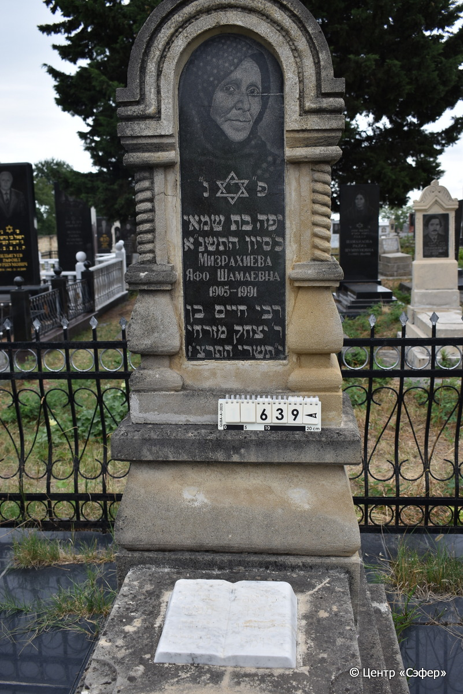
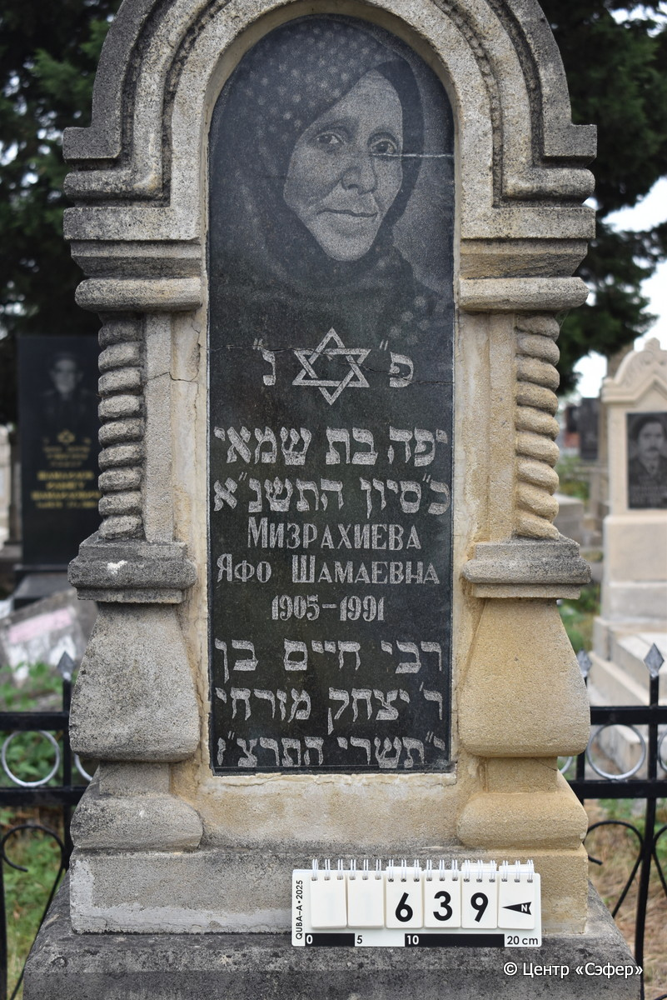
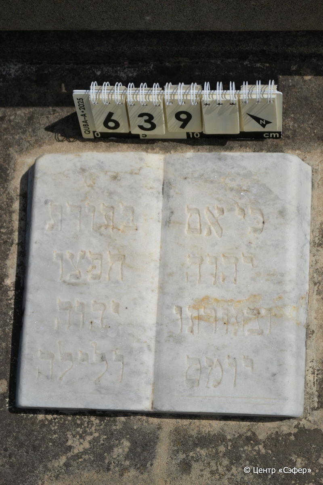
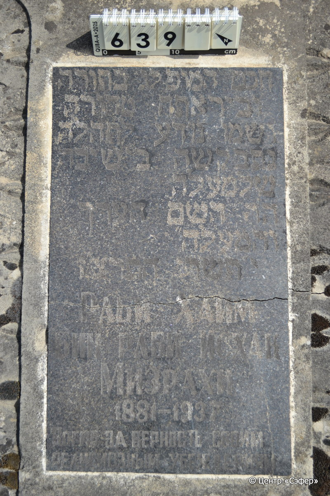
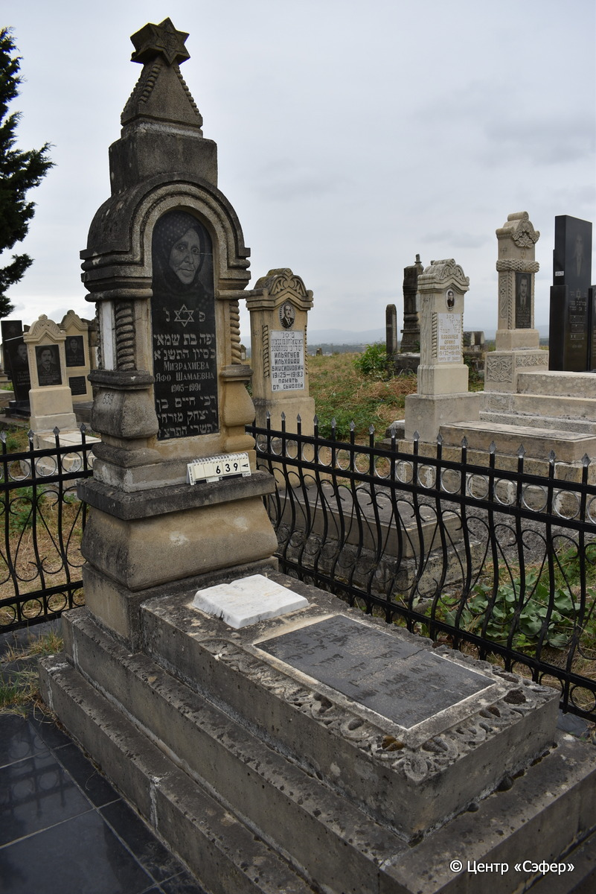

::: {style="font-size: 1em; margin-bottom: 1.2em"}
[Куба (центральное)](../cemeteries/QBA.html) > QBA0639
:::

```{r}
suppressPackageStartupMessages(library(tidyverse))
```


:::: {.columns}

::: {.column width="20%"}

```{r}
#| lightbox:
#|   group: photos







```
:::

::: {.column width="5%"}
:::

::: {.column width="74%"}

::: {.name-style}
МИЗРАХИЕВА Яфа, дочь Шамая (Яфо)
:::

::: {style="font-size: 1.2em;"}
יפה בת שמאי
:::

:::: {.columns}
::: {.column width="5%"}
{width=1.3em}
:::

::: {.column style="width: 40%; padding-left: 0.2em;"}
-.-.1905 /  
:::

::: {.column width="5%"}
{width=1.3em}
:::

::: {.column style="width: 50%; padding-left: 0.2em;"}
-.-.1991 / 20.Si.5751
:::

::::

---

::: {.name-style}
Хаим [Шамаевна]
:::

::: {style="font-size: 1.2em;"}
חיים בן חיים מזרחי
:::

:::: {.columns}
::: {.column width="5%"}
{width=1.3em}
:::

::: {.column style="width: 40%; padding-left: 0.2em;"}
-.-.1881 /  
:::

::: {.column width="5%"}
{width=1.3em}
:::

::: {.column style="width: 50%; padding-left: 0.2em;"}
-.-.1937 / 10.Ti.5697
:::

::::


::: {.panel-tabset}

#### Эпитафия

```{r}
tibble(`Оригинал` = "сверху
פ״נ״
יפה בת שמאי
כ״ סיון התשנ״א
Мизрахиева
Яфо Шамаевна
1905-1991
רבי חיים בן
ר׳ יצחק מזרחי
י״תשרי התרצ״ז

снизу
כי אם בתורת
יהוה חפצו
ובתורתו יהגה
יומם ולילה
חכם המופלג בתורה
וביראת ה טהורה
ושמו נודע לתהלה
נתב קשה בישיבה
שלמעלה 
ה״ה השם הערך
והמעלה״
י׳ תשרי התרצ״ז
Раби Хаим
Бин раби Исхак
Мизрахи
1881-1937
Погиб за верность своим
религиозным убеждениям",
       `Перевод` = "
Здесь покоится
Яфа, дочь Шамая.
20 сивана 5751.
Мизрахиева
Яфо Шамаевна
1905 - 1991
рабби Хаим, сын
р. Ицхака Мизрахи.
10 тишрея 5697 года.

 
Ибо если Тору
святую желаете
и по Торе живете
денно и нощно.
Мудрец, выдающийся в Торе
и в чистой богобоязненности,
и имя его прославлено,
путь его тяжел в иешиву,
что на небе,
наш уважаемый раввин, имя, ценность
и добродетель.
10 тишрея 5697 года.
Рабби Хаим
сын рабби Исхака
Мизрахи
1881-1937
Погиб за верность своим
религиозным убеждениям.") |>
  mutate(`Оригинал` = str_split(`Оригинал`, "
"),
         `Перевод` = str_split(`Перевод`, "
")) |>
  unnest_longer(c(`Оригинал`, `Перевод`)) |> 
  mutate(id = 1:n()) |> 
  relocate(id, .before = Перевод) |> 
  rename(` ` = id) |> 
  knitr::kable(align = c("r", "c", "l"))
```

|||
|-|---|
|**Примечания**|*Цит. Псалмы 1:2
Хаим Мизрахи, старший сын раввина Кубы Ицхака бар Гершона Мизрахи. Репрессирован и расстрелян в числе других раввинов Красной слободы в 1937 году.|
|**Язык**      |иврит, русский    |
|**Метки**     |знаток Писания, раввин, благородное происхождение, насильственная смерть    |
: {tbl-colwidths="[25,75]"}

#### Памятник

|||
|-|---|
|**Тип памятника**   |L-образный                                                                         |
|**Материал**        |известняк, габбро-диорит, мрамор (трещины, цементный раствор, две вставки с портретом и текстом из темного камня на стеле и на плите, мраморная книга на плите, мраморные вставки по бокам стелы)                                                     |
|**Размеры**         |212×61×42  --- стела; 18×55×120  --- плита; 40×90×199  --- основание                                                                        |
|**Тип декора**      |архитектурно-орнаментальный, растительный, традиционная символика                                                                        |
|**Элементы декора** |навершие со звездой Давида, полукруглая арка на витых полуколоннах, портрет и звезда Давида на вставке на стеле, растительный орнамент по краям плиты, рельефная книга                                                                          |
|**Координаты**      |[41.37110239, 48.50826201](https://www.google.com/maps/place/41.37110239, 48.50826201)                    |
: {tbl-colwidths="[25,75]"}

#### Источник

|||
|-|---|
|**Место хранения**        |Архив полевых исследований Центра «Сэфер»     |
|**Контакты**              |students@sefer.ru    |
|**Ссылка**                |https://sfira.org        |
|**Исходный ID**           |  |
|**Условия использования** |[CC BY-NC 4.0](https://creativecommons.org/licenses/by-nc/4.0/deed.ru)     |
: {tbl-colwidths="[25,75]"}

:::

:::

::::

