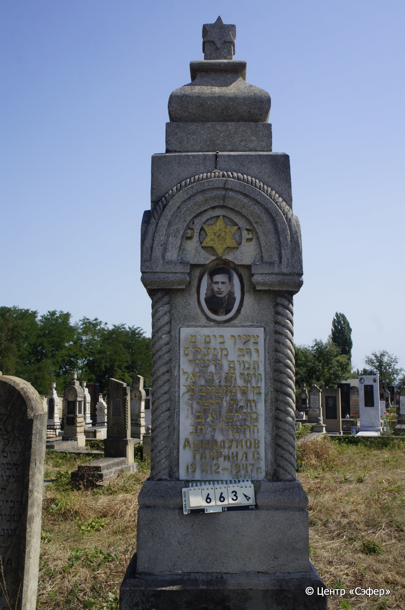
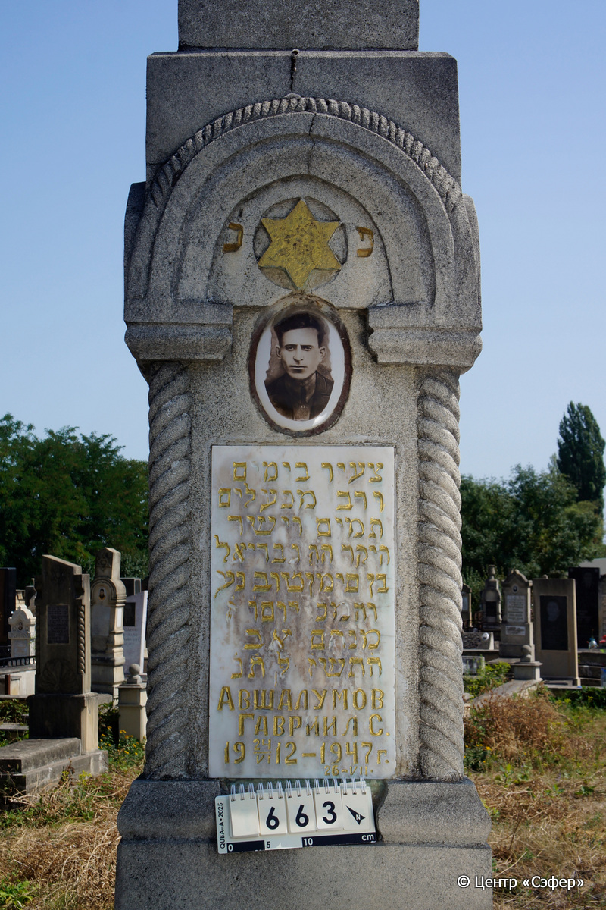
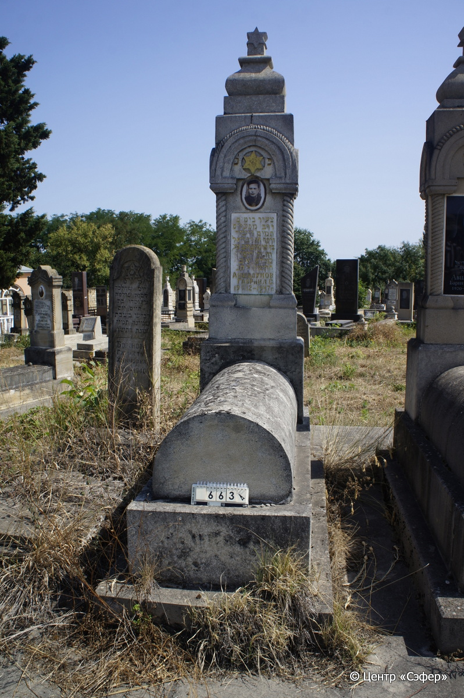

::: {style="font-size: 1em; margin-bottom: 1.2em"}
[Куба (центральное)](../cemeteries/QBA.html) > QBA0663
:::

```{r}
suppressPackageStartupMessages(library(tidyverse))
```


:::: {.columns}

::: {.column width="20%"}

```{r}
#| lightbox:
#|   group: photos





```
:::

::: {.column width="5%"}
:::

::: {.column width="74%"}

::: {.name-style}
АВШАЛУМОВ Гавриэль, сын Симан-Това (Гавриил)
:::

::: {style="font-size: 1.2em;"}
גבריאל בן סימון טוב
:::

:::: {.columns}
::: {.column width="5%"}
{width=1.3em}
:::

::: {.column style="width: 40%; padding-left: 0.2em;"}
24.06.1912 /  
:::

::: {.column width="5%"}
{width=1.3em}
:::

::: {.column style="width: 50%; padding-left: 0.2em;"}
26.07.1947 / 07.Av.5707
:::

::::


::: {.panel-tabset}

#### Эпитафия

```{r}
tibble(`Оригинал` = "פ נ֗
צעיר בימים
ורב מפעלים
תמים וישר 
היקר ה״ה גבריאל
בן סימוןטוב נע
והמ׳כ יום ו֗ ז֗
מנחם אב
ה֗ת֗ש֗ז֗ לפ֗ק  ת֗נ֗
Авшалумов
Гавриил С.
24.VI.1912-1947 г.
26-VII",
       `Перевод` = "Здесь покоится
юный днями
и славный делами,
прямодушный и честный,
дорогой наш господин Гавриэль,
сын Симантова, душа его в раю,
благослованна память его. Пятница, 7
менахем ава,
5707 по малому летоисчислению. Да будет [душа его завязана в узле жизни].
Авшалумов
Гавриил С.
24.VI.1912-1947 г.
26-VII") |>
  mutate(`Оригинал` = str_split(`Оригинал`, "
"),
         `Перевод` = str_split(`Перевод`, "
")) |>
  unnest_longer(c(`Оригинал`, `Перевод`)) |> 
  mutate(id = 1:n()) |> 
  relocate(id, .before = Перевод) |> 
  rename(` ` = id) |> 
  knitr::kable(align = c("r", "c", "l"))
```

|||
|-|---|
|**Примечания**| |
|**Язык**      |иврит, русский    |
|**Метки**     |     |
: {tbl-colwidths="[25,75]"}

#### Памятник

|||
|-|---|
|**Тип памятника**   |L-образный                                                                         |
|**Материал**        |известняк, мрамор, бетон (следы эрозии ; мраморная табличка с текстом эпитафии ; керамический медальон с фотографией)                                                     |
|**Размеры**         |227×59×34  --- стела; 35×54×113  --- саркофаг; 42×85×190  --- основание                                                                        |
|**Тип декора**      |архитектурно-орнаментальный, традиционная символика                                                                        |
|**Элементы декора** |навершие: звезда Давида на постаменте; портал с золотой звездой Давида; четыре полукруглых витых полуколонны; золотая гравировка текста эпитафии на мраморной табличке; на обратной стороне портал                                                                          |
|**Координаты**      |[41.37101286, 48.50839828](https://www.google.com/maps/place/41.37101286, 48.50839828)                    |
: {tbl-colwidths="[25,75]"}

#### Источник

|||
|-|---|
|**Место хранения**        |Архив полевых исследований Центра «Сэфер»     |
|**Контакты**              |students@sefer.ru    |
|**Ссылка**                |https://sfira.org        |
|**Исходный ID**           |  |
|**Условия использования** |[CC BY-NC 4.0](https://creativecommons.org/licenses/by-nc/4.0/deed.ru)     |
: {tbl-colwidths="[25,75]"}

:::

:::

::::

