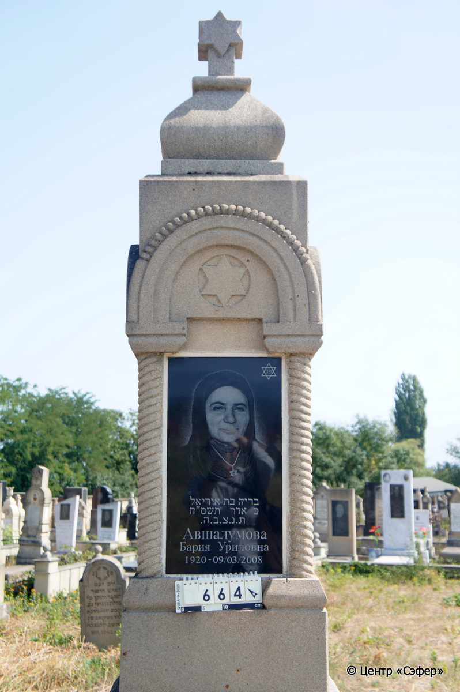
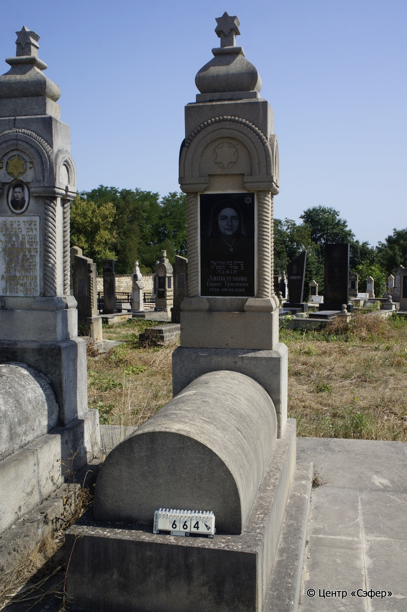

::: {style="font-size: 1em; margin-bottom: 1.2em"}
[Куба (центральное)](../cemeteries/QBA.html) > QBA0664
:::

```{r}
suppressPackageStartupMessages(library(tidyverse))
```


:::: {.columns}

::: {.column width="20%"}

```{r}
#| lightbox:
#|   group: photos




```
:::

::: {.column width="5%"}
:::

::: {.column width="74%"}

::: {.name-style}
АВШАЛУМОВА Бария, дочь Уриэля (Бария Уриловна)
:::

::: {style="font-size: 1.2em;"}
בריה בת אוריאל
:::

:::: {.columns}
::: {.column width="5%"}
{width=1.3em}
:::

::: {.column style="width: 40%; padding-left: 0.2em;"}
-.-.1920 /  
:::

::: {.column width="5%"}
{width=1.3em}
:::

::: {.column style="width: 50%; padding-left: 0.2em;"}
09.03.2008 / 02.Ad.5768
:::

::::


::: {.panel-tabset}

#### Эпитафия

```{r}
tibble(`Оригинал` = "פ״ נ
בריה בת אוריאל
ב אדר תשס״ ח
ת. נ. צ. ב. ה.
Авшалумова
Бария Уриловна
1920 - 09/03/2008",
       `Перевод` = "Здесь покоится
Бария, дочь Уриэля.
2 адара 768 года.
Да будет душа ее завязана в узле жизни.
Авшалумова
Бария Уриловна
1920 - 09/03/2008") |>
  mutate(`Оригинал` = str_split(`Оригинал`, "
"),
         `Перевод` = str_split(`Перевод`, "
")) |>
  unnest_longer(c(`Оригинал`, `Перевод`)) |> 
  mutate(id = 1:n()) |> 
  relocate(id, .before = Перевод) |> 
  rename(` ` = id) |> 
  knitr::kable(align = c("r", "c", "l"))
```

|||
|-|---|
|**Примечания**| |
|**Язык**      |иврит, русский    |
|**Метки**     |     |
: {tbl-colwidths="[25,75]"}

#### Памятник

|||
|-|---|
|**Тип памятника**   |L-образный                                                                         |
|**Материал**        |песчаник, габбро-диорит, бетон (гранитная вставка с фотопортретом)                                                     |
|**Размеры**         |223×59×34  --- стела; 35×49×113  --- саркофаг; 43×86×189  --- основание                                                                        |
|**Тип декора**      |архитектурно-орнаментальный, традиционная символика                                                                        |
|**Элементы декора** |навершие со звездой Давида на постаменте; портал со звездой Давида внутри; четыре витые полуколонны; по бокам с справа и слева, а также с обратной стороны портал; гранитная вставка с портретом и текстом эпитафии; звезда Давида в правом верхнем углу                                                                          |
|**Координаты**      |[41.37100315, 48.50840566](https://www.google.com/maps/place/41.37100315, 48.50840566)                    |
: {tbl-colwidths="[25,75]"}

#### Источник

|||
|-|---|
|**Место хранения**        |Архив полевых исследований Центра «Сэфер»     |
|**Контакты**              |students@sefer.ru    |
|**Ссылка**                |https://sfira.org        |
|**Исходный ID**           |  |
|**Условия использования** |[CC BY-NC 4.0](https://creativecommons.org/licenses/by-nc/4.0/deed.ru)     |
: {tbl-colwidths="[25,75]"}

:::

:::

::::

