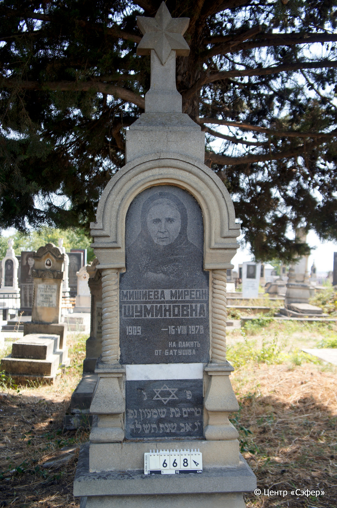
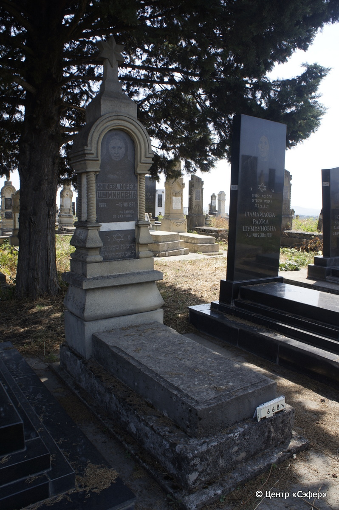

::: {style="font-size: 1em; margin-bottom: 1.2em"}
[Куба (центральное)](../cemeteries/QBA.html) > QBA0668
:::

```{r}
suppressPackageStartupMessages(library(tidyverse))
```


:::: {.columns}

::: {.column width="20%"}

```{r}
#| lightbox:
#|   group: photos




```
:::

::: {.column width="5%"}
:::

::: {.column width="74%"}

::: {.name-style}
МИШИЕВА Мирьям, дочь Шимона (Миреон Шуминовна)
:::

::: {style="font-size: 1.2em;"}
מרים בת שמעון
:::

:::: {.columns}
::: {.column width="5%"}
{width=1.3em}
:::

::: {.column style="width: 40%; padding-left: 0.2em;"}
-.-.1909 /  
:::

::: {.column width="5%"}
{width=1.3em}
:::

::: {.column style="width: 50%; padding-left: 0.2em;"}
16.08.1978 / 13.Av.5738
:::

::::


::: {.panel-tabset}

#### Эпитафия

```{r}
tibble(`Оригинал` = "МИШИЕВА МИРЕОН
ШУМИНОВНА
1909 - 16.VIII 1978
НА ПАМЯТЬ
ОТ БАТУШВА
פ׳ נ׳
מרים בת שמעון נפ׳
יג אב שנת ת֗ש֗ל֗ח֗",
       `Перевод` = "МИШИЕВА МИРЕОН
ШУМИНОВНА
1909 - 16.VIII 1978
НА ПАМЯТЬ
ОТ БАТУШВА
Здесь покоится
Мирьям, дочь Шимона. Сконалась
13 ава года 738.") |>
  mutate(`Оригинал` = str_split(`Оригинал`, "
"),
         `Перевод` = str_split(`Перевод`, "
")) |>
  unnest_longer(c(`Оригинал`, `Перевод`)) |> 
  mutate(id = 1:n()) |> 
  relocate(id, .before = Перевод) |> 
  rename(` ` = id) |> 
  knitr::kable(align = c("r", "c", "l"))
```

|||
|-|---|
|**Примечания**| |
|**Язык**      |иврит, русский    |
|**Метки**     |     |
: {tbl-colwidths="[25,75]"}

#### Памятник

|||
|-|---|
|**Тип памятника**   |L-образный                                                                         |
|**Материал**        |песчаник, гранит, бетон (следы эрозии; две гранитные вставки с портретом и текстом эпитафии)                                                     |
|**Размеры**         |236×67×42  --- стела; 18×55×120  --- плита; 22×87×191  --- основание                                                                        |
|**Тип декора**      |архитектурно-орнаментальный                                                                        |
|**Элементы декора** |навершие со звездой Давида на постаменте; четыре витые полуколонны; звезда Давида на нижней гранитной табличке; на обратной стороне портал                                                                          |
|**Координаты**      |[41.37112869, 48.50839379](https://www.google.com/maps/place/41.37112869, 48.50839379)                    |
: {tbl-colwidths="[25,75]"}

#### Источник

|||
|-|---|
|**Место хранения**        |Архив полевых исследований Центра «Сэфер»     |
|**Контакты**              |students@sefer.ru    |
|**Ссылка**                |https://sfira.org        |
|**Исходный ID**           |  |
|**Условия использования** |[CC BY-NC 4.0](https://creativecommons.org/licenses/by-nc/4.0/deed.ru)     |
: {tbl-colwidths="[25,75]"}

:::

:::

::::

