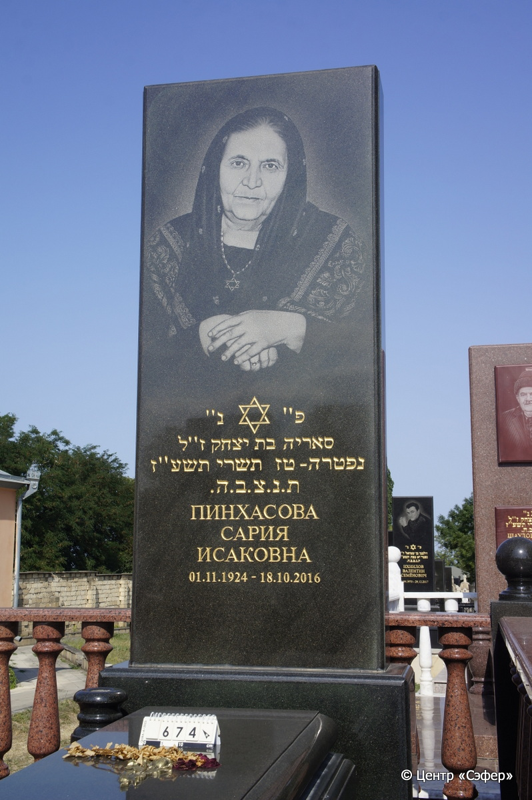
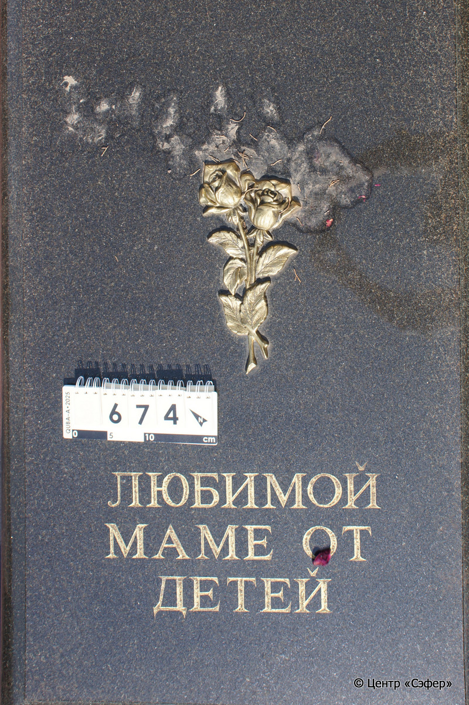
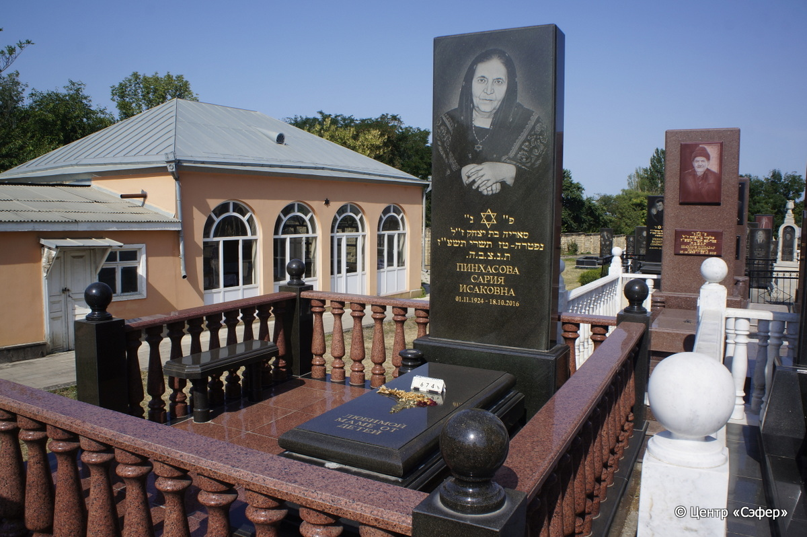
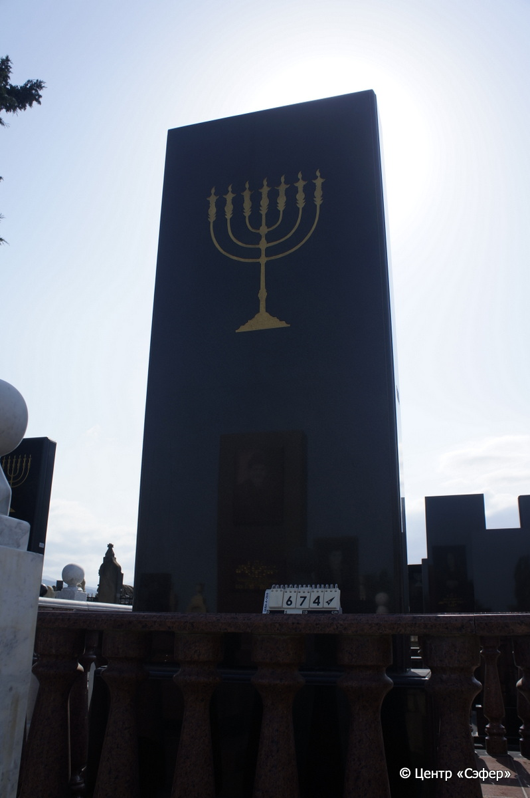

::: {style="font-size: 1em; margin-bottom: 1.2em"}
[Куба (центральное)](../cemeteries/QBA.html) > QBA0674
:::

```{r}
suppressPackageStartupMessages(library(tidyverse))
```


:::: {.columns}

::: {.column width="20%"}

```{r}
#| lightbox:
#|   group: photos






```
:::

::: {.column width="5%"}
:::

::: {.column width="74%"}

::: {.name-style}
ПИНХАСОВА Сария, дочь Ицхака (Исаковна)
:::

::: {style="font-size: 1.2em;"}
סאריה בת יצחק
:::

:::: {.columns}
::: {.column width="5%"}
{width=1.3em}
:::

::: {.column style="width: 40%; padding-left: 0.2em;"}
01.11.1924 /  
:::

::: {.column width="5%"}
{width=1.3em}
:::

::: {.column style="width: 50%; padding-left: 0.2em;"}
18.10.2016 / 16.Ti.5777
:::

::::


::: {.panel-tabset}

#### Эпитафия

```{r}
tibble(`Оригинал` = "פ״ נ״
סאריה בת יצחק ז״ ל
נפטרה - טז תשרי תשע״ ז
ת. נ. צ. ב. ה.
ПИНХАСОВА
САРИЯ
ИСАКОВНА
01.11.1924 - 18.10.2016

снизу
ЛЮБИМОЙ
МАМЕ ОТ
ДЕТЕЙ",
       `Перевод` = "Здесь покоится
Сария, дочь Ицхака, благословенной памяти.
Скончалась 16 тишрея 777 года.
Да будет душа ее завязана в узле жизни.
ПИНХАСОВА
САРИЯ
ИСАКОВНА
01.11.1924 - 18.10.2016


ЛЮБИМОЙ
МАМЕ ОТ
ДЕТЕЙ") |>
  mutate(`Оригинал` = str_split(`Оригинал`, "
"),
         `Перевод` = str_split(`Перевод`, "
")) |>
  unnest_longer(c(`Оригинал`, `Перевод`)) |> 
  mutate(id = 1:n()) |> 
  relocate(id, .before = Перевод) |> 
  rename(` ` = id) |> 
  knitr::kable(align = c("r", "c", "l"))
```

|||
|-|---|
|**Примечания**| |
|**Язык**      |иврит, русский    |
|**Метки**     |     |
: {tbl-colwidths="[25,75]"}

#### Памятник

|||
|-|---|
|**Тип памятника**   |L-образный                                                                         |
|**Материал**        |гранит, габбро-диорит (цементный раствор, стоит на основании)                                                     |
|**Размеры**         |290×116×46  --- стела; 48×80×180  --- плита                                                                        |
|**Тип декора**      |растительный, традиционная символика                                                                        |
|**Элементы декора** |две розы на плите, ваза, звезда Давида и фотопортрет женщины с подвеской в виде звезды Давида на стеле, менора с обратной стороны                                                                          |
|**Координаты**      |[41.37121215, 48.50841462](https://www.google.com/maps/place/41.37121215, 48.50841462)                    |
: {tbl-colwidths="[25,75]"}

#### Источник

|||
|-|---|
|**Место хранения**        |Архив полевых исследований Центра «Сэфер»     |
|**Контакты**              |students@sefer.ru    |
|**Ссылка**                |https://sfira.org        |
|**Исходный ID**           |  |
|**Условия использования** |[CC BY-NC 4.0](https://creativecommons.org/licenses/by-nc/4.0/deed.ru)     |
: {tbl-colwidths="[25,75]"}

:::

:::

::::

