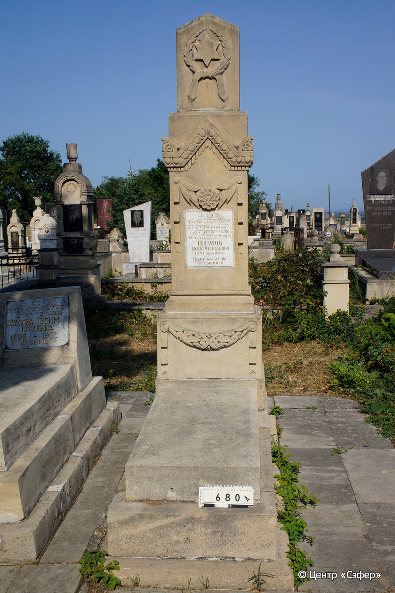
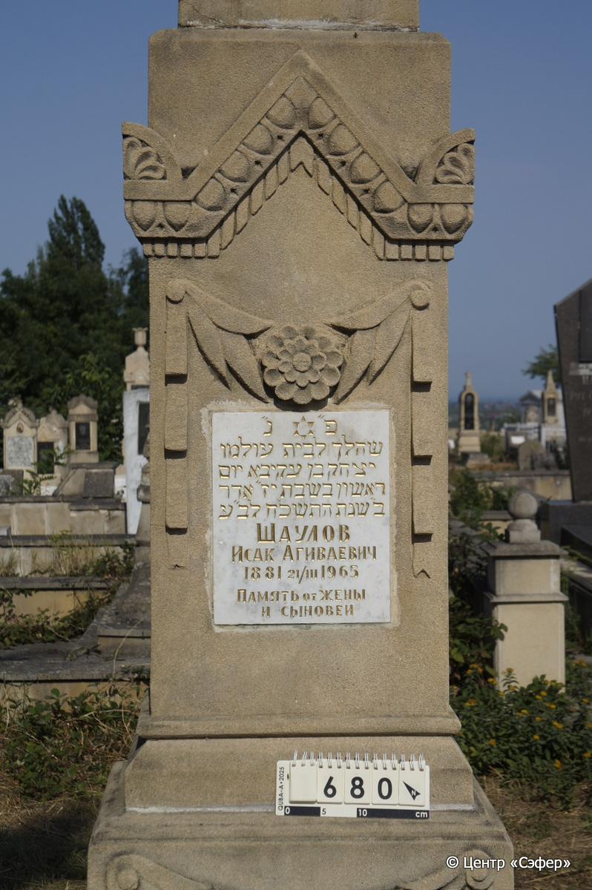
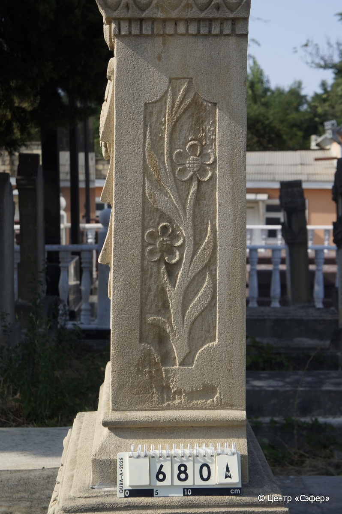
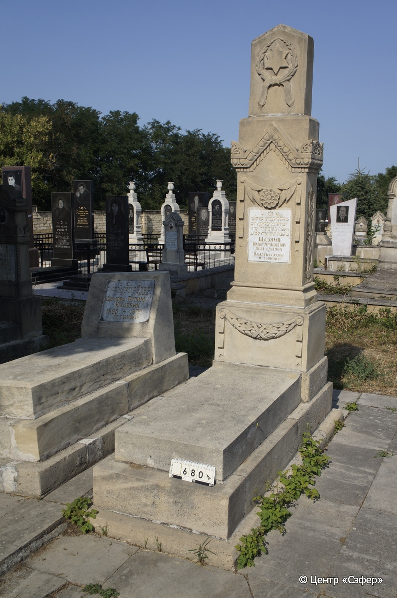

::: {style="font-size: 1em; margin-bottom: 1.2em"}
[Куба (центральное)](../cemeteries/QBA.html) > QBA0680
:::

```{r}
suppressPackageStartupMessages(library(tidyverse))
```


:::: {.columns}

::: {.column width="20%"}

```{r}
#| lightbox:
#|   group: photos






```
:::

::: {.column width="5%"}
:::

::: {.column width="74%"}

::: {.name-style}
ШАУЛОВ Ицхак, сын Акивы (Исак Агиваевич)
:::

::: {style="font-size: 1.2em;"}
יצחק בן עקיבא
:::

:::: {.columns}
::: {.column width="5%"}
{width=1.3em}
:::

::: {.column style="width: 40%; padding-left: 0.2em;"}
-.-.1881 /  
:::

::: {.column width="5%"}
{width=1.3em}
:::

::: {.column style="width: 50%; padding-left: 0.2em;"}
21.03.1965 / 17.Ad2.5728
:::

::::


::: {.panel-tabset}

#### Эпитафия

```{r}
tibble(`Оригинал` = "פ״נ״
שהלך לבית עולמו 
יצחק בן עקיבא יום 
ראשון בשבת יז״ אדר
ב״ שנת התשכ״ח לב״ע
Шаулов
Исак Агиваевич 
1881 21/III 1965
 память от жены
и сыновей",
       `Перевод` = "Здесь покоится.
Ушел в дом вечности
Ицхак, сын Акивы, в день
воскресенье, 17 адара-II
года 5728 от сотворения мира.
Шаулов
Исак Агиваевич 
1881 21/III 1965
 память от жены
и сыновей") |>
  mutate(`Оригинал` = str_split(`Оригинал`, "
"),
         `Перевод` = str_split(`Перевод`, "
")) |>
  unnest_longer(c(`Оригинал`, `Перевод`)) |> 
  mutate(id = 1:n()) |> 
  relocate(id, .before = Перевод) |> 
  rename(` ` = id) |> 
  knitr::kable(align = c("r", "c", "l"))
```

|||
|-|---|
|**Примечания**| |
|**Язык**      |иврит, русский    |
|**Метки**     |     |
: {tbl-colwidths="[25,75]"}

#### Памятник

|||
|-|---|
|**Тип памятника**   |L-образный                                                                         |
|**Материал**        |известняк, мрамор (мраморная вставка для текста,цементный раствор, трещины)                                                     |
|**Размеры**         |192×57×42  --- стела; 19×53×115  --- плита; 25×78×190  --- основание                                                                        |
|**Тип декора**      |архитектурно-орнаментальный, растительный, традиционная символика                                                                        |
|**Элементы декора** |архитектурное навершие со звездой Давида в венке. орнаментальный пояс с растительным и геометрическим мотивами, палтметки; по бокам стелы орнаментальные цветв , над вставкой - гирлянда из лент, листьев с цветком; звезда Давида на вставке у основания гирлянды из лент и листьев                                                                          |
|**Координаты**      |[41.37109873, 48.50846885](https://www.google.com/maps/place/41.37109873, 48.50846885)                    |
: {tbl-colwidths="[25,75]"}

#### Источник

|||
|-|---|
|**Место хранения**        |Архив полевых исследований Центра «Сэфер»     |
|**Контакты**              |students@sefer.ru    |
|**Ссылка**                |https://sfira.org        |
|**Исходный ID**           |  |
|**Условия использования** |[CC BY-NC 4.0](https://creativecommons.org/licenses/by-nc/4.0/deed.ru)     |
: {tbl-colwidths="[25,75]"}

:::

:::

::::

