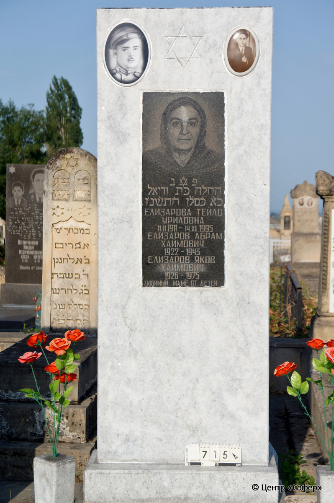
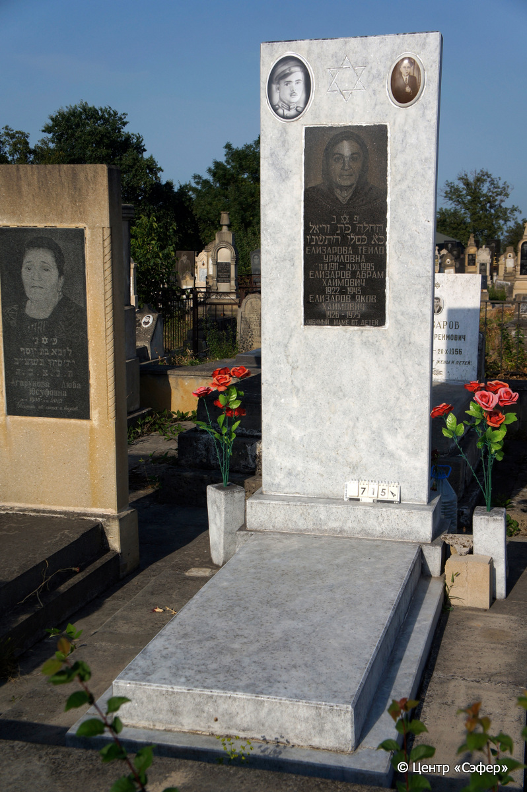
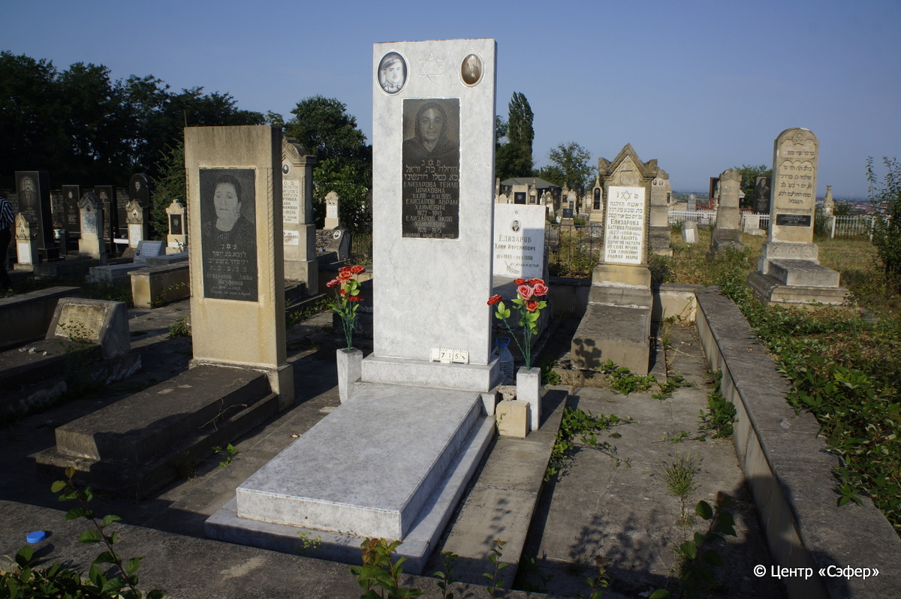

::: {style="font-size: 1em; margin-bottom: 1.2em"}
[Куба (центральное)](../cemeteries/QBA.html) > QBA0715
:::

```{r}
suppressPackageStartupMessages(library(tidyverse))
```


:::: {.columns}

::: {.column width="20%"}

```{r}
#| lightbox:
#|   group: photos





```
:::

::: {.column width="5%"}
:::

::: {.column width="74%"}

::: {.name-style}
ЕЛИЗАРОВА Техила, дочь Урии (Тейло Уриловна)
:::

::: {style="font-size: 1.2em;"}
תהלה בת אוריה
:::

:::: {.columns}
::: {.column width="5%"}
{width=1.3em}
:::

::: {.column style="width: 40%; padding-left: 0.2em;"}
11.02.1911 /  
:::

::: {.column width="5%"}
{width=1.3em}
:::

::: {.column style="width: 50%; padding-left: 0.2em;"}
14.12.1995 / 21.Ki.5756
:::

::::

---

::: {.name-style}
ЕЛИЗАРОВ Абрам Хаимович
:::

::: {style="font-size: 1.2em;"}

:::

:::: {.columns}
::: {.column width="5%"}
{width=1.3em}
:::

::: {.column style="width: 40%; padding-left: 0.2em;"}
-.-.1922 /  
:::

::: {.column width="5%"}
{width=1.3em}
:::

::: {.column style="width: 50%; padding-left: 0.2em;"}
-.-.1943 /  
:::

::::

---

::: {.name-style}
ЕЛИЗАРОВ Яков Хаимович
:::

::: {style="font-size: 1.2em;"}

:::

:::: {.columns}
::: {.column width="5%"}
{width=1.3em}
:::

::: {.column style="width: 40%; padding-left: 0.2em;"}
-.-.1926 /  
:::

::: {.column width="5%"}
{width=1.3em}
:::

::: {.column style="width: 50%; padding-left: 0.2em;"}
-.-.1975 /  
:::

::::


::: {.panel-tabset}

#### Эпитафия

```{r}
tibble(`Оригинал` = "פ נ 
תהלה בּת וריאל
כ֗א֗ כּ֗סל֗ו ה֗תש֗נ׳ו
Елизарова Тейло
Уриловна
11.II.1911 - 14.XII.1995
Елизаров Абрам
Хаимович
1922 - 1943
Елизаров Яков
Хаимович
1926 - 1975
Любимый маме от детей",
       `Перевод` = "Здесь покоится
Тахала, дочь Урии.
21 кислева 5756 года.
Елизарова Тейло
Уриловна
11.II.1911 - 14.XII.1995
Елизаров Абрам
Хаимович
1922 - 1943
Елизаров Яков
Хаимович
1926 - 1975
Любимый маме от детей") |>
  mutate(`Оригинал` = str_split(`Оригинал`, "
"),
         `Перевод` = str_split(`Перевод`, "
")) |>
  unnest_longer(c(`Оригинал`, `Перевод`)) |> 
  mutate(id = 1:n()) |> 
  relocate(id, .before = Перевод) |> 
  rename(` ` = id) |> 
  knitr::kable(align = c("r", "c", "l"))
```

|||
|-|---|
|**Примечания**| |
|**Язык**      |иврит, русский    |
|**Метки**     |     |
: {tbl-colwidths="[25,75]"}

#### Памятник

|||
|-|---|
|**Тип памятника**   |L-образный                                                                         |
|**Материал**        |габбро-диорит, мрамор (вставка с текстом из темного камня, керамические медальоны)                                                     |
|**Размеры**         |195×80×40  --- стела                                                                        |
|**Тип декора**      |традиционная символика                                                                        |
|**Элементы декора** |звезда Давида, два портрета на медальонах, один портрет на вставке, по бокам памятника две вазы                                                                          |
|**Координаты**      |[41.37106812, 48.5086142](https://www.google.com/maps/place/41.37106812, 48.5086142)                    |
: {tbl-colwidths="[25,75]"}

#### Источник

|||
|-|---|
|**Место хранения**        |Архив полевых исследований Центра «Сэфер»     |
|**Контакты**              |students@sefer.ru    |
|**Ссылка**                |https://sfira.org        |
|**Исходный ID**           |  |
|**Условия использования** |[CC BY-NC 4.0](https://creativecommons.org/licenses/by-nc/4.0/deed.ru)     |
: {tbl-colwidths="[25,75]"}

:::

:::

::::

