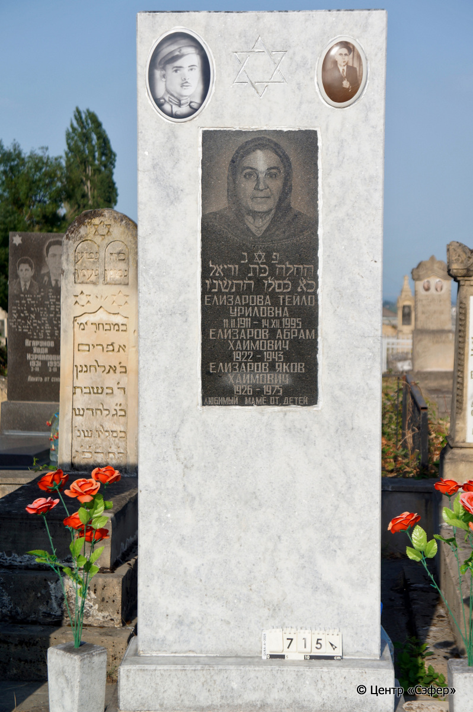
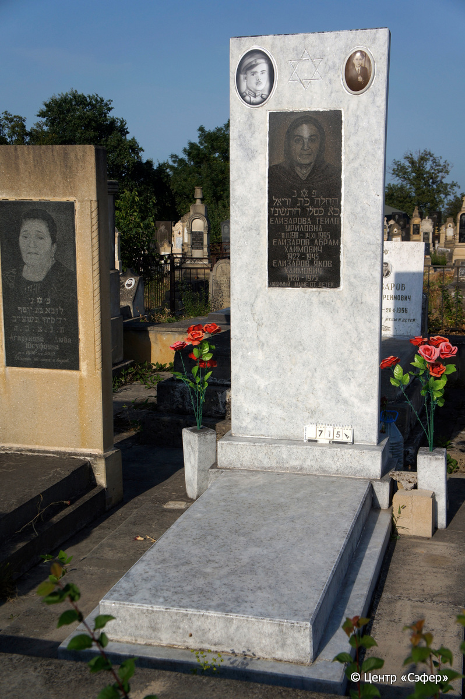
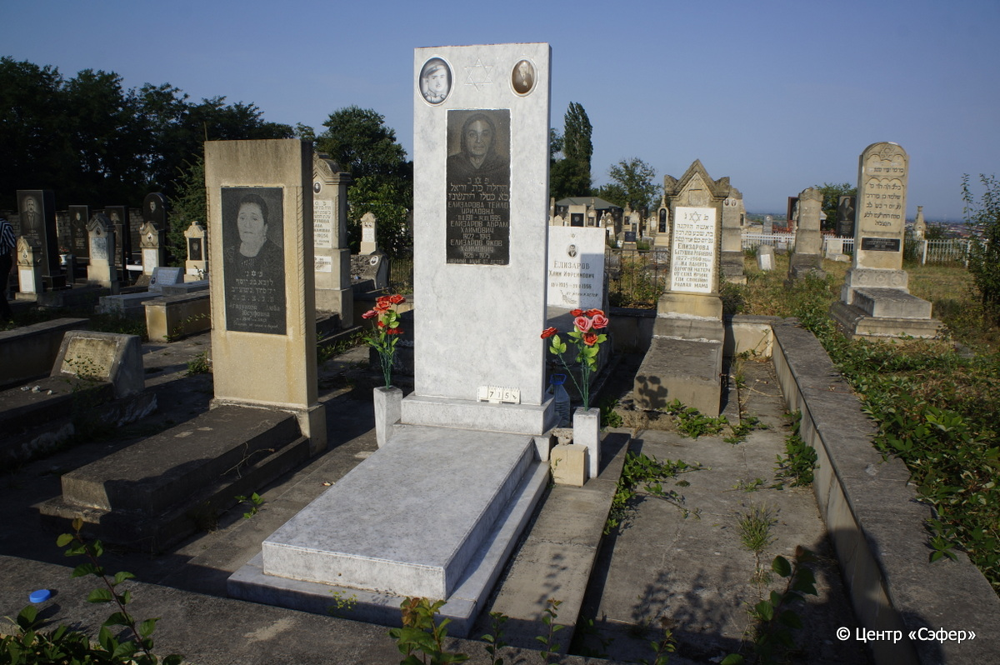

::: {style="font-size: 1em; margin-bottom: 1.2em"}
[Куба (центральное)](../cemeteries/QBA.html) > QBA0715
:::

```{r}
suppressPackageStartupMessages(library(tidyverse))
```


:::: {.columns}

::: {.column width="20%"}

```{r}
#| lightbox:
#|   group: photos





```
:::

::: {.column width="5%"}
:::

::: {.column width="74%"}

::: {.custom-frame}
::: {.name-style}
**ЕЛИЗАРОВА Техила, дочь Урии (Тейло Уриловна)**
:::

::: {style="font-size: 1.2em; color: #929292;"}
תהלה בת אוריה
:::

:::: {.columns .date-panel .align-items-center}
::: {.column width="1.5em" .text-center}
{width=1.3em .nolightbox}
:::

::: {.column style="width: fit-content; padding-left: 0.4em; padding-right: 4em;"}
11.02.1911 

[--]{style="color: #929292"}
:::

::: {.column width="1.5em" .text-center}
{width=1.3em .nolightbox}
:::

::: {.column style="width: fit-content; padding-left: 0.4em;"}
14.12.1995 

[21.Ki.5756]{style="color: #929292"}
:::

::::

---

::: {.name-style}
**ЕЛИЗАРОВ Абрам Хаимович**
:::

::: {style="font-size: 1.2em; color: #929292;"}

:::

:::: {.columns .date-panel .align-items-center}
::: {.column width="1.5em" .text-center}
{width=1.3em .nolightbox}
:::

::: {.column style="width: fit-content; padding-left: 0.4em; padding-right: 4em;"}
-.-.1922 

[--]{style="color: #929292"}
:::

::: {.column width="1.5em" .text-center}
{width=1.3em .nolightbox}
:::

::: {.column style="width: fit-content; padding-left: 0.4em;"}
-.-.1943 

[--]{style="color: #929292"}
:::

::::

---

::: {.name-style}
**ЕЛИЗАРОВ Яков Хаимович**
:::

::: {style="font-size: 1.2em; color: #929292;"}

:::

:::: {.columns .date-panel .align-items-center}
::: {.column width="1.5em" .text-center}
{width=1.3em .nolightbox}
:::

::: {.column style="width: fit-content; padding-left: 0.4em; padding-right: 4em;"}
-.-.1926 

[--]{style="color: #929292"}
:::

::: {.column width="1.5em" .text-center}
{width=1.3em .nolightbox}
:::

::: {.column style="width: fit-content; padding-left: 0.4em;"}
-.-.1975 

[--]{style="color: #929292"}
:::

::::

:::

::: {.panel-tabset}

#### Эпитафия

```{r}
tibble(`Оригинал` = "פ נ 
תהלה בּת וריאל
כ֗א֗ כּ֗סל֗ו ה֗תש֗נ׳ו
Елизарова Тейло
Уриловна
11.II.1911 - 14.XII.1995
Елизаров Абрам
Хаимович
1922 - 1943
Елизаров Яков
Хаимович
1926 - 1975
Любимый маме от детей",
       `Перевод` = "Здесь покоится
Тахала, дочь Урии.
21 кислева 5756 года.
Елизарова Тейло
Уриловна
11.II.1911 - 14.XII.1995
Елизаров Абрам
Хаимович
1922 - 1943
Елизаров Яков
Хаимович
1926 - 1975
Любимый маме от детей") |>
  mutate(`Оригинал` = str_split(`Оригинал`, "
"),
         `Перевод` = str_split(`Перевод`, "
")) |>
  unnest_longer(c(`Оригинал`, `Перевод`)) |> 
  mutate(id = 1:n()) |> 
  relocate(id, .before = Перевод) |> 
  rename(` ` = id) |> 
  knitr::kable(align = c("r", "c", "l"))
```

|||
|-|---|
|Примечания| |
|Язык      |иврит, русский    |
|Метки     |     |
: {.striped .custom-table tbl-colwidths="[25,75]"}

#### Памятник

|||
|-|---|
|Тип памятника   |L-образный                                                                         |
|Материал        |габбро-диорит, мрамор (вставка с текстом из темного камня, керамические медальоны)                                                     |
|Размеры         |195×80×40  --- стела                                                                        |
|Тип декора      |традиционная символика, портретный                                                                        |
|Элементы декора |звезда Давида, два портрета на медальонах, один портрет на вставке, по бокам памятника две вазы                                                                          |
|Координаты      |[41.37106812, 48.5086142](https://www.google.com/maps/place/41.37106812, 48.5086142)                    |
: {.striped .custom-table tbl-colwidths="[25,75]"}

#### Источник

|                          |                 |
|--------------------------|-----------------|
|Место хранения        |Архив полевых исследований Центра «Сэфер»        |
|Контакты              |students@sefer.ru       |
|Ссылка                |[https://sfira.org](https://sfira.org) |
|Исходный ID           |     |
|Условия использования |[CC BY-NC 4.0](https://creativecommons.org/licenses/by-nc/4.0/deed.ru)        |
: {.striped .custom-table tbl-colwidths="[25,75]"}

:::

:::

::::

