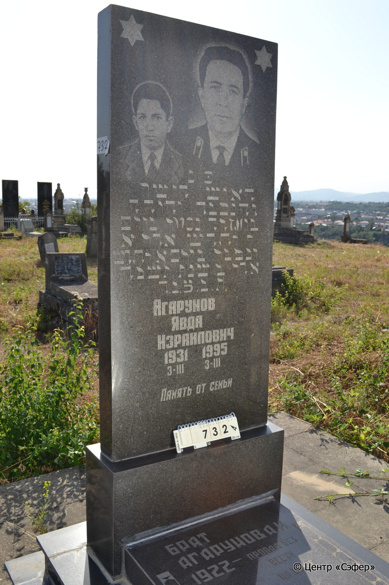
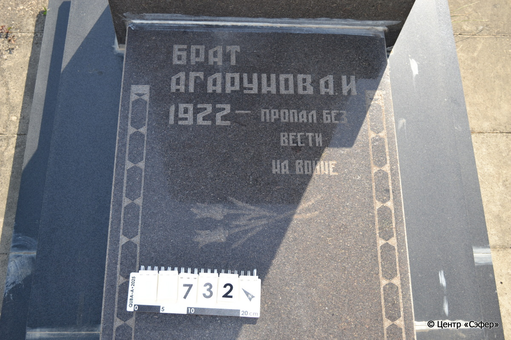
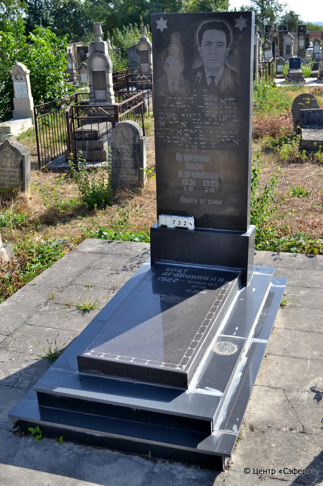

::: {style="font-size: 1em; margin-bottom: 1.2em"}
[Куба (центральное)](../cemeteries/QBA.html) > QBA0732
:::

```{r}
suppressPackageStartupMessages(library(tidyverse))
```


:::: {.columns}

::: {.column width="20%"}

```{r}
#| lightbox:
#|   group: photos





```
:::

::: {.column width="5%"}
:::

::: {.column width="74%"}

::: {.name-style}
АГАРУНОВ Йехуда, сын Эзры (Явда Израилович)
:::

::: {style="font-size: 1.2em;"}
יהודה בן עזרה
:::

:::: {.columns}
::: {.column width="5%"}
{width=1.3em}
:::

::: {.column style="width: 40%; padding-left: 0.2em;"}
03.03.1931 /  
:::

::: {.column width="5%"}
{width=1.3em}
:::

::: {.column style="width: 50%; padding-left: 0.2em;"}
03.03.1995 / 30.Ad1.5755
:::

::::

---

::: {.name-style}
АГАРУНОВ А. Израилович
:::

::: {style="font-size: 1.2em;"}

:::

:::: {.columns}
::: {.column width="5%"}
{width=1.3em}
:::

::: {.column style="width: 40%; padding-left: 0.2em;"}
-.-.1922 /  
:::

::: {.column width="5%"}
{width=1.3em}
:::

::: {.column style="width: 50%; padding-left: 0.2em;"}
  / 
:::

::::


::: {.panel-tabset}

#### Эпитафия

```{r}
tibble(`Оригинал` = "פ נ
האיש הישר
והנכבד יהודה
בן עזרה נפטר ביום
ל לחדש אדר א
ונקבר ביום א לחדש
אדר ב שנת תשנה
ת. נ. צ. ב. ה.
АГАРУНОВ
ЯВДА
ИЗРАИЛОВИЧ
1931 3-III 1995 3-III
ПАМЯТЬ ОТ СЕМЬИ

снизу
БРАТ
АГАРУНОВ А. И.
1922 - ПРОПАЛ БЕЗ
ВЕСТИ
НА ВОЙНЕ",
       `Перевод` = "Здесь покоится
человек прямодушный
и уважаемый, Йехуда,
сын Эзры. Скончался
30 числа месяца адар-I,
и похоронен 1 числа месяца
адар-II года 755.
Да будет душа его завязана в узле жизни.
АГАРУНОВ
ЯВДА
ИЗРАИЛОВИЧ
1931 3-III 1995 3-III
ПАМЯТЬ ОТ СЕМЬИ


БРАТ
АГАРУНОВ А. И.
1922 - ПРОПАЛ БЕЗ
ВЕСТИ
НА ВОЙНЕ") |>
  mutate(`Оригинал` = str_split(`Оригинал`, "
"),
         `Перевод` = str_split(`Перевод`, "
")) |>
  unnest_longer(c(`Оригинал`, `Перевод`)) |> 
  mutate(id = 1:n()) |> 
  relocate(id, .before = Перевод) |> 
  rename(` ` = id) |> 
  knitr::kable(align = c("r", "c", "l"))
```

|||
|-|---|
|**Примечания**| |
|**Язык**      |иврит, русский    |
|**Метки**     |     |
: {tbl-colwidths="[25,75]"}

#### Памятник

|||
|-|---|
|**Тип памятника**   |L-образный                                                                         |
|**Материал**        |габбро-диорит, лабрадорит (цементный раствор, следы эрозии)                                                     |
|**Размеры**         |171×68×23  --- стела; 11×59×121  --- плита; 23×113×191  --- основание                                                                        |
|**Тип декора**      |архитектурно-орнаментальный, растительный, традиционная символика                                                                        |
|**Элементы декора** |две звезды Давида и два портрета на стеле, два тюльпана и геометрический орнамент на плите                                                                          |
|**Координаты**      |[41.37110237, 48.50869575](https://www.google.com/maps/place/41.37110237, 48.50869575)                    |
: {tbl-colwidths="[25,75]"}

#### Источник

|||
|-|---|
|**Место хранения**        |Архив полевых исследований Центра «Сэфер»     |
|**Контакты**              |students@sefer.ru    |
|**Ссылка**                |https://sfira.org        |
|**Исходный ID**           |  |
|**Условия использования** |[CC BY-NC 4.0](https://creativecommons.org/licenses/by-nc/4.0/deed.ru)     |
: {tbl-colwidths="[25,75]"}

:::

:::

::::

