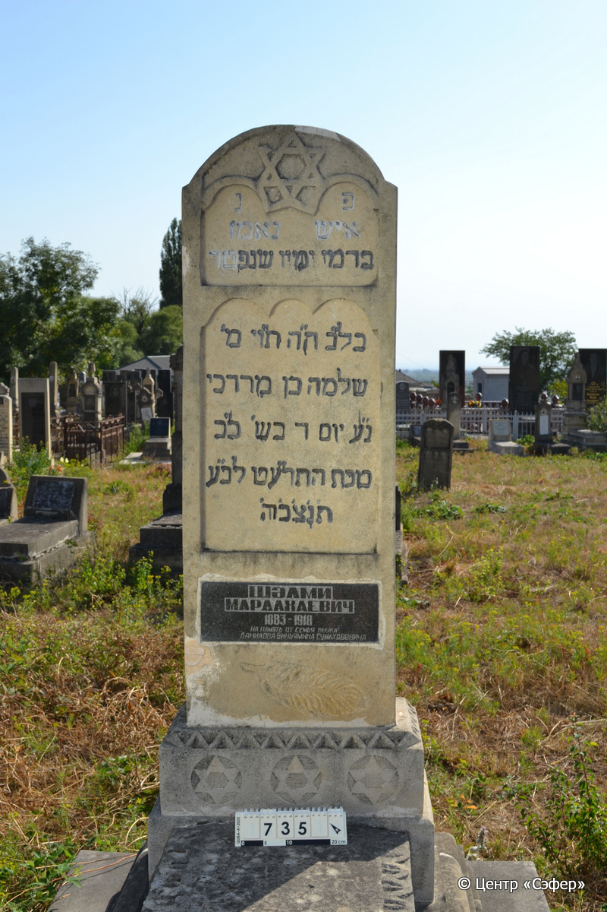
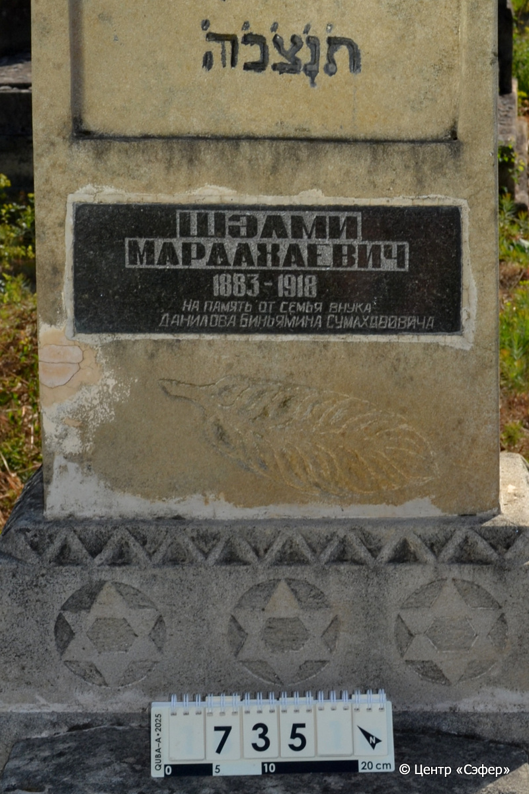
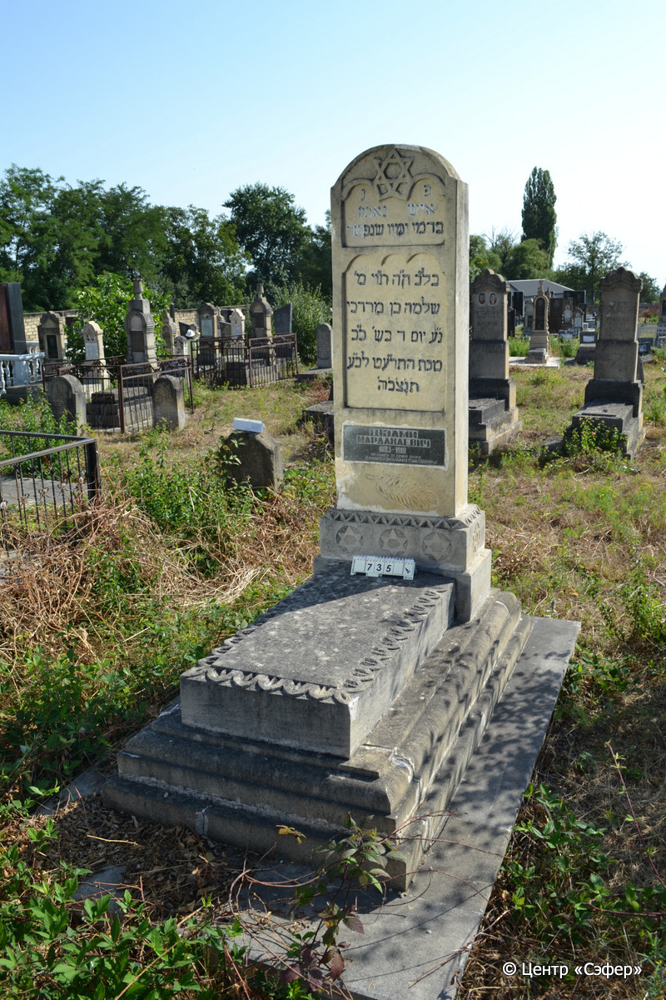

::: {style="font-size: 1em; margin-bottom: 1.2em"}
[Куба (центральное)](../cemeteries/QBA.html) > QBA0735
:::

```{r}
suppressPackageStartupMessages(library(tidyverse))
```


:::: {.columns}

::: {.column width="20%"}

```{r}
#| lightbox:
#|   group: photos





```
:::

::: {.column width="5%"}
:::

::: {.column width="74%"}

::: {.name-style}
Шломо, сын Мордехая
:::

::: {style="font-size: 1.2em;"}
שלמה בן מרדכי
:::

:::: {.columns}
::: {.column width="5%"}
{width=1.3em}
:::

::: {.column style="width: 40%; padding-left: 0.2em;"}
-.-.1883 /  
:::

::: {.column width="5%"}
{width=1.3em}
:::

::: {.column style="width: 50%; padding-left: 0.2em;"}
-.-.1918 / 22.Te.5679
:::

::::


::: {.panel-tabset}

#### Эпитафия

```{r}
tibble(`Оригинал` = "פ נ
איש נאמן
בדמי ימיו שנפטר
בל״ב ה״ ה ת״וי מ׳
שלמה בן מרדכי
נ״ע יום ד בש׳ כ״ ב
טבת התר״ עט לב״ ע
ת׳נ׳ צ׳ב׳ ה׳
Шəлми
Мардахаевич
1883 - 1918
На память от семья внука
ДАНИЛОВА БИНЬЯМИНА СУМАХАВОВИЧА",
       `Перевод` = "Здесь покоится
человек преданный,
в расцвете лет скончался,
не оставив потомства человек честный и прямодушный, г-н
Шломо, сын Мордехая,
душа его в раю. Среда, 22
тевета 5679 года от сотворения мира.
Да будет душа его завязана в узле жизни.
Шалми
Мардахаевич
1883 - 1918
На память от семья внука
ДАНИЛОВА БИНЬЯМИНА СУМАХАВОВИЧА") |>
  mutate(`Оригинал` = str_split(`Оригинал`, "
"),
         `Перевод` = str_split(`Перевод`, "
")) |>
  unnest_longer(c(`Оригинал`, `Перевод`)) |> 
  mutate(id = 1:n()) |> 
  relocate(id, .before = Перевод) |> 
  rename(` ` = id) |> 
  knitr::kable(align = c("r", "c", "l"))
```

|||
|-|---|
|**Примечания**| |
|**Язык**      |иврит, русский    |
|**Метки**     |     |
: {tbl-colwidths="[25,75]"}

#### Памятник

|||
|-|---|
|**Тип памятника**   |L-образный                                                                         |
|**Материал**        |известняк, габбро-диорит (цементный раствор, следы эрозии, сколы, вставка для текста из темного камня, следы ремонта)                                                     |
|**Размеры**         |180×67×37  --- стела; 17×55×110  --- плита; 26×97×179  --- основание                                                                        |
|**Тип декора**      |архитектурно-орнаментальный, растительный, традиционная символика                                                                        |
|**Элементы декора** |полукруглое завершение, звезда Давида, фигурные ниши для текста, пальмовая ветвь , пояс из геометрического орнамента, звезды Давида в круглых нишах, по краям плиты растительный орнамент в виде листьев                                                                          |
|**Координаты**      |[41.37105482, 48.50868885](https://www.google.com/maps/place/41.37105482, 48.50868885)                    |
: {tbl-colwidths="[25,75]"}

#### Источник

|||
|-|---|
|**Место хранения**        |Архив полевых исследований Центра «Сэфер»     |
|**Контакты**              |students@sefer.ru    |
|**Ссылка**                |https://sfira.org        |
|**Исходный ID**           |  |
|**Условия использования** |[CC BY-NC 4.0](https://creativecommons.org/licenses/by-nc/4.0/deed.ru)     |
: {tbl-colwidths="[25,75]"}

:::

:::

::::

